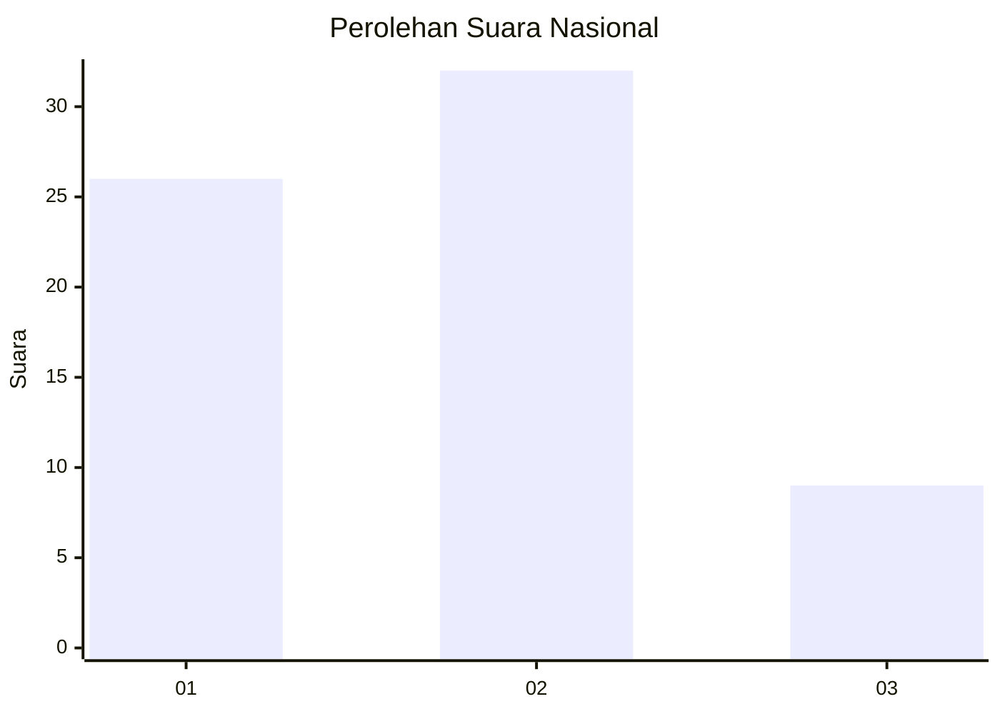
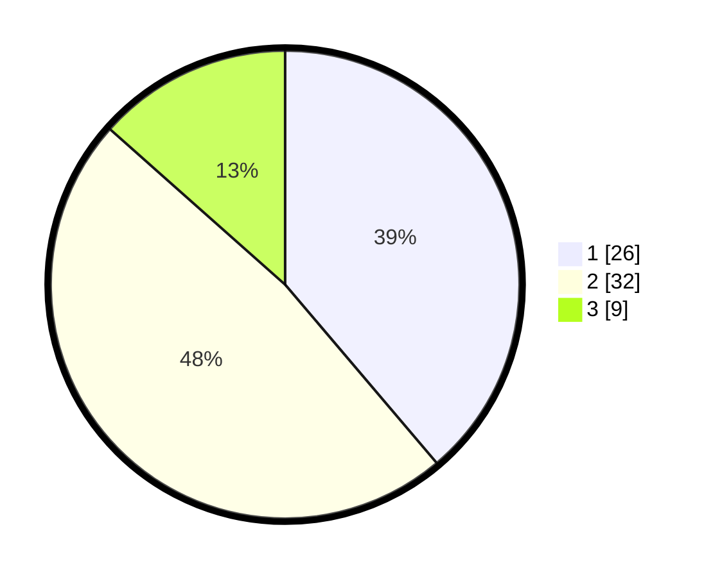

# Hasil

## Grafik

## Tabel

| No. | Nama Paslon    | Suara | Suara (raw) | Persentase |
|:--- |:-------------- | -----:| -----------:| ----------:|
| 1   | ANIES MUHAIMIN | 26    | [26][p-1]   | 38,81      |
| 2   | PRABOWO GIBRAN | 32    | [32][p-2]   | 47,76      |
| 3   | GANJAR MAHFUD  | 9     | [9][p-3]    | 13,43      |

[p-1]: https://github.com/gigit-pemilu/pemilu-2024/blob/main/pilpres/hitung-suara/sub/99-luar-negeri/sub/62-kuala-lumpur-malaysia/sub/01-kuala-lumpur-malaysia/sub/0001-kuala-lumpur-malaysia/sub/456-tps-143/sub/paslon-1.txt
[p-2]: https://github.com/gigit-pemilu/pemilu-2024/blob/main/pilpres/hitung-suara/sub/99-luar-negeri/sub/62-kuala-lumpur-malaysia/sub/01-kuala-lumpur-malaysia/sub/0001-kuala-lumpur-malaysia/sub/456-tps-143/sub/paslon-2.txt
[p-3]: https://github.com/gigit-pemilu/pemilu-2024/blob/main/pilpres/hitung-suara/sub/99-luar-negeri/sub/62-kuala-lumpur-malaysia/sub/01-kuala-lumpur-malaysia/sub/0001-kuala-lumpur-malaysia/sub/456-tps-143/sub/paslon-3.txt

## Foto C Plano

https://sirekap-obj-formc.kpu.go.id/c526/pemilu/ppwp/99/62/01/00/01/9962010001456-20240215-225034--d1bb67ae-1103-4dd5-85e1-09d02953f2f2.jpg

https://sirekap-obj-formc.kpu.go.id/c526/pemilu/ppwp/99/62/01/00/01/9962010001456-20240215-225129--2591a49f-3cdf-4083-9012-8d741eef69d8.jpg

https://sirekap-obj-formc.kpu.go.id/c526/pemilu/ppwp/99/62/01/00/01/9962010001456-20240215-224731--3a930b46-2fc7-45d1-ada7-ea01f32c0301.jpg

## Metadata

| Key        | Value               |
| ---------- | ------------------- |
| Time Stamp | 2024-02-22 23:00:00 |

## DATA PEMILIH TETAP

Jumlah pemilih dalam DPT: **1000**.
 * L: **591**.
 * P: **409**.

## DATA PENGGUNA HAK PILIH

Jumlah pengguna hak pilih dalam DPT: **0**.
 * L: **0**.
 * P: **0**.

Jumlah pengguna hak pilih dalam DPTb: **30**.
 * L: **19**.
 * P: **11**.

Jumlah pengguna hak pilih dalam DPK: **38**.
 * L: **28**.
 * P: **10**.

Jumlah pengguna hak pilih: **68**.
 * L: **47**.
 * P: **21**.

## JUMLAH SUARA SAH DAN TIDAK SAH

JUMLAH SELURUH SUARA SAH: **67**.

JUMLAH SUARA TIDAK SAH: **1**.

JUMLAH SELURUH SUARA SAH DAN SUARA TIDAK SAH: **68**.

