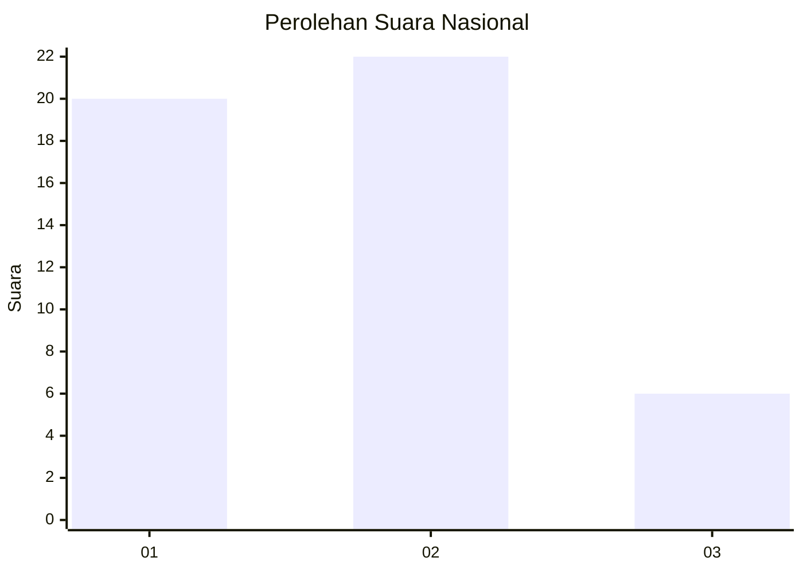
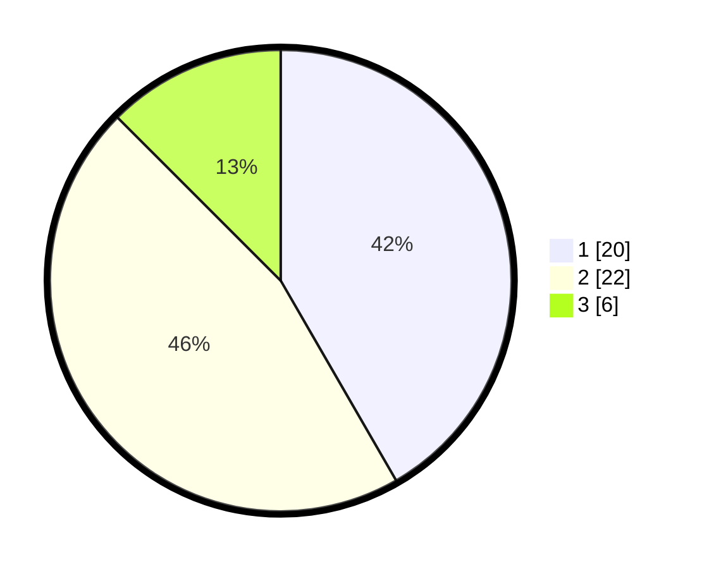

# Hasil

## Grafik

## Tabel

| No. | Nama Paslon    | Suara | Suara (raw) | Persentase |
|:--- |:-------------- | -----:| -----------:| ----------:|
| 1   | ANIES MUHAIMIN | 20    | [20][p-1]   | 41,67      |
| 2   | PRABOWO GIBRAN | 22    | [22][p-2]   | 45,83      |
| 3   | GANJAR MAHFUD  | 6     | [6][p-3]    | 12,50      |

[p-1]: https://github.com/gigit-pemilu/pemilu-2024/blob/main/pilpres/hitung-suara/sub/99-luar-negeri/sub/62-kuala-lumpur-malaysia/sub/01-kuala-lumpur-malaysia/sub/0001-kuala-lumpur-malaysia/sub/459-tps-146/sub/paslon-1.txt
[p-2]: https://github.com/gigit-pemilu/pemilu-2024/blob/main/pilpres/hitung-suara/sub/99-luar-negeri/sub/62-kuala-lumpur-malaysia/sub/01-kuala-lumpur-malaysia/sub/0001-kuala-lumpur-malaysia/sub/459-tps-146/sub/paslon-2.txt
[p-3]: https://github.com/gigit-pemilu/pemilu-2024/blob/main/pilpres/hitung-suara/sub/99-luar-negeri/sub/62-kuala-lumpur-malaysia/sub/01-kuala-lumpur-malaysia/sub/0001-kuala-lumpur-malaysia/sub/459-tps-146/sub/paslon-3.txt

## Foto C Plano

https://sirekap-obj-formc.kpu.go.id/0a2a/pemilu/ppwp/99/62/01/00/01/9962010001459-20240216-005215--75bb3f91-ecf6-4c2d-9583-610f0666dc2f.jpg

https://sirekap-obj-formc.kpu.go.id/0a2a/pemilu/ppwp/99/62/01/00/01/9962010001459-20240216-005346--7a042adf-2852-4db7-9f90-74a1cb474283.jpg

https://sirekap-obj-formc.kpu.go.id/0a2a/pemilu/ppwp/99/62/01/00/01/9962010001459-20240216-005712--ac9c0a57-f393-45b4-bd4f-bfafcb5a573b.jpg

## Metadata

| Key        | Value               |
| ---------- | ------------------- |
| Time Stamp | 2024-02-24 22:31:28 |

## DATA PEMILIH TETAP

Jumlah pemilih dalam DPT: **7**.
 * L: **700**.
 * P: **0**.

## DATA PENGGUNA HAK PILIH

Jumlah pengguna hak pilih dalam DPT: **0**.
 * L: **7044**.
 * P: **70**.

Jumlah pengguna hak pilih dalam DPTb: **715**.
 * L: **4776**.
 * P: **4009**.

Jumlah pengguna hak pilih dalam DPK: **35**.
 * L: **28**.
 * P: **40707**.

Jumlah pengguna hak pilih: **50**.
 * L: **34**.
 * P: **16**.

## JUMLAH SUARA SAH DAN TIDAK SAH

JUMLAH SELURUH SUARA SAH: **48**.

JUMLAH SUARA TIDAK SAH: **2**.

JUMLAH SELURUH SUARA SAH DAN SUARA TIDAK SAH: **50**.

