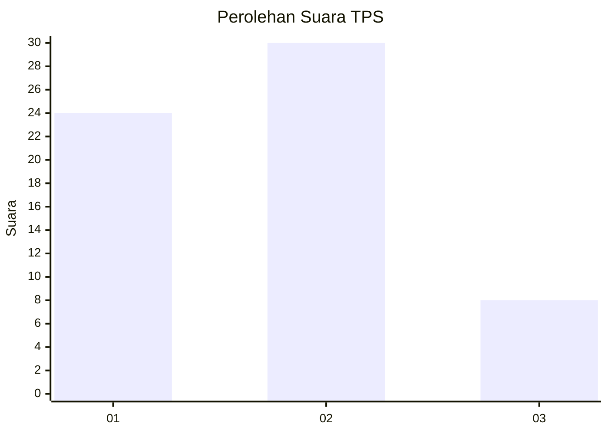
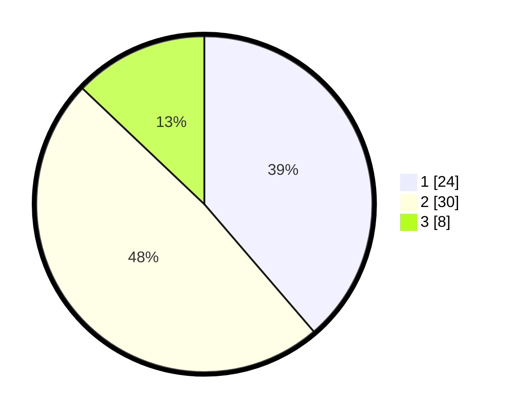

# Hasil

## Grafik

## Tabel

| No. | Nama Paslon    | Suara | Suara (raw) | Persentase |
|:--- |:-------------- | -----:| -----------:| ----------:|
| 1   | ANIES MUHAIMIN | 24    | [24][p-1]   | 38,71      |
| 2   | PRABOWO GIBRAN | 30    | [30][p-2]   | 48,39      |
| 3   | GANJAR MAHFUD  | 8     | [8][p-3]    | 12,90      |

[p-1]: https://github.com/gigit-pemilu/pemilu-2024-99-luar-negeri/blob/main/pilpres/hitung-suara/sub/99-luar-negeri/sub/62-kuala-lumpur-malaysia/sub/01-kuala-lumpur-malaysia/sub/0001-kuala-lumpur-malaysia/sub/460-tps-147/sub/paslon-1.txt
[p-2]: https://github.com/gigit-pemilu/pemilu-2024-99-luar-negeri/blob/main/pilpres/hitung-suara/sub/99-luar-negeri/sub/62-kuala-lumpur-malaysia/sub/01-kuala-lumpur-malaysia/sub/0001-kuala-lumpur-malaysia/sub/460-tps-147/sub/paslon-2.txt
[p-3]: https://github.com/gigit-pemilu/pemilu-2024-99-luar-negeri/blob/main/pilpres/hitung-suara/sub/99-luar-negeri/sub/62-kuala-lumpur-malaysia/sub/01-kuala-lumpur-malaysia/sub/0001-kuala-lumpur-malaysia/sub/460-tps-147/sub/paslon-3.txt

## Foto C Plano

https://sirekap-obj-formc.kpu.go.id/092a/pemilu/ppwp/99/62/01/00/01/9962010001460-20240216-015123--0b935074-493a-4a6e-b246-65724cd66180.jpg

https://sirekap-obj-formc.kpu.go.id/092a/pemilu/ppwp/99/62/01/00/01/9962010001460-20240216-002544--5b9631a4-b301-4bb2-8bb0-e8acf8751fb7.jpg

https://sirekap-obj-formc.kpu.go.id/092a/pemilu/ppwp/99/62/01/00/01/9962010001460-20240216-002648--4c9cca60-bcbd-47cd-83aa-7f594113133e.jpg

## Metadata

| Key        | Value               |
| ---------- | ------------------- |
| Time Stamp | 2024-02-21 16:00:00 |

## DATA PEMILIH TETAP

Jumlah pemilih dalam DPT: **1000**.
 * L: **484**.
 * P: **516**.

## DATA PENGGUNA HAK PILIH

Jumlah pengguna hak pilih dalam DPT: **0**.
 * L: **0**.
 * P: **0**.

Jumlah pengguna hak pilih dalam DPTb: **13**.
 * L: **8**.
 * P: **5**.

Jumlah pengguna hak pilih dalam DPK: **54**.
 * L: **33**.
 * P: **21**.

Jumlah pengguna hak pilih: **67**.
 * L: **41**.
 * P: **26**.

## JUMLAH SUARA SAH DAN TIDAK SAH

JUMLAH SELURUH SUARA SAH: **62**.

JUMLAH SUARA TIDAK SAH: **5**.

JUMLAH SELURUH SUARA SAH DAN SUARA TIDAK SAH: **67**.

