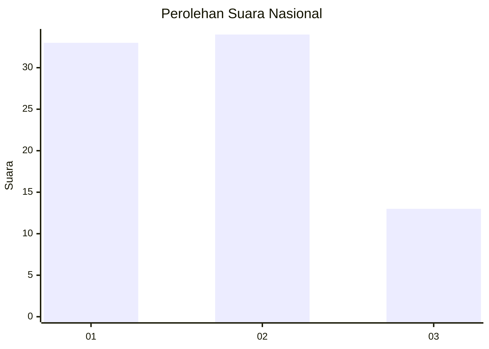
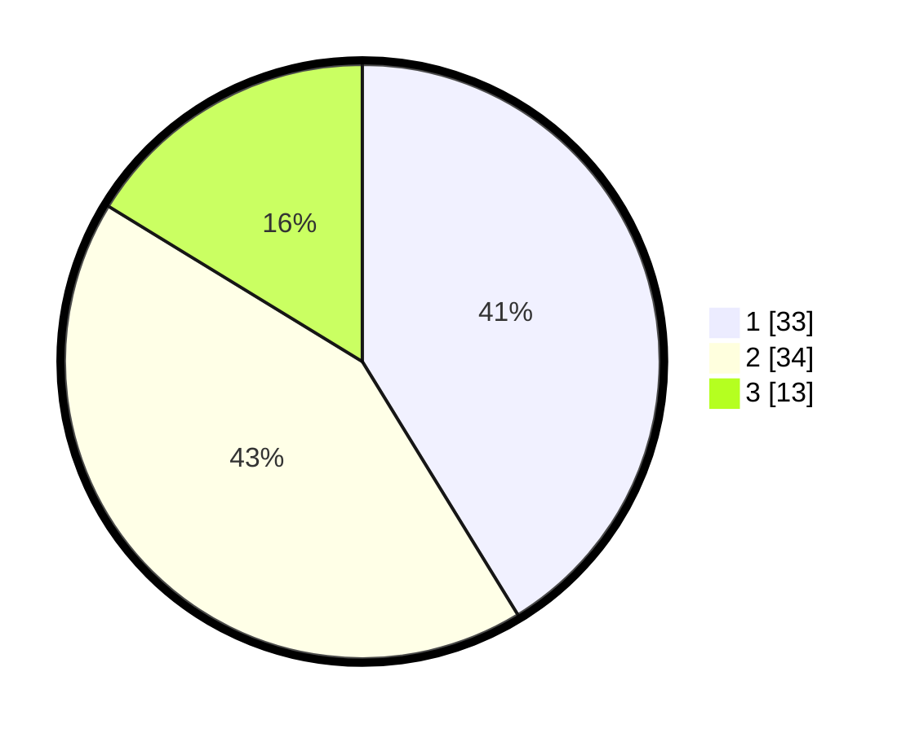

# Hasil

## Grafik

## Tabel

| No. | Nama Paslon    | Suara | Suara (raw) | Persentase |
|:--- |:-------------- | -----:| -----------:| ----------:|
| 1   | ANIES MUHAIMIN | 33    | [33][p-1]   | 41,25      |
| 2   | PRABOWO GIBRAN | 34    | [34][p-2]   | 42,50      |
| 3   | GANJAR MAHFUD  | 13    | [13][p-3]   | 16,25      |

[p-1]: https://github.com/gigit-pemilu/pemilu-2024/blob/main/pilpres/hitung-suara/sub/99-luar-negeri/sub/62-kuala-lumpur-malaysia/sub/01-kuala-lumpur-malaysia/sub/0001-kuala-lumpur-malaysia/sub/471-tps-158/sub/paslon-1.txt
[p-2]: https://github.com/gigit-pemilu/pemilu-2024/blob/main/pilpres/hitung-suara/sub/99-luar-negeri/sub/62-kuala-lumpur-malaysia/sub/01-kuala-lumpur-malaysia/sub/0001-kuala-lumpur-malaysia/sub/471-tps-158/sub/paslon-2.txt
[p-3]: https://github.com/gigit-pemilu/pemilu-2024/blob/main/pilpres/hitung-suara/sub/99-luar-negeri/sub/62-kuala-lumpur-malaysia/sub/01-kuala-lumpur-malaysia/sub/0001-kuala-lumpur-malaysia/sub/471-tps-158/sub/paslon-3.txt

## Foto C Plano

https://sirekap-obj-formc.kpu.go.id/b8da/pemilu/ppwp/99/62/01/00/01/9962010001471-20240215-233134--cbe43bce-21df-486a-aa04-85ca5b078f41.jpg

https://sirekap-obj-formc.kpu.go.id/b8da/pemilu/ppwp/99/62/01/00/01/9962010001471-20240215-233222--fcb51216-d1d1-49f0-b114-e49592dc4d91.jpg

https://sirekap-obj-formc.kpu.go.id/b8da/pemilu/ppwp/99/62/01/00/01/9962010001471-20240215-233502--f0e53455-fb2d-4241-9571-d737d0371ed9.jpg

## Metadata

| Key        | Value               |
| ---------- | ------------------- |
| Time Stamp | 2024-02-24 22:31:28 |

## DATA PEMILIH TETAP

Jumlah pemilih dalam DPT: **1000**.
 * L: **538**.
 * P: **462**.

## DATA PENGGUNA HAK PILIH

Jumlah pengguna hak pilih dalam DPT: **2**.
 * L: **2**.
 * P: **0**.

Jumlah pengguna hak pilih dalam DPTb: **46**.
 * L: **30**.
 * P: **16**.

Jumlah pengguna hak pilih dalam DPK: **36**.
 * L: **24**.
 * P: **12**.

Jumlah pengguna hak pilih: **84**.
 * L: **56**.
 * P: **28**.

## JUMLAH SUARA SAH DAN TIDAK SAH

JUMLAH SELURUH SUARA SAH: **80**.

JUMLAH SUARA TIDAK SAH: **4**.

JUMLAH SELURUH SUARA SAH DAN SUARA TIDAK SAH: **84**.

