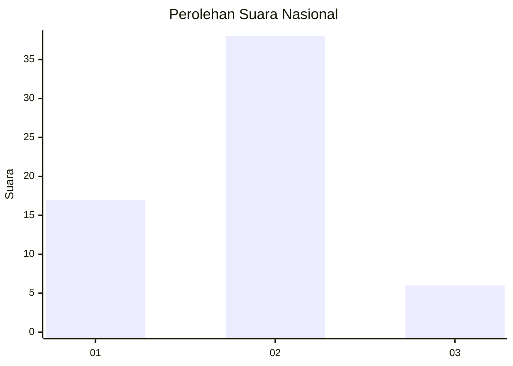
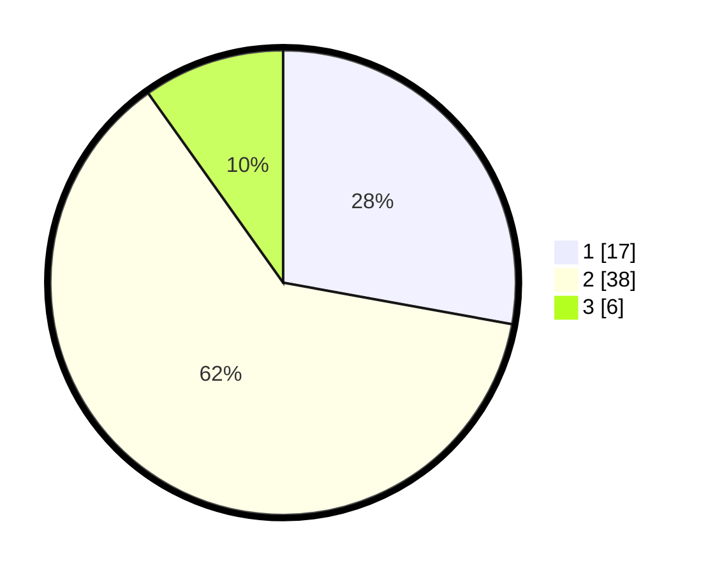

# Hasil

## Grafik

## Tabel

| No. | Nama Paslon    | Suara | Suara (raw) | Persentase |
|:--- |:-------------- | -----:| -----------:| ----------:|
| 1   | ANIES MUHAIMIN | 17    | [17][p-1]   | 27,87      |
| 2   | PRABOWO GIBRAN | 38    | [38][p-2]   | 62,30      |
| 3   | GANJAR MAHFUD  | 6     | [6][p-3]    | 9,84       |

[p-1]: https://github.com/gigit-pemilu/pemilu-2024/blob/main/pilpres/hitung-suara/sub/99-luar-negeri/sub/62-kuala-lumpur-malaysia/sub/01-kuala-lumpur-malaysia/sub/0001-kuala-lumpur-malaysia/sub/482-tps-169/sub/paslon-1.txt
[p-2]: https://github.com/gigit-pemilu/pemilu-2024/blob/main/pilpres/hitung-suara/sub/99-luar-negeri/sub/62-kuala-lumpur-malaysia/sub/01-kuala-lumpur-malaysia/sub/0001-kuala-lumpur-malaysia/sub/482-tps-169/sub/paslon-2.txt
[p-3]: https://github.com/gigit-pemilu/pemilu-2024/blob/main/pilpres/hitung-suara/sub/99-luar-negeri/sub/62-kuala-lumpur-malaysia/sub/01-kuala-lumpur-malaysia/sub/0001-kuala-lumpur-malaysia/sub/482-tps-169/sub/paslon-3.txt

## Foto C Plano

https://sirekap-obj-formc.kpu.go.id/3de1/pemilu/ppwp/99/62/01/00/01/9962010001482-20240215-215331--71416ba0-bf25-4935-8fc3-c477d0bc1c12.jpg

https://sirekap-obj-formc.kpu.go.id/3de1/pemilu/ppwp/99/62/01/00/01/9962010001482-20240216-000244--5cf454ef-b8ce-4694-b513-94ea83b5c95a.jpg

https://sirekap-obj-formc.kpu.go.id/3de1/pemilu/ppwp/99/62/01/00/01/9962010001482-20240215-224857--13751d38-f999-49fe-bfcf-0b8b47106d5b.jpg

## Metadata

| Key        | Value               |
| ---------- | ------------------- |
| Time Stamp | 2024-02-16 02:00:27 |

