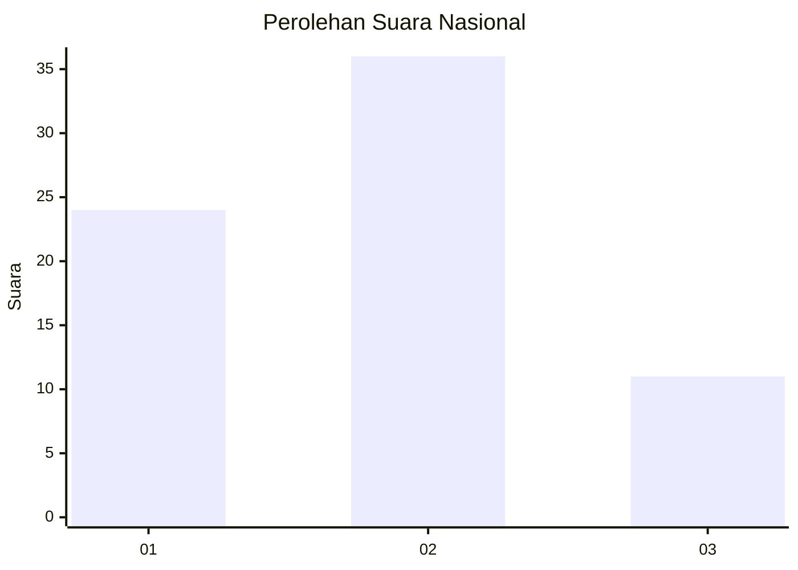
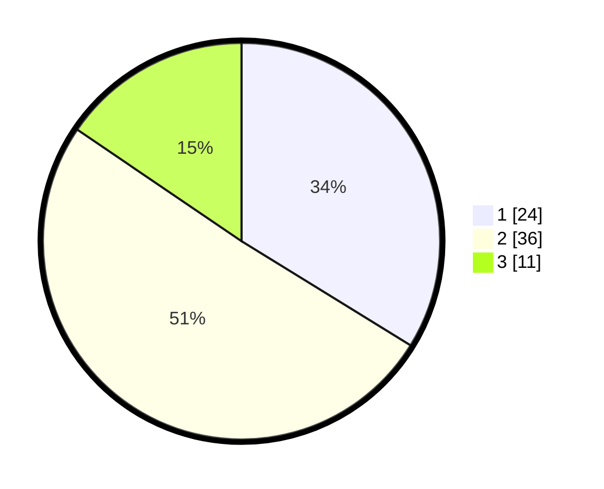

# Hasil

## Grafik

## Tabel

| No. | Nama Paslon    | Suara | Suara (raw) | Persentase |
|:--- |:-------------- | -----:| -----------:| ----------:|
| 1   | ANIES MUHAIMIN | 24    | [24][p-1]   | 33,80      |
| 2   | PRABOWO GIBRAN | 36    | [36][p-2]   | 50,70      |
| 3   | GANJAR MAHFUD  | 11    | [11][p-3]   | 15,49      |

[p-1]: https://github.com/gigit-pemilu/pemilu-2024/blob/main/pilpres/hitung-suara/sub/99-luar-negeri/sub/62-kuala-lumpur-malaysia/sub/01-kuala-lumpur-malaysia/sub/0001-kuala-lumpur-malaysia/sub/498-tps-185/sub/paslon-1.txt
[p-2]: https://github.com/gigit-pemilu/pemilu-2024/blob/main/pilpres/hitung-suara/sub/99-luar-negeri/sub/62-kuala-lumpur-malaysia/sub/01-kuala-lumpur-malaysia/sub/0001-kuala-lumpur-malaysia/sub/498-tps-185/sub/paslon-2.txt
[p-3]: https://github.com/gigit-pemilu/pemilu-2024/blob/main/pilpres/hitung-suara/sub/99-luar-negeri/sub/62-kuala-lumpur-malaysia/sub/01-kuala-lumpur-malaysia/sub/0001-kuala-lumpur-malaysia/sub/498-tps-185/sub/paslon-3.txt

## Foto C Plano

https://sirekap-obj-formc.kpu.go.id/297c/pemilu/ppwp/99/62/01/00/01/9962010001498-20240216-030249--cc147330-4e48-4b1b-8524-1d3dede0986d.jpg

https://sirekap-obj-formc.kpu.go.id/297c/pemilu/ppwp/99/62/01/00/01/9962010001498-20240216-031053--109ca263-3649-4108-8f13-21d0563d4fdd.jpg

https://sirekap-obj-formc.kpu.go.id/297c/pemilu/ppwp/99/62/01/00/01/9962010001498-20240216-031211--92e30580-e2f4-4980-9b60-0292c515fdf4.jpg

## Metadata

| Key        | Value               |
| ---------- | ------------------- |
| Time Stamp | 2024-02-19 06:16:00 |

