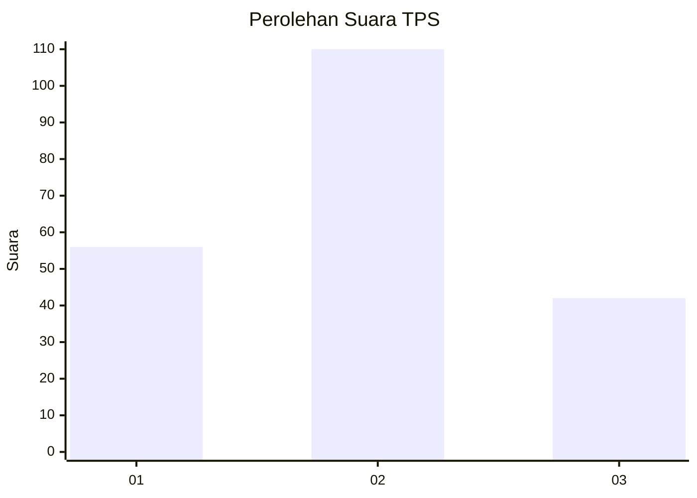
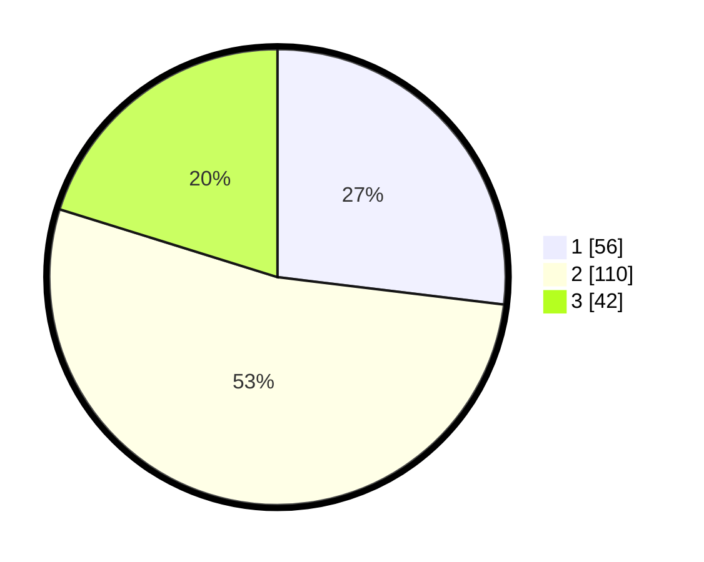

# Hasil

## Grafik

## Tabel

| No. | Nama Paslon    | Suara | Suara (raw) | Persentase |
|:--- |:-------------- | -----:| -----------:| ----------:|
| 1   | ANIES MUHAIMIN | 56    | [56][p-1]   | 26,92      |
| 2   | PRABOWO GIBRAN | 110   | [110][p-2]  | 52,88      |
| 3   | GANJAR MAHFUD  | 42    | [42][p-3]   | 20,19      |

[p-1]: https://github.com/gigit-pemilu/pemilu-2024-99-luar-negeri/blob/main/pilpres/hitung-suara/sub/99-luar-negeri/sub/63-kuching-malaysia/sub/01-kuching-malaysia/sub/0001-kuching-malaysia/sub/001-tps/sub/paslon-1.txt
[p-2]: https://github.com/gigit-pemilu/pemilu-2024-99-luar-negeri/blob/main/pilpres/hitung-suara/sub/99-luar-negeri/sub/63-kuching-malaysia/sub/01-kuching-malaysia/sub/0001-kuching-malaysia/sub/001-tps/sub/paslon-2.txt
[p-3]: https://github.com/gigit-pemilu/pemilu-2024-99-luar-negeri/blob/main/pilpres/hitung-suara/sub/99-luar-negeri/sub/63-kuching-malaysia/sub/01-kuching-malaysia/sub/0001-kuching-malaysia/sub/001-tps/sub/paslon-3.txt

## Foto C Plano

https://sirekap-obj-formc.kpu.go.id/9c0c/pemilu/ppwp/99/63/01/00/01/9963010001001-20240214-194426--062e8bc8-b523-4694-be2c-990bf5b67607.jpg

https://sirekap-obj-formc.kpu.go.id/9c0c/pemilu/ppwp/99/63/01/00/01/9963010001001-20240214-194512--d18637d7-6a92-44e2-92ec-67c7854f9433.jpg

https://sirekap-obj-formc.kpu.go.id/9c0c/pemilu/ppwp/99/63/01/00/01/9963010001001-20240214-194619--f3d6374c-8a0f-441f-8ed6-edad2c6cadf0.jpg

## Metadata

| Key        | Value               |
| ---------- | ------------------- |
| Time Stamp | 2024-02-14 21:46:01 |

## DATA PEMILIH TETAP

Jumlah pemilih dalam DPT: **576**.
 * L: **187**.
 * P: **389**.

## DATA PENGGUNA HAK PILIH

Jumlah pengguna hak pilih dalam DPT: **80**.
 * L: **37**.
 * P: **43**.

Jumlah pengguna hak pilih dalam DPTb: **8**.
 * L: **6**.
 * P: **2**.

Jumlah pengguna hak pilih dalam DPK: **122**.
 * L: **90**.
 * P: **32**.

Jumlah pengguna hak pilih: **210**.
 * L: **133**.
 * P: **77**.

## JUMLAH SUARA SAH DAN TIDAK SAH

JUMLAH SELURUH SUARA SAH: **208**.

JUMLAH SUARA TIDAK SAH: **2**.

JUMLAH SELURUH SUARA SAH DAN SUARA TIDAK SAH: **210**.

