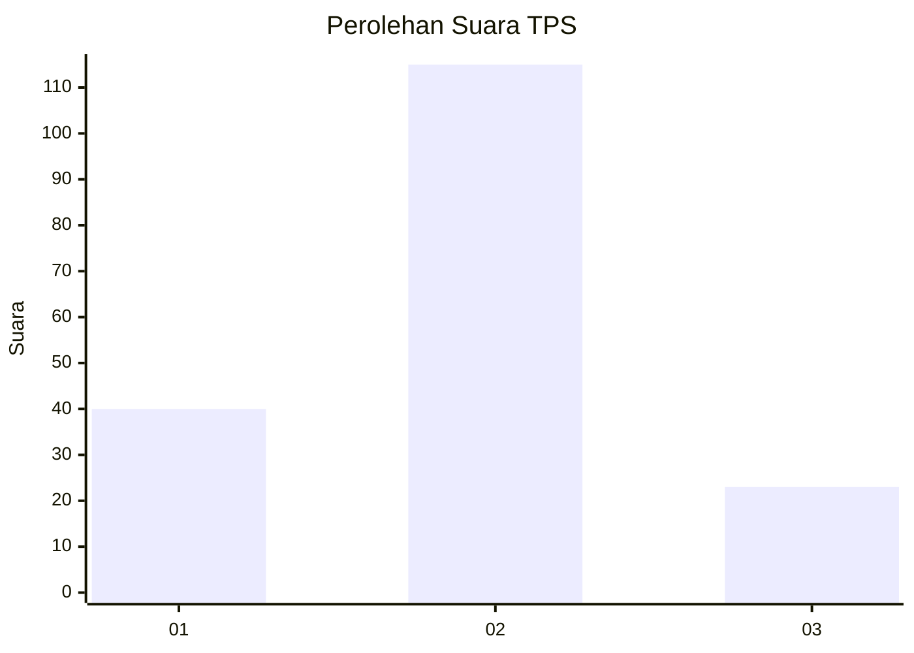
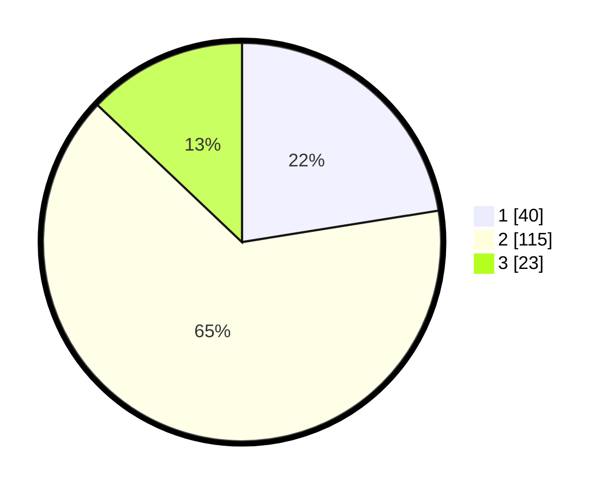

# Hasil

## Grafik

## Tabel

| No. | Nama Paslon    | Suara | Suara (raw) | Persentase |
|:--- |:-------------- | -----:| -----------:| ----------:|
| 1   | ANIES MUHAIMIN | 40    | [40][p-1]   | 22,47      |
| 2   | PRABOWO GIBRAN | 115   | [115][p-2]  | 64,61      |
| 3   | GANJAR MAHFUD  | 23    | [23][p-3]   | 12,92      |

[p-1]: https://github.com/gigit-pemilu/pemilu-2024-99-luar-negeri/blob/main/pilpres/hitung-suara/sub/99-luar-negeri/sub/63-kuching-malaysia/sub/01-kuching-malaysia/sub/0001-kuching-malaysia/sub/003-tps/sub/paslon-1.txt
[p-2]: https://github.com/gigit-pemilu/pemilu-2024-99-luar-negeri/blob/main/pilpres/hitung-suara/sub/99-luar-negeri/sub/63-kuching-malaysia/sub/01-kuching-malaysia/sub/0001-kuching-malaysia/sub/003-tps/sub/paslon-2.txt
[p-3]: https://github.com/gigit-pemilu/pemilu-2024-99-luar-negeri/blob/main/pilpres/hitung-suara/sub/99-luar-negeri/sub/63-kuching-malaysia/sub/01-kuching-malaysia/sub/0001-kuching-malaysia/sub/003-tps/sub/paslon-3.txt

## Foto C Plano

https://sirekap-obj-formc.kpu.go.id/df9e/pemilu/ppwp/99/63/01/00/01/9963010001003-20240214-204934--1b9d2085-8d30-4e7a-9d16-ed350e23b263.jpg

https://sirekap-obj-formc.kpu.go.id/df9e/pemilu/ppwp/99/63/01/00/01/9963010001003-20240214-215925--80b05001-4dbf-4a62-bc51-aa359648e00a.jpg

https://sirekap-obj-formc.kpu.go.id/df9e/pemilu/ppwp/99/63/01/00/01/9963010001003-20240214-205102--798fa254-5725-40fa-a8f8-6346e9ba37d9.jpg

## Metadata

| Key        | Value               |
| ---------- | ------------------- |
| Time Stamp | 2024-02-15 18:30:25 |

## DATA PEMILIH TETAP

Jumlah pemilih dalam DPT: **586**.
 * L: **218**.
 * P: **368**.

## DATA PENGGUNA HAK PILIH

Jumlah pengguna hak pilih dalam DPT: **47**.
 * L: **17**.
 * P: **30**.

Jumlah pengguna hak pilih dalam DPTb: **6**.
 * L: **3**.
 * P: **3**.

Jumlah pengguna hak pilih dalam DPK: **127**.
 * L: **86**.
 * P: **41**.

Jumlah pengguna hak pilih: **180**.
 * L: **106**.
 * P: **74**.

## JUMLAH SUARA SAH DAN TIDAK SAH

JUMLAH SELURUH SUARA SAH: **178**.

JUMLAH SUARA TIDAK SAH: **2**.

JUMLAH SELURUH SUARA SAH DAN SUARA TIDAK SAH: **180**.

