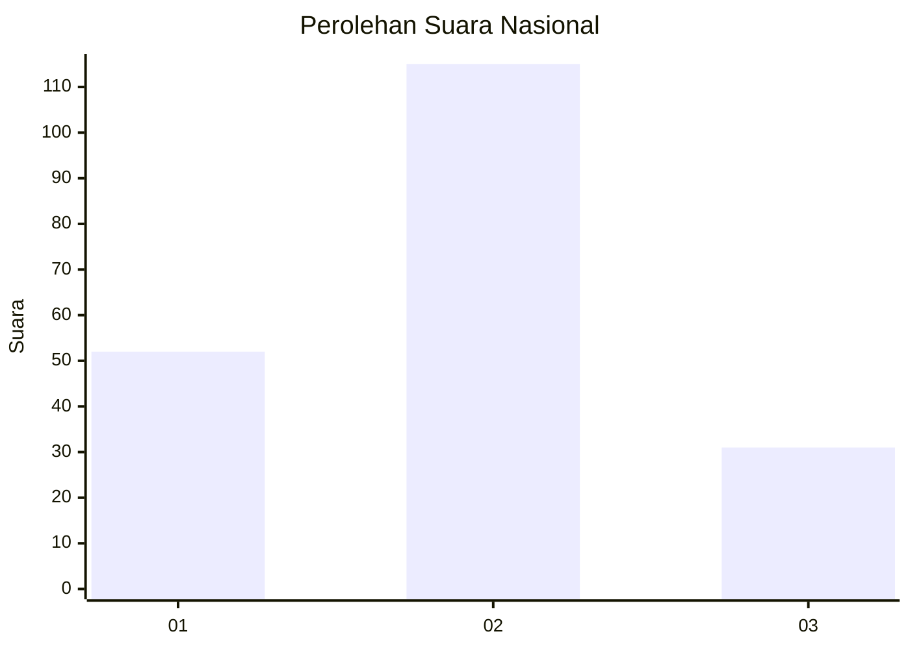

# Hasil

## Grafik

## Tabel

| No. | Nama Paslon    | Suara | Suara (raw) | Persentase |
|:--- |:-------------- | -----:| -----------:| ----------:|
| 1   | ANIES MUHAIMIN | 52    | [52][p-1]   | 26,26      |
| 2   | PRABOWO GIBRAN | 115   | [115][p-2]  | 58,08      |
| 3   | GANJAR MAHFUD  | 31    | [31][p-3]   | 15,66      |

[p-1]: https://github.com/gigit-pemilu/pemilu-2024/blob/main/pilpres/hitung-suara/sub/99-luar-negeri/sub/63-kuching-malaysia/sub/01-kuching-malaysia/sub/0001-kuching-malaysia/sub/004-tps/sub/paslon-1.txt
[p-2]: https://github.com/gigit-pemilu/pemilu-2024/blob/main/pilpres/hitung-suara/sub/99-luar-negeri/sub/63-kuching-malaysia/sub/01-kuching-malaysia/sub/0001-kuching-malaysia/sub/004-tps/sub/paslon-2.txt
[p-3]: https://github.com/gigit-pemilu/pemilu-2024/blob/main/pilpres/hitung-suara/sub/99-luar-negeri/sub/63-kuching-malaysia/sub/01-kuching-malaysia/sub/0001-kuching-malaysia/sub/004-tps/sub/paslon-3.txt

## Foto C Plano

https://sirekap-obj-formc.kpu.go.id/4cce/pemilu/ppwp/99/63/01/00/01/9963010001004-20240214-230157--2ec398ba-2e8b-4b49-a999-a9bb1d7edf70.jpg

https://sirekap-obj-formc.kpu.go.id/4cce/pemilu/ppwp/99/63/01/00/01/9963010001004-20240215-142710--63147552-4909-4fb4-85c5-fe30d3ef0153.jpg

https://sirekap-obj-formc.kpu.go.id/4cce/pemilu/ppwp/99/63/01/00/01/9963010001004-20240214-212104--5ca91147-8851-4806-978e-d2f3f20e7486.jpg

## Metadata

| Key        | Value               |
| ---------- | ------------------- |
| Time Stamp | 2024-02-22 08:00:00 |

