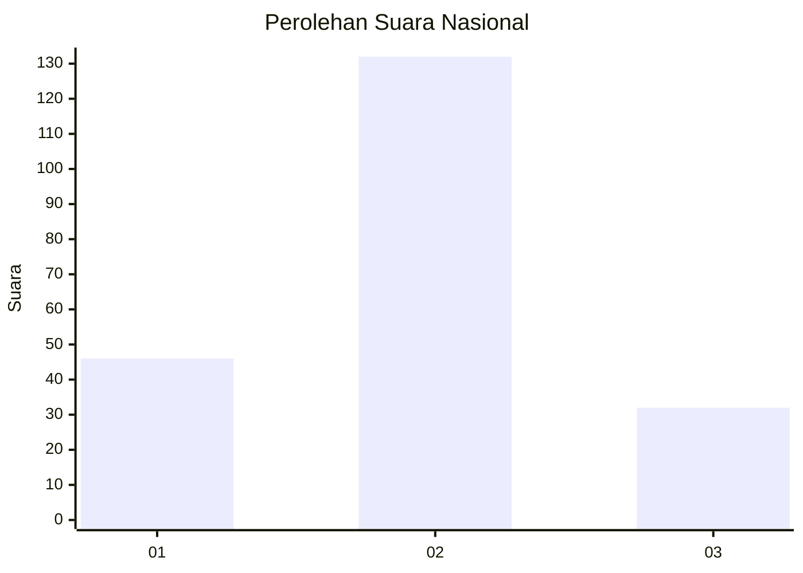
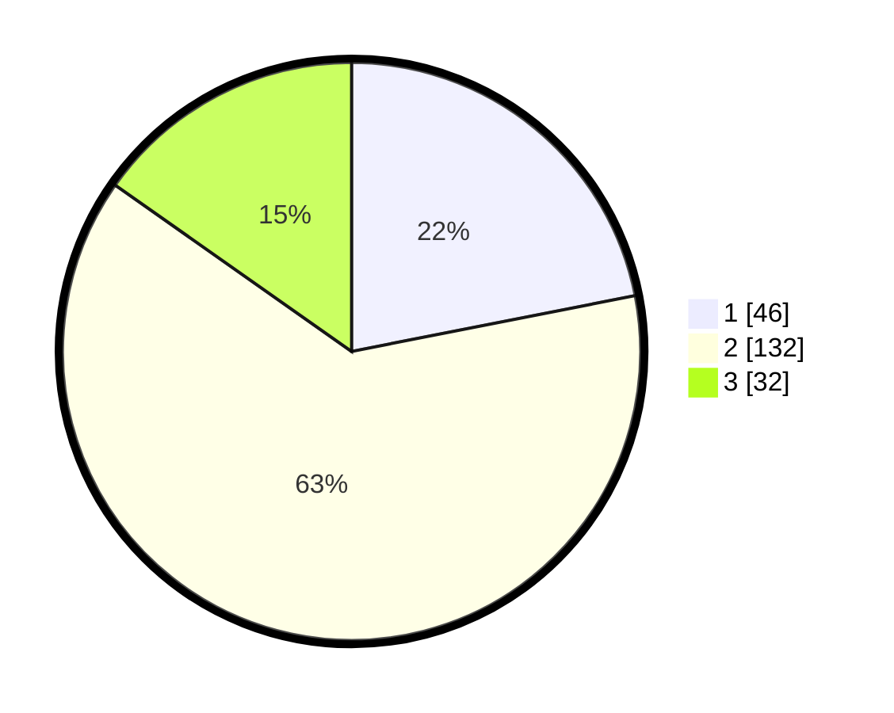

# Hasil

## Grafik

## Tabel

| No. | Nama Paslon    | Suara | Suara (raw) | Persentase |
|:--- |:-------------- | -----:| -----------:| ----------:|
| 1   | ANIES MUHAIMIN | 46    | [46][p-1]   | 21,90      |
| 2   | PRABOWO GIBRAN | 132   | [132][p-2]  | 62,86      |
| 3   | GANJAR MAHFUD  | 32    | [32][p-3]   | 15,24      |

[p-1]: https://github.com/gigit-pemilu/pemilu-2024/blob/main/pilpres/hitung-suara/sub/99-luar-negeri/sub/63-kuching-malaysia/sub/01-kuching-malaysia/sub/0001-kuching-malaysia/sub/005-tps/sub/paslon-1.txt
[p-2]: https://github.com/gigit-pemilu/pemilu-2024/blob/main/pilpres/hitung-suara/sub/99-luar-negeri/sub/63-kuching-malaysia/sub/01-kuching-malaysia/sub/0001-kuching-malaysia/sub/005-tps/sub/paslon-2.txt
[p-3]: https://github.com/gigit-pemilu/pemilu-2024/blob/main/pilpres/hitung-suara/sub/99-luar-negeri/sub/63-kuching-malaysia/sub/01-kuching-malaysia/sub/0001-kuching-malaysia/sub/005-tps/sub/paslon-3.txt

## Foto C Plano

https://sirekap-obj-formc.kpu.go.id/37ce/pemilu/ppwp/99/63/01/00/01/9963010001005-20240215-224733--244d3e8d-1dd6-4a42-94cc-19c136b26caa.jpg

https://sirekap-obj-formc.kpu.go.id/37ce/pemilu/ppwp/99/63/01/00/01/9963010001005-20240214-202404--28d1de89-d98c-4a00-b6da-d992522ee8b3.jpg

https://sirekap-obj-formc.kpu.go.id/37ce/pemilu/ppwp/99/63/01/00/01/9963010001005-20240214-195314--c7cbfaa4-ddc7-4bc9-a057-f3d1ec8a2e83.jpg

## Metadata

| Key        | Value               |
| ---------- | ------------------- |
| Time Stamp | 2024-02-15 23:29:50 |

## DATA PEMILIH TETAP

Jumlah pemilih dalam DPT: **676**.
 * L: **425**.
 * P: **251**.

## DATA PENGGUNA HAK PILIH

Jumlah pengguna hak pilih dalam DPT: **78**.
 * L: **34**.
 * P: **44**.

Jumlah pengguna hak pilih dalam DPTb: **8**.
 * L: **6**.
 * P: **2**.

Jumlah pengguna hak pilih dalam DPK: **125**.
 * L: **82**.
 * P: **43**.

Jumlah pengguna hak pilih: **211**.
 * L: **122**.
 * P: **89**.

## JUMLAH SUARA SAH DAN TIDAK SAH

JUMLAH SELURUH SUARA SAH: **210**.

JUMLAH SUARA TIDAK SAH: **1**.

JUMLAH SELURUH SUARA SAH DAN SUARA TIDAK SAH: **211**.

