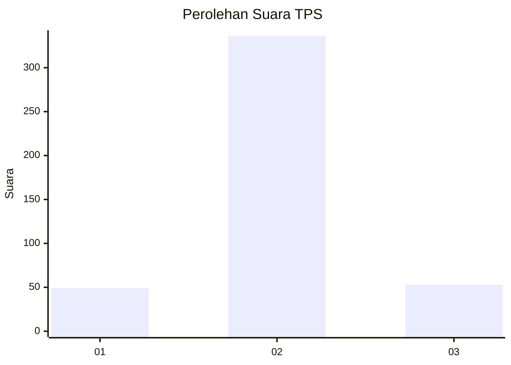
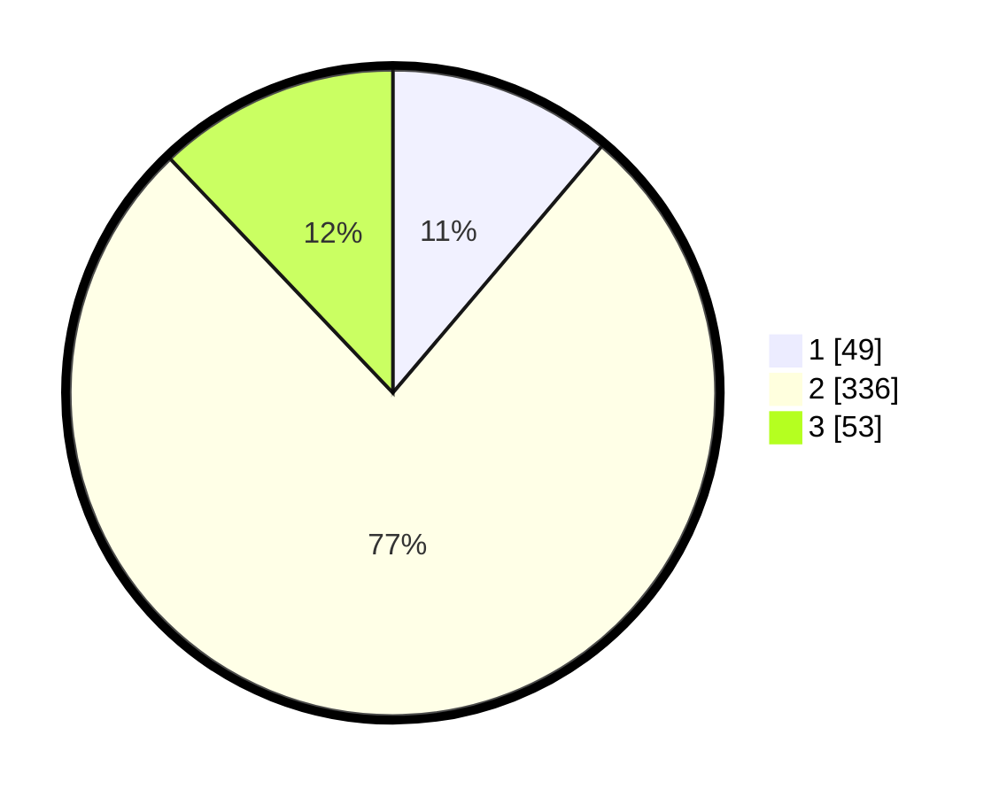

# Hasil

## Grafik

## Tabel

| No. | Nama Paslon    | Suara | Suara (raw) | Persentase |
|:--- |:-------------- | -----:| -----------:| ----------:|
| 1   | ANIES MUHAIMIN | 49    | [49][p-1]   | 11,19      |
| 2   | PRABOWO GIBRAN | 336   | [336][p-2]  | 76,71      |
| 3   | GANJAR MAHFUD  | 53    | [53][p-3]   | 12,10      |

[p-1]: https://github.com/gigit-pemilu/pemilu-2024-99-luar-negeri/blob/main/pilpres/hitung-suara/sub/99-luar-negeri/sub/63-kuching-malaysia/sub/01-kuching-malaysia/sub/0001-kuching-malaysia/sub/006-ksk-001/sub/paslon-1.txt
[p-2]: https://github.com/gigit-pemilu/pemilu-2024-99-luar-negeri/blob/main/pilpres/hitung-suara/sub/99-luar-negeri/sub/63-kuching-malaysia/sub/01-kuching-malaysia/sub/0001-kuching-malaysia/sub/006-ksk-001/sub/paslon-2.txt
[p-3]: https://github.com/gigit-pemilu/pemilu-2024-99-luar-negeri/blob/main/pilpres/hitung-suara/sub/99-luar-negeri/sub/63-kuching-malaysia/sub/01-kuching-malaysia/sub/0001-kuching-malaysia/sub/006-ksk-001/sub/paslon-3.txt

## Foto C Plano

https://sirekap-obj-formc.kpu.go.id/c569/pemilu/ppwp/99/63/01/00/01/9963010001006-20240214-220951--dc29d83e-5311-4b4d-83a9-f50fc507a7c1.jpg

https://sirekap-obj-formc.kpu.go.id/c569/pemilu/ppwp/99/63/01/00/01/9963010001006-20240214-221123--88dbe667-4f3e-4e0e-89a2-c8bb7b8f6db1.jpg

https://sirekap-obj-formc.kpu.go.id/c569/pemilu/ppwp/99/63/01/00/01/9963010001006-20240214-221140--8359923f-b5da-444f-b0bd-5fa6aa179b66.jpg

## Metadata

| Key        | Value               |
| ---------- | ------------------- |
| Time Stamp | 2024-02-21 15:00:00 |

## DATA PEMILIH TETAP

Jumlah pemilih dalam DPT: **447**.
 * L: **377**.
 * P: **70**.

## DATA PENGGUNA HAK PILIH

Jumlah pengguna hak pilih dalam DPT: **193**.
 * L: **161**.
 * P: **32**.

Jumlah pengguna hak pilih dalam DPTb: **0**.
 * L: **0**.
 * P: **0**.

Jumlah pengguna hak pilih dalam DPK: **263**.
 * L: **219**.
 * P: **44**.

Jumlah pengguna hak pilih: **456**.
 * L: **380**.
 * P: **76**.

## JUMLAH SUARA SAH DAN TIDAK SAH

JUMLAH SELURUH SUARA SAH: **438**.

JUMLAH SUARA TIDAK SAH: **18**.

JUMLAH SELURUH SUARA SAH DAN SUARA TIDAK SAH: **456**.

