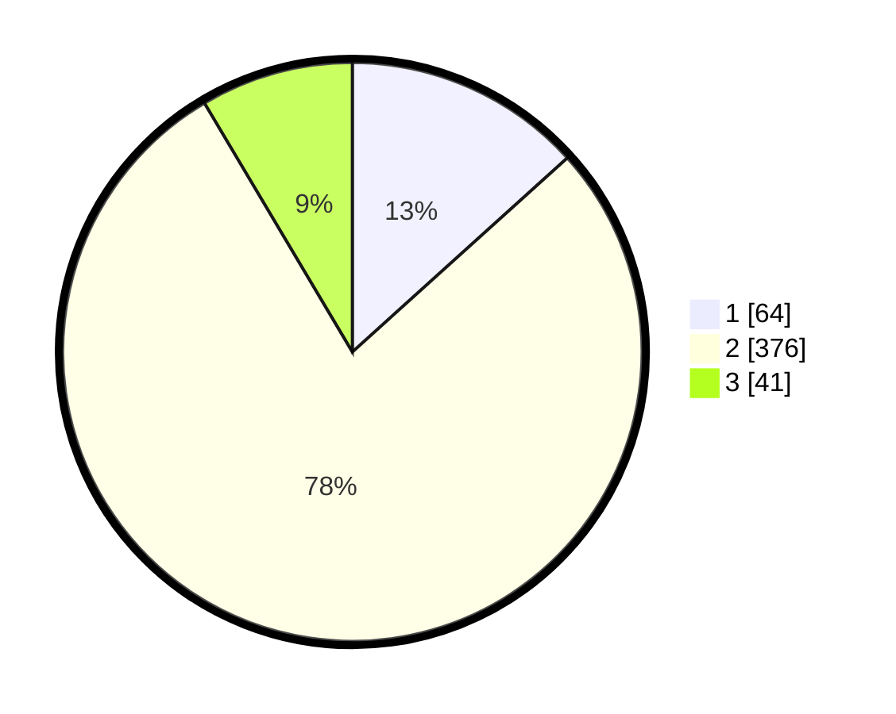

# Hasil

## Grafik

## Tabel

| No. | Nama Paslon    | Suara | Suara (raw) | Persentase |
|:--- |:-------------- | -----:| -----------:| ----------:|
| 1   | ANIES MUHAIMIN | 64    | [64][p-1]   | 13,31      |
| 2   | PRABOWO GIBRAN | 376   | [376][p-2]  | 78,17      |
| 3   | GANJAR MAHFUD  | 41    | [41][p-3]   | 8,52       |

[p-1]: https://github.com/gigit-pemilu/pemilu-2024-99-luar-negeri/blob/main/pilpres/hitung-suara/sub/99-luar-negeri/sub/63-kuching-malaysia/sub/01-kuching-malaysia/sub/0001-kuching-malaysia/sub/007-ksk-002/sub/paslon-1.txt
[p-2]: https://github.com/gigit-pemilu/pemilu-2024-99-luar-negeri/blob/main/pilpres/hitung-suara/sub/99-luar-negeri/sub/63-kuching-malaysia/sub/01-kuching-malaysia/sub/0001-kuching-malaysia/sub/007-ksk-002/sub/paslon-2.txt
[p-3]: https://github.com/gigit-pemilu/pemilu-2024-99-luar-negeri/blob/main/pilpres/hitung-suara/sub/99-luar-negeri/sub/63-kuching-malaysia/sub/01-kuching-malaysia/sub/0001-kuching-malaysia/sub/007-ksk-002/sub/paslon-3.txt

## Foto C Plano

https://sirekap-obj-formc.kpu.go.id/316c/pemilu/ppwp/99/63/01/00/01/9963010001007-20240214-231235--03e3eda4-6d26-4c7a-9f60-30bf5f17c47f.jpg

https://sirekap-obj-formc.kpu.go.id/316c/pemilu/ppwp/99/63/01/00/01/9963010001007-20240214-231416--ceab57bd-29c6-4897-927e-da3d01106b33.jpg

https://sirekap-obj-formc.kpu.go.id/316c/pemilu/ppwp/99/63/01/00/01/9963010001007-20240214-231638--23be6cce-b98b-46cc-bb3e-79ef23993eee.jpg

## Metadata

| Key        | Value               |
| ---------- | ------------------- |
| Time Stamp | 2024-02-22 08:00:00 |

