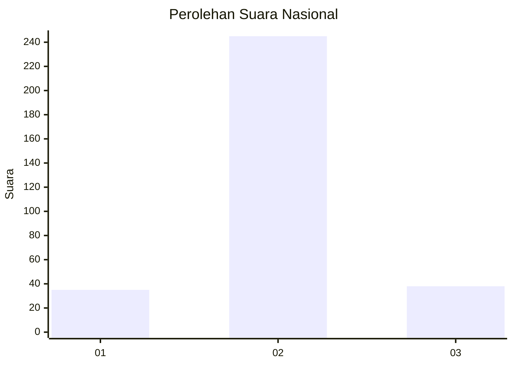
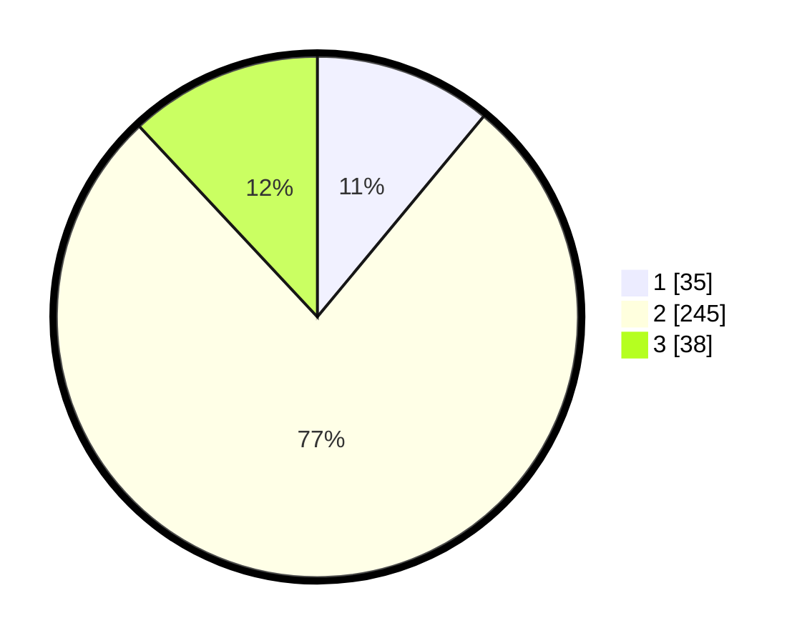

# Hasil

## Grafik

## Tabel

| No. | Nama Paslon    | Suara | Suara (raw) | Persentase |
|:--- |:-------------- | -----:| -----------:| ----------:|
| 1   | ANIES MUHAIMIN | 35    | [35][p-1]   | 11,01      |
| 2   | PRABOWO GIBRAN | 245   | [245][p-2]  | 77,04      |
| 3   | GANJAR MAHFUD  | 38    | [38][p-3]   | 11,95      |

[p-1]: https://github.com/gigit-pemilu/pemilu-2024/blob/main/pilpres/hitung-suara/sub/99-luar-negeri/sub/63-kuching-malaysia/sub/01-kuching-malaysia/sub/0001-kuching-malaysia/sub/011-ksk-006/sub/paslon-1.txt
[p-2]: https://github.com/gigit-pemilu/pemilu-2024/blob/main/pilpres/hitung-suara/sub/99-luar-negeri/sub/63-kuching-malaysia/sub/01-kuching-malaysia/sub/0001-kuching-malaysia/sub/011-ksk-006/sub/paslon-2.txt
[p-3]: https://github.com/gigit-pemilu/pemilu-2024/blob/main/pilpres/hitung-suara/sub/99-luar-negeri/sub/63-kuching-malaysia/sub/01-kuching-malaysia/sub/0001-kuching-malaysia/sub/011-ksk-006/sub/paslon-3.txt

## Foto C Plano

https://sirekap-obj-formc.kpu.go.id/7ab2/pemilu/ppwp/99/63/01/00/01/9963010001011-20240216-184538--4579bf1f-45d8-4054-8114-546c4436d9e1.jpg

https://sirekap-obj-formc.kpu.go.id/7ab2/pemilu/ppwp/99/63/01/00/01/9963010001011-20240216-183853--2334fcf1-02d0-494e-a5e8-fa524de61cdc.jpg

https://sirekap-obj-formc.kpu.go.id/7ab2/pemilu/ppwp/99/63/01/00/01/9963010001011-20240216-184224--4e49a464-402b-4c5a-a1f1-1f6f0209d497.jpg

## Metadata

| Key        | Value               |
| ---------- | ------------------- |
| Time Stamp | 2024-02-22 08:00:00 |

