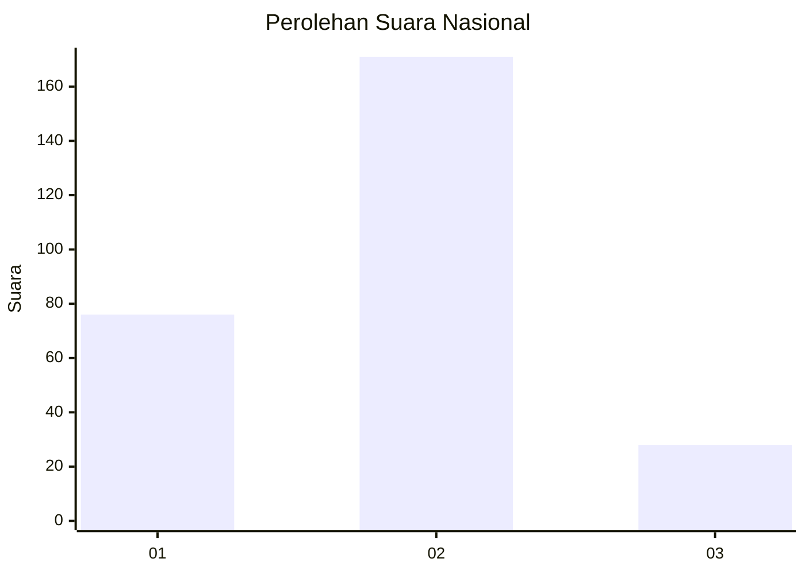
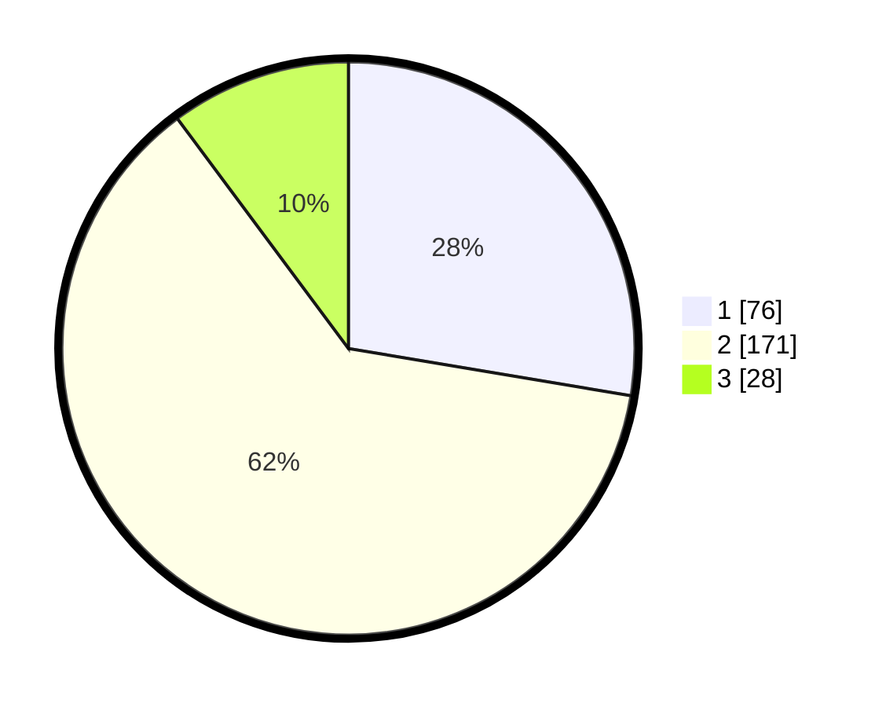

# Hasil

## Grafik

## Tabel

| No. | Nama Paslon    | Suara | Suara (raw) | Persentase |
|:--- |:-------------- | -----:| -----------:| ----------:|
| 1   | ANIES MUHAIMIN | 76    | [76][p-1]   | 27,64      |
| 2   | PRABOWO GIBRAN | 171   | [171][p-2]  | 62,18      |
| 3   | GANJAR MAHFUD  | 28    | [28][p-3]   | 10,18      |

[p-1]: https://github.com/gigit-pemilu/pemilu-2024/blob/main/pilpres/hitung-suara/sub/99-luar-negeri/sub/63-kuching-malaysia/sub/01-kuching-malaysia/sub/0001-kuching-malaysia/sub/013-ksk-008/sub/paslon-1.txt
[p-2]: https://github.com/gigit-pemilu/pemilu-2024/blob/main/pilpres/hitung-suara/sub/99-luar-negeri/sub/63-kuching-malaysia/sub/01-kuching-malaysia/sub/0001-kuching-malaysia/sub/013-ksk-008/sub/paslon-2.txt
[p-3]: https://github.com/gigit-pemilu/pemilu-2024/blob/main/pilpres/hitung-suara/sub/99-luar-negeri/sub/63-kuching-malaysia/sub/01-kuching-malaysia/sub/0001-kuching-malaysia/sub/013-ksk-008/sub/paslon-3.txt

## Foto C Plano

https://sirekap-obj-formc.kpu.go.id/092f/pemilu/ppwp/99/63/01/00/01/9963010001013-20240214-205426--589e93d2-24b0-4477-b9f8-4c542a1f53b6.jpg

https://sirekap-obj-formc.kpu.go.id/092f/pemilu/ppwp/99/63/01/00/01/9963010001013-20240214-214113--1ca15f46-2c6a-474a-998b-9fbd100835ff.jpg

https://sirekap-obj-formc.kpu.go.id/092f/pemilu/ppwp/99/63/01/00/01/9963010001013-20240214-212820--8e343211-9b22-417a-a2a4-19c4dfe12315.jpg

## Metadata

| Key        | Value               |
| ---------- | ------------------- |
| Time Stamp | 2024-02-15 18:30:25 |

