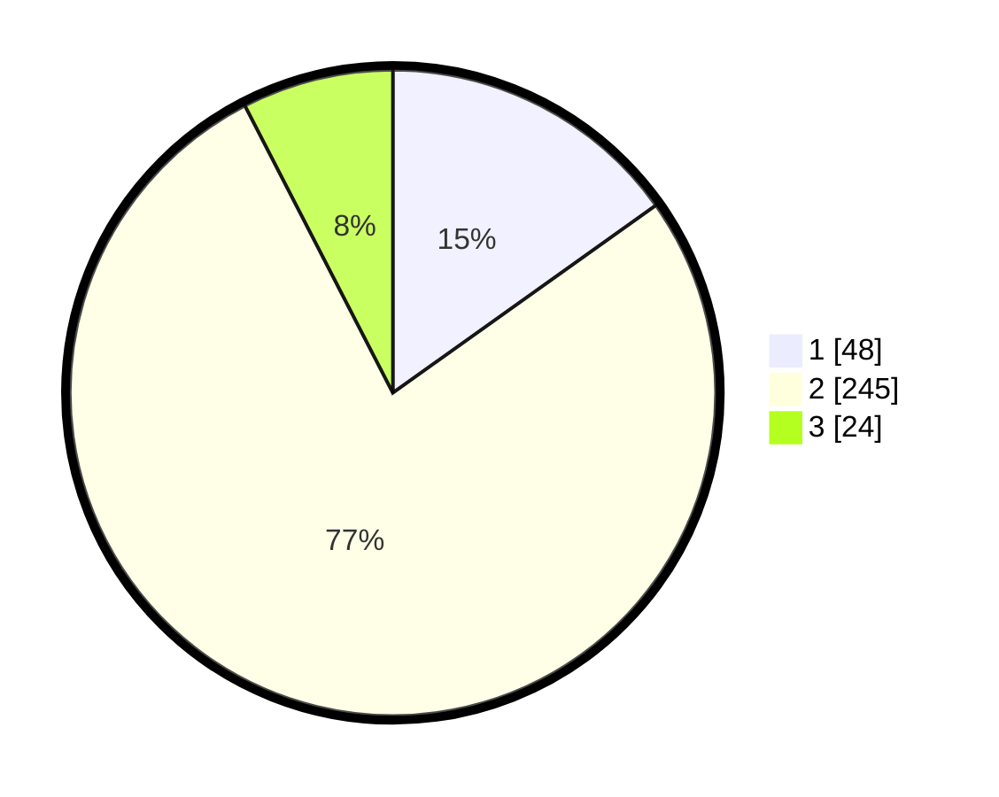

# Hasil

## Grafik

## Tabel

| No. | Nama Paslon    | Suara | Suara (raw) | Persentase |
|:--- |:-------------- | -----:| -----------:| ----------:|
| 1   | ANIES MUHAIMIN | 48    | [48][p-1]   | 15,14      |
| 2   | PRABOWO GIBRAN | 245   | [245][p-2]  | 77,29      |
| 3   | GANJAR MAHFUD  | 24    | [24][p-3]   | 7,57       |

[p-1]: https://github.com/gigit-pemilu/pemilu-2024/blob/main/pilpres/hitung-suara/sub/99-luar-negeri/sub/63-kuching-malaysia/sub/01-kuching-malaysia/sub/0001-kuching-malaysia/sub/017-ksk-012/sub/paslon-1.txt
[p-2]: https://github.com/gigit-pemilu/pemilu-2024/blob/main/pilpres/hitung-suara/sub/99-luar-negeri/sub/63-kuching-malaysia/sub/01-kuching-malaysia/sub/0001-kuching-malaysia/sub/017-ksk-012/sub/paslon-2.txt
[p-3]: https://github.com/gigit-pemilu/pemilu-2024/blob/main/pilpres/hitung-suara/sub/99-luar-negeri/sub/63-kuching-malaysia/sub/01-kuching-malaysia/sub/0001-kuching-malaysia/sub/017-ksk-012/sub/paslon-3.txt

## Foto C Plano

https://sirekap-obj-formc.kpu.go.id/8897/pemilu/ppwp/99/63/01/00/01/9963010001017-20240215-011047--10d90933-097a-4796-8cb2-f6b0da660f2e.jpg

https://sirekap-obj-formc.kpu.go.id/8897/pemilu/ppwp/99/63/01/00/01/9963010001017-20240215-011131--54ca25a6-78a8-457a-a791-5c4703d74a9d.jpg

https://sirekap-obj-formc.kpu.go.id/8897/pemilu/ppwp/99/63/01/00/01/9963010001017-20240215-011204--2b050b31-7dab-415c-b041-e70c4b2c4065.jpg

## Metadata

| Key        | Value               |
| ---------- | ------------------- |
| Time Stamp | 2024-02-22 08:00:00 |

