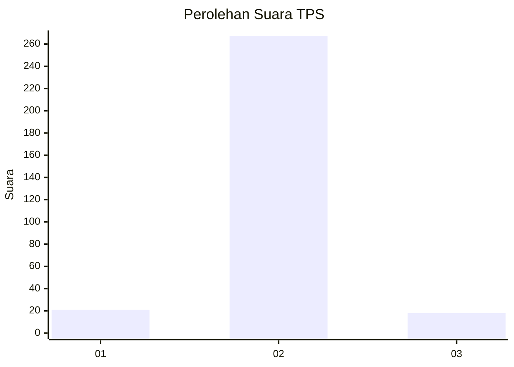
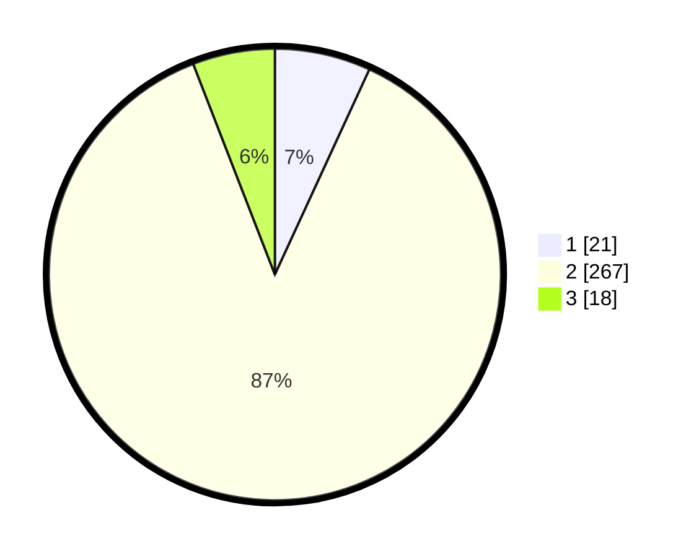

# Hasil

## Grafik

## Tabel

| No. | Nama Paslon    | Suara | Suara (raw) | Persentase |
|:--- |:-------------- | -----:| -----------:| ----------:|
| 1   | ANIES MUHAIMIN | 21    | [21][p-1]   | 6,86       |
| 2   | PRABOWO GIBRAN | 267   | [267][p-2]  | 87,25      |
| 3   | GANJAR MAHFUD  | 18    | [18][p-3]   | 5,88       |

[p-1]: https://github.com/gigit-pemilu/pemilu-2024-99-luar-negeri/blob/main/pilpres/hitung-suara/sub/99-luar-negeri/sub/63-kuching-malaysia/sub/01-kuching-malaysia/sub/0001-kuching-malaysia/sub/020-ksk-015/sub/paslon-1.txt
[p-2]: https://github.com/gigit-pemilu/pemilu-2024-99-luar-negeri/blob/main/pilpres/hitung-suara/sub/99-luar-negeri/sub/63-kuching-malaysia/sub/01-kuching-malaysia/sub/0001-kuching-malaysia/sub/020-ksk-015/sub/paslon-2.txt
[p-3]: https://github.com/gigit-pemilu/pemilu-2024-99-luar-negeri/blob/main/pilpres/hitung-suara/sub/99-luar-negeri/sub/63-kuching-malaysia/sub/01-kuching-malaysia/sub/0001-kuching-malaysia/sub/020-ksk-015/sub/paslon-3.txt

## Foto C Plano

https://sirekap-obj-formc.kpu.go.id/e241/pemilu/ppwp/99/63/01/00/01/9963010001020-20240215-140807--a2c83cb3-327d-418d-a9cc-e1092e04f5ea.jpg

https://sirekap-obj-formc.kpu.go.id/e241/pemilu/ppwp/99/63/01/00/01/9963010001020-20240215-141004--f86d2e10-f867-4c27-bcaa-e794dbebb5c5.jpg

https://sirekap-obj-formc.kpu.go.id/e241/pemilu/ppwp/99/63/01/00/01/9963010001020-20240215-141218--213c6f63-d3b0-4da4-bf7c-6da7e5b51b90.jpg

## Metadata

| Key        | Value               |
| ---------- | ------------------- |
| Time Stamp | 2024-02-22 08:00:00 |

