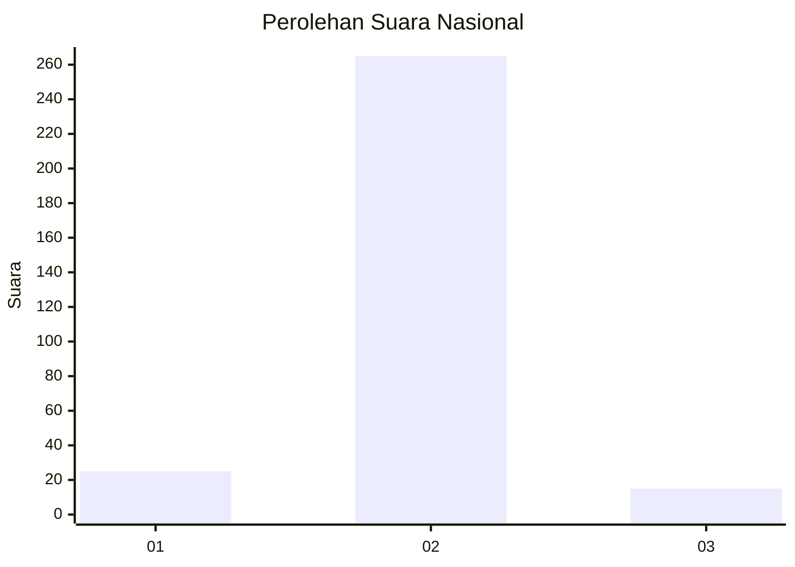
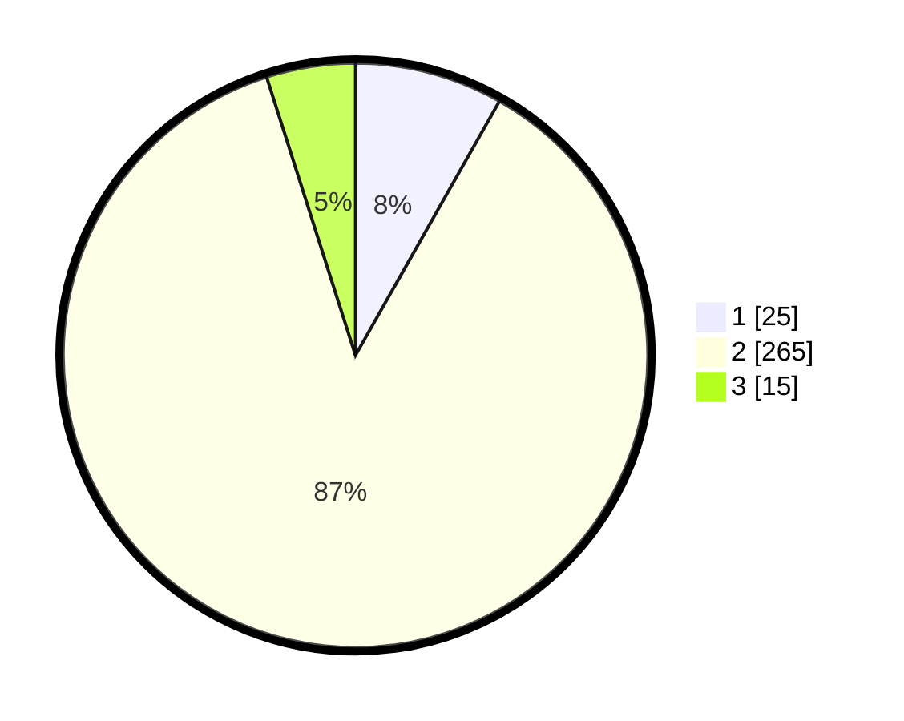

# Hasil

## Grafik

## Tabel

| No. | Nama Paslon    | Suara | Suara (raw) | Persentase |
|:--- |:-------------- | -----:| -----------:| ----------:|
| 1   | ANIES MUHAIMIN | 25    | [25][p-1]   | 8,20       |
| 2   | PRABOWO GIBRAN | 265   | [265][p-2]  | 86,89      |
| 3   | GANJAR MAHFUD  | 15    | [15][p-3]   | 4,92       |

[p-1]: https://github.com/gigit-pemilu/pemilu-2024/blob/main/pilpres/hitung-suara/sub/99-luar-negeri/sub/63-kuching-malaysia/sub/01-kuching-malaysia/sub/0001-kuching-malaysia/sub/021-ksk-016/sub/paslon-1.txt
[p-2]: https://github.com/gigit-pemilu/pemilu-2024/blob/main/pilpres/hitung-suara/sub/99-luar-negeri/sub/63-kuching-malaysia/sub/01-kuching-malaysia/sub/0001-kuching-malaysia/sub/021-ksk-016/sub/paslon-2.txt
[p-3]: https://github.com/gigit-pemilu/pemilu-2024/blob/main/pilpres/hitung-suara/sub/99-luar-negeri/sub/63-kuching-malaysia/sub/01-kuching-malaysia/sub/0001-kuching-malaysia/sub/021-ksk-016/sub/paslon-3.txt

## Foto C Plano

https://sirekap-obj-formc.kpu.go.id/e6ee/pemilu/ppwp/99/63/01/00/01/9963010001021-20240214-233307--e83f30f0-3ebc-44e6-a04d-70e0057e0016.jpg

https://sirekap-obj-formc.kpu.go.id/e6ee/pemilu/ppwp/99/63/01/00/01/9963010001021-20240214-233403--1458464b-4681-4b6d-9b72-741f8d86e226.jpg

https://sirekap-obj-formc.kpu.go.id/e6ee/pemilu/ppwp/99/63/01/00/01/9963010001021-20240214-233504--7d234b5f-5c32-466b-9cfc-b57829a13284.jpg

## Metadata

| Key        | Value               |
| ---------- | ------------------- |
| Time Stamp | 2024-02-15 15:00:29 |

