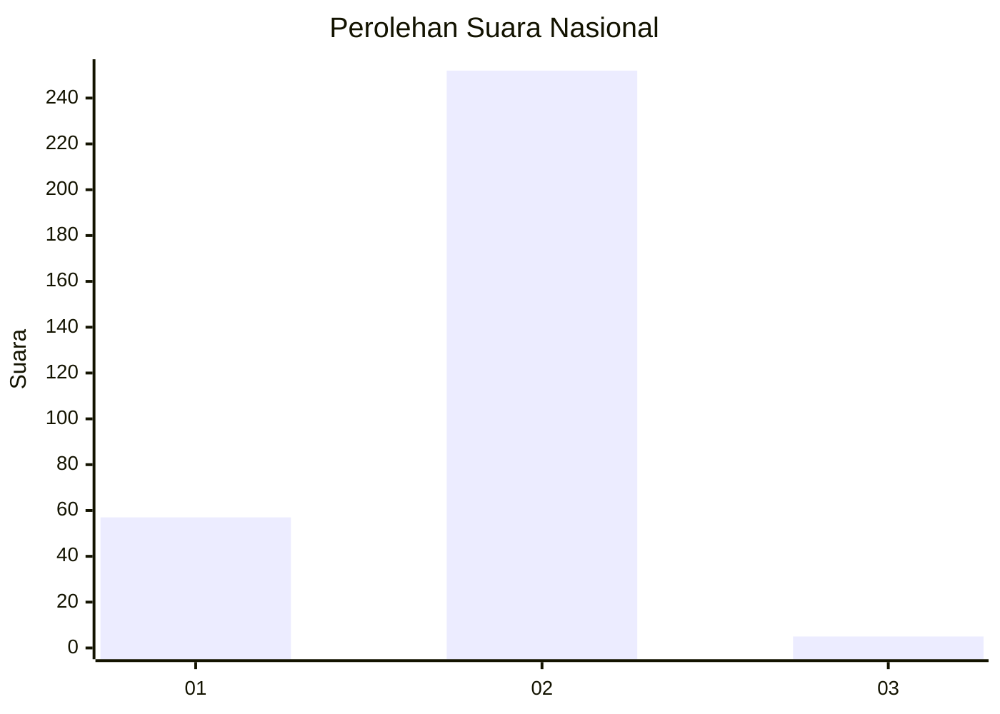
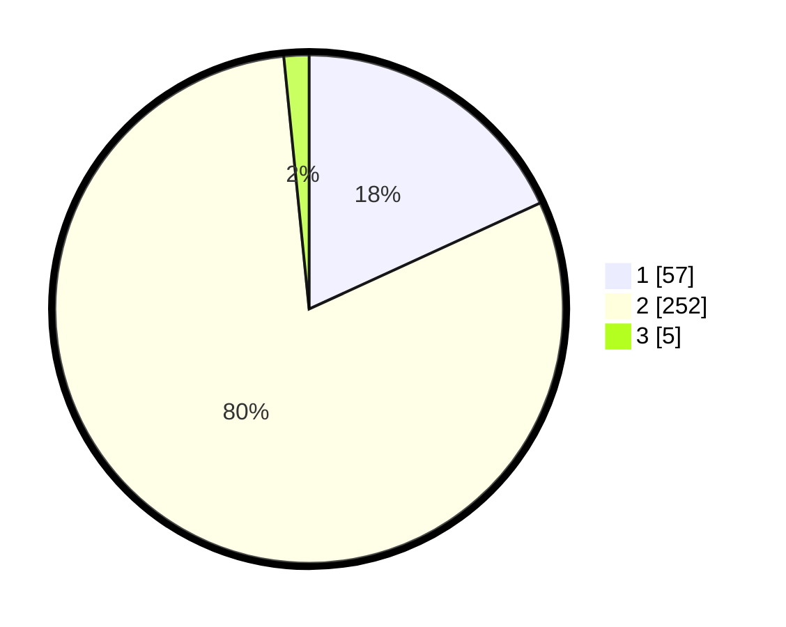

# Hasil

## Grafik

## Tabel

| No. | Nama Paslon    | Suara | Suara (raw) | Persentase |
|:--- |:-------------- | -----:| -----------:| ----------:|
| 1   | ANIES MUHAIMIN | 57    | [57][p-1]   | 18,15      |
| 2   | PRABOWO GIBRAN | 252   | [252][p-2]  | 80,25      |
| 3   | GANJAR MAHFUD  | 5     | [5][p-3]    | 1,59       |

[p-1]: https://github.com/gigit-pemilu/pemilu-2024/blob/main/pilpres/hitung-suara/sub/99-luar-negeri/sub/63-kuching-malaysia/sub/01-kuching-malaysia/sub/0001-kuching-malaysia/sub/022-ksk-017/sub/paslon-1.txt
[p-2]: https://github.com/gigit-pemilu/pemilu-2024/blob/main/pilpres/hitung-suara/sub/99-luar-negeri/sub/63-kuching-malaysia/sub/01-kuching-malaysia/sub/0001-kuching-malaysia/sub/022-ksk-017/sub/paslon-2.txt
[p-3]: https://github.com/gigit-pemilu/pemilu-2024/blob/main/pilpres/hitung-suara/sub/99-luar-negeri/sub/63-kuching-malaysia/sub/01-kuching-malaysia/sub/0001-kuching-malaysia/sub/022-ksk-017/sub/paslon-3.txt

## Foto C Plano

https://sirekap-obj-formc.kpu.go.id/d461/pemilu/ppwp/99/63/01/00/01/9963010001022-20240215-183219--e985ee6e-393b-4b0c-b17d-c7fec6cda210.jpg

https://sirekap-obj-formc.kpu.go.id/d461/pemilu/ppwp/99/63/01/00/01/9963010001022-20240215-183434--0a8cb330-5335-4584-9ec3-28efabd38fdd.jpg

https://sirekap-obj-formc.kpu.go.id/d461/pemilu/ppwp/99/63/01/00/01/9963010001022-20240215-183527--58604ff6-f7b7-46ff-8fb2-29ad83f0e56b.jpg

## Metadata

| Key        | Value               |
| ---------- | ------------------- |
| Time Stamp | 2024-02-25 21:00:00 |

