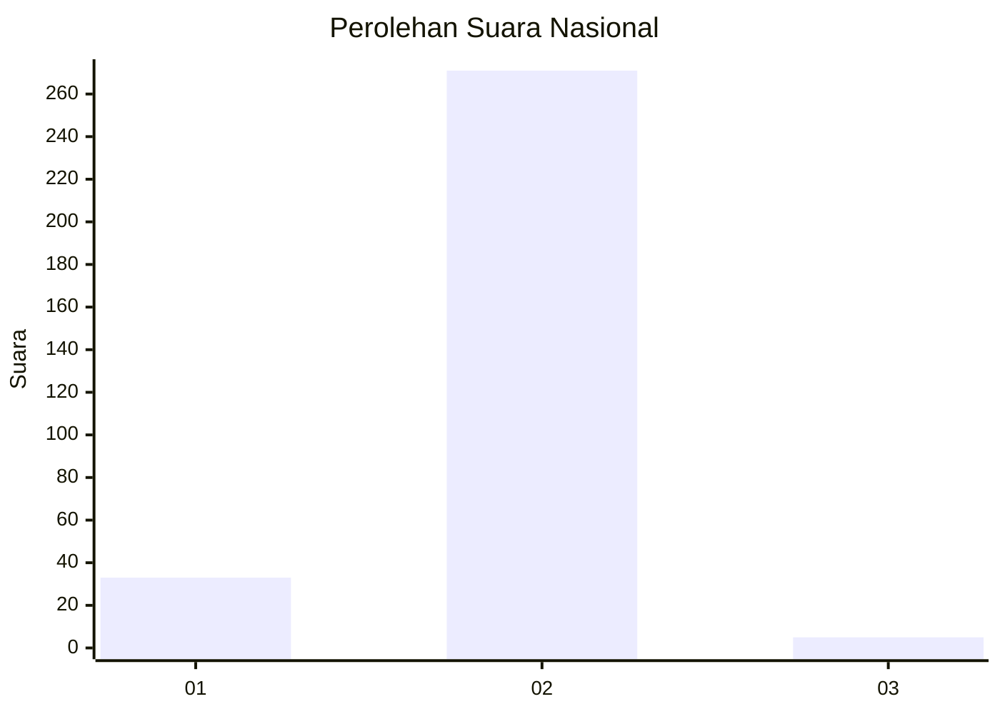
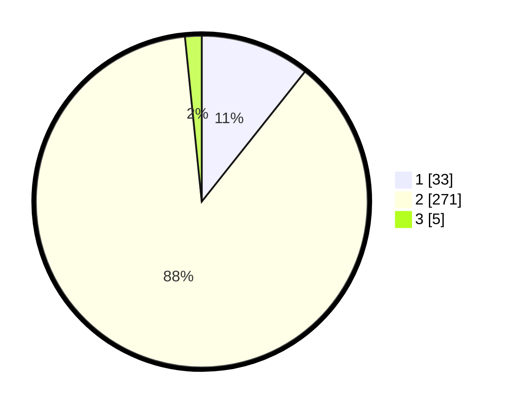

# Hasil

## Grafik

## Tabel

| No. | Nama Paslon    | Suara | Suara (raw) | Persentase |
|:--- |:-------------- | -----:| -----------:| ----------:|
| 1   | ANIES MUHAIMIN | 33    | [33][p-1]   | 10,68      |
| 2   | PRABOWO GIBRAN | 271   | [271][p-2]  | 87,70      |
| 3   | GANJAR MAHFUD  | 5     | [5][p-3]    | 1,62       |

[p-1]: https://github.com/gigit-pemilu/pemilu-2024/blob/main/pilpres/hitung-suara/sub/99-luar-negeri/sub/63-kuching-malaysia/sub/01-kuching-malaysia/sub/0001-kuching-malaysia/sub/025-ksk-020/sub/paslon-1.txt
[p-2]: https://github.com/gigit-pemilu/pemilu-2024/blob/main/pilpres/hitung-suara/sub/99-luar-negeri/sub/63-kuching-malaysia/sub/01-kuching-malaysia/sub/0001-kuching-malaysia/sub/025-ksk-020/sub/paslon-2.txt
[p-3]: https://github.com/gigit-pemilu/pemilu-2024/blob/main/pilpres/hitung-suara/sub/99-luar-negeri/sub/63-kuching-malaysia/sub/01-kuching-malaysia/sub/0001-kuching-malaysia/sub/025-ksk-020/sub/paslon-3.txt

## Foto C Plano

https://sirekap-obj-formc.kpu.go.id/4d31/pemilu/ppwp/99/63/01/00/01/9963010001025-20240215-004115--93f7e9bd-f17a-470a-871a-1c88d3aadcdf.jpg

https://sirekap-obj-formc.kpu.go.id/4d31/pemilu/ppwp/99/63/01/00/01/9963010001025-20240215-004620--aee0f7a2-1698-4b49-87dc-4040b82919b6.jpg

https://sirekap-obj-formc.kpu.go.id/4d31/pemilu/ppwp/99/63/01/00/01/9963010001025-20240215-004740--39c5c391-1265-4fd2-a255-bd331e245b9b.jpg

## Metadata

| Key        | Value               |
| ---------- | ------------------- |
| Time Stamp | 2024-02-22 07:00:00 |

