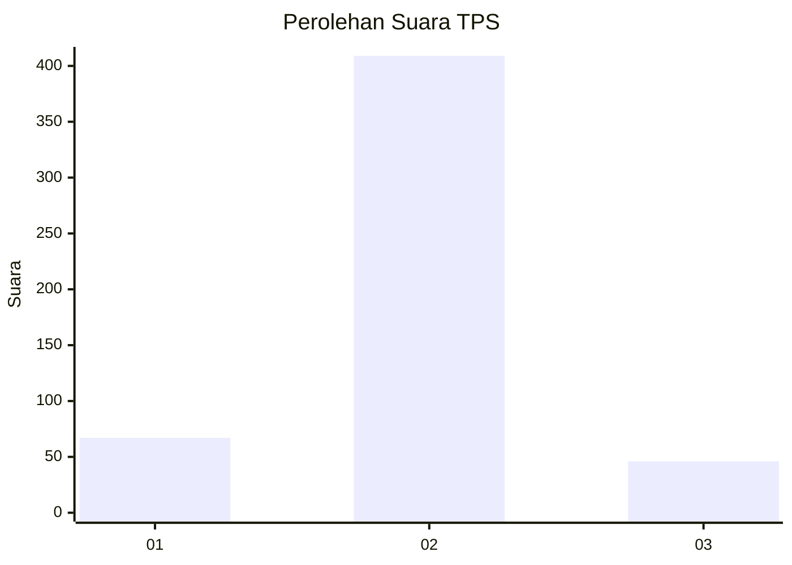
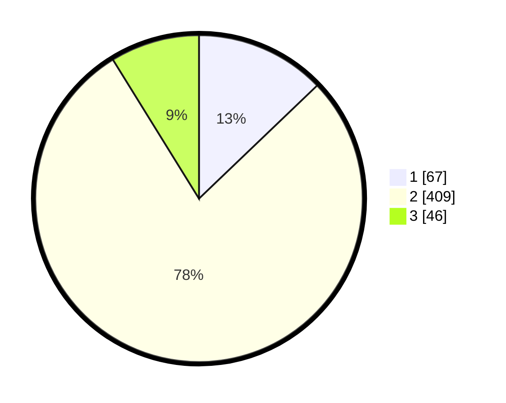

# Hasil

## Grafik

## Tabel

| No. | Nama Paslon    | Suara | Suara (raw) | Persentase |
|:--- |:-------------- | -----:| -----------:| ----------:|
| 1   | ANIES MUHAIMIN | 67    | [67][p-1]   | 12,84      |
| 2   | PRABOWO GIBRAN | 409   | [409][p-2]  | 78,35      |
| 3   | GANJAR MAHFUD  | 46    | [46][p-3]   | 8,81       |

[p-1]: https://github.com/gigit-pemilu/pemilu-2024-99-luar-negeri/blob/main/pilpres/hitung-suara/sub/99-luar-negeri/sub/63-kuching-malaysia/sub/01-kuching-malaysia/sub/0001-kuching-malaysia/sub/026-ksk-021/sub/paslon-1.txt
[p-2]: https://github.com/gigit-pemilu/pemilu-2024-99-luar-negeri/blob/main/pilpres/hitung-suara/sub/99-luar-negeri/sub/63-kuching-malaysia/sub/01-kuching-malaysia/sub/0001-kuching-malaysia/sub/026-ksk-021/sub/paslon-2.txt
[p-3]: https://github.com/gigit-pemilu/pemilu-2024-99-luar-negeri/blob/main/pilpres/hitung-suara/sub/99-luar-negeri/sub/63-kuching-malaysia/sub/01-kuching-malaysia/sub/0001-kuching-malaysia/sub/026-ksk-021/sub/paslon-3.txt

## Foto C Plano

https://sirekap-obj-formc.kpu.go.id/f14e/pemilu/ppwp/99/63/01/00/01/9963010001026-20240215-015949--261a640f-3f19-4e65-9510-06d2d72aee68.jpg

https://sirekap-obj-formc.kpu.go.id/f14e/pemilu/ppwp/99/63/01/00/01/9963010001026-20240215-020107--8594e2df-d747-47eb-b3f5-f19e9564cf97.jpg

https://sirekap-obj-formc.kpu.go.id/f14e/pemilu/ppwp/99/63/01/00/01/9963010001026-20240215-020144--88e3a02e-e688-4084-9ed4-7a005102455c.jpg

## Metadata

| Key        | Value               |
| ---------- | ------------------- |
| Time Stamp | 2024-02-22 07:00:00 |

