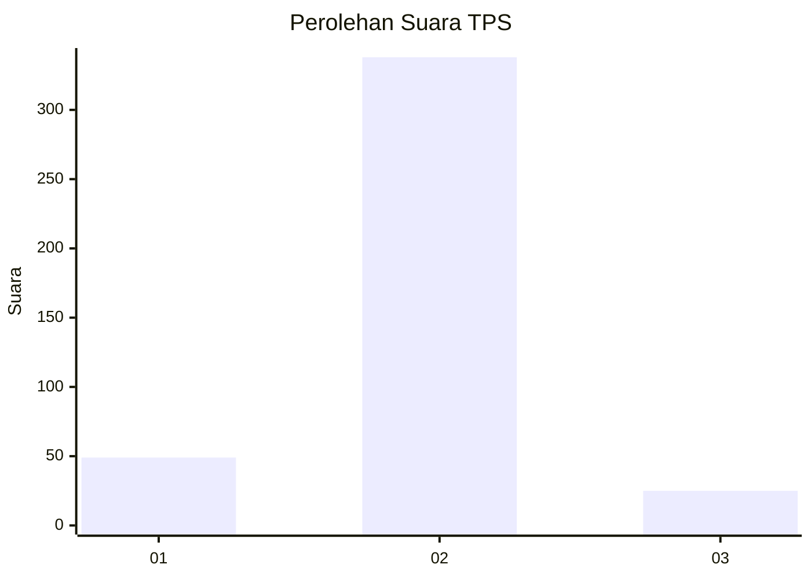
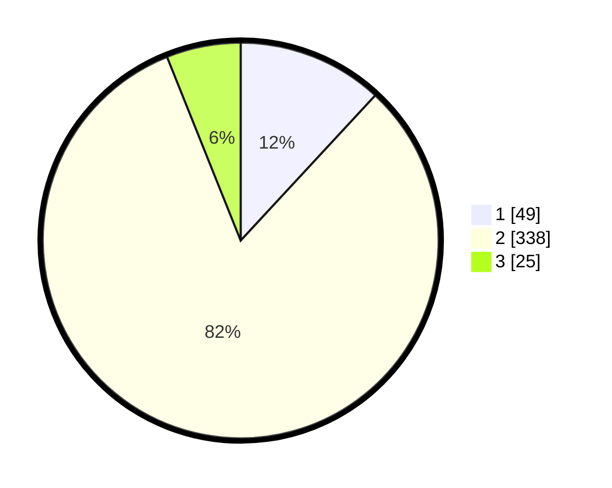

# Hasil

## Grafik

## Tabel

| No. | Nama Paslon    | Suara | Suara (raw) | Persentase |
|:--- |:-------------- | -----:| -----------:| ----------:|
| 1   | ANIES MUHAIMIN | 49    | [49][p-1]   | 11,89      |
| 2   | PRABOWO GIBRAN | 338   | [338][p-2]  | 82,04      |
| 3   | GANJAR MAHFUD  | 25    | [25][p-3]   | 6,07       |

[p-1]: https://github.com/gigit-pemilu/pemilu-2024-99-luar-negeri/blob/main/pilpres/hitung-suara/sub/99-luar-negeri/sub/63-kuching-malaysia/sub/01-kuching-malaysia/sub/0001-kuching-malaysia/sub/031-ksk-026/sub/paslon-1.txt
[p-2]: https://github.com/gigit-pemilu/pemilu-2024-99-luar-negeri/blob/main/pilpres/hitung-suara/sub/99-luar-negeri/sub/63-kuching-malaysia/sub/01-kuching-malaysia/sub/0001-kuching-malaysia/sub/031-ksk-026/sub/paslon-2.txt
[p-3]: https://github.com/gigit-pemilu/pemilu-2024-99-luar-negeri/blob/main/pilpres/hitung-suara/sub/99-luar-negeri/sub/63-kuching-malaysia/sub/01-kuching-malaysia/sub/0001-kuching-malaysia/sub/031-ksk-026/sub/paslon-3.txt

## Foto C Plano

https://sirekap-obj-formc.kpu.go.id/96ff/pemilu/ppwp/99/63/01/00/01/9963010001031-20240214-233907--1929b2c3-e42a-42d9-9d46-89e8efa46a76.jpg

https://sirekap-obj-formc.kpu.go.id/96ff/pemilu/ppwp/99/63/01/00/01/9963010001031-20240214-231010--4477e02f-8e58-4049-9861-4a58fdd3f740.jpg

https://sirekap-obj-formc.kpu.go.id/96ff/pemilu/ppwp/99/63/01/00/01/9963010001031-20240214-231153--6326ac00-418e-4bc4-bbec-3a77090af320.jpg

## Metadata

| Key        | Value               |
| ---------- | ------------------- |
| Time Stamp | 2024-02-22 08:00:00 |

