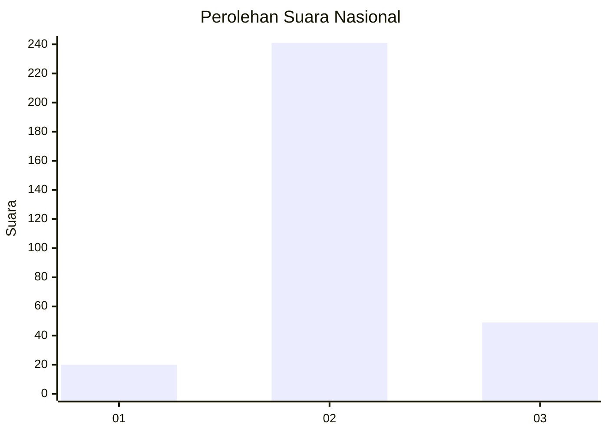
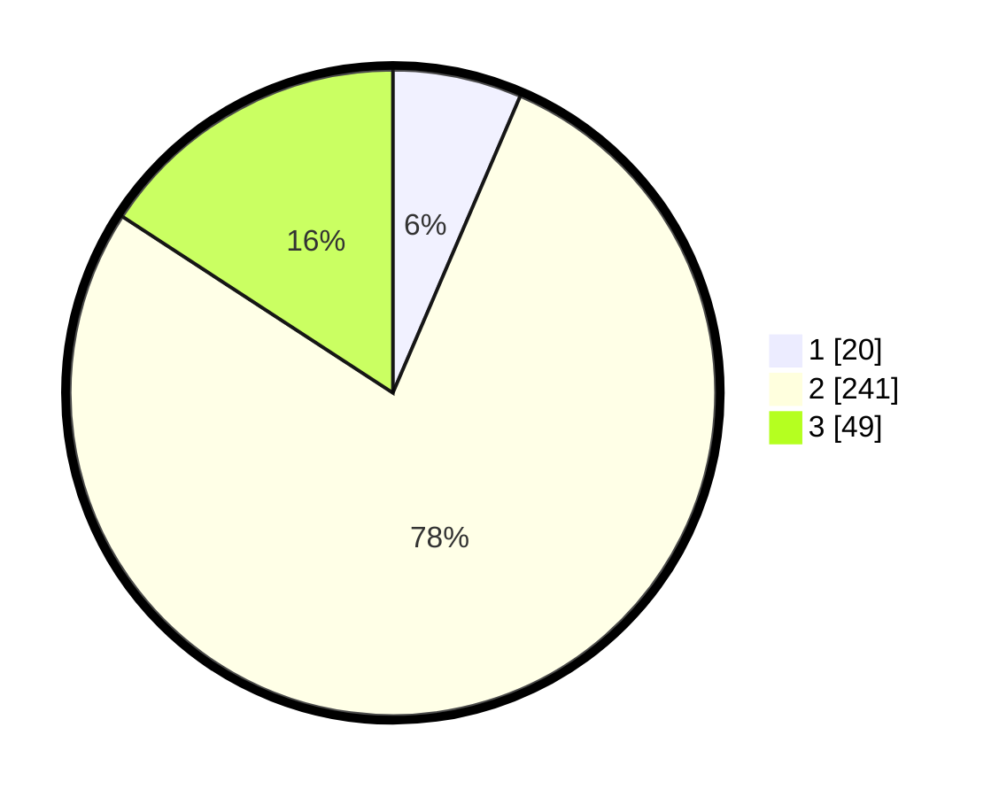

# Hasil

## Grafik

## Tabel

| No. | Nama Paslon    | Suara | Suara (raw) | Persentase |
|:--- |:-------------- | -----:| -----------:| ----------:|
| 1   | ANIES MUHAIMIN | 20    | [20][p-1]   | 6,45       |
| 2   | PRABOWO GIBRAN | 241   | [241][p-2]  | 77,74      |
| 3   | GANJAR MAHFUD  | 49    | [49][p-3]   | 15,81      |

[p-1]: https://github.com/gigit-pemilu/pemilu-2024/blob/main/pilpres/hitung-suara/sub/99-luar-negeri/sub/63-kuching-malaysia/sub/01-kuching-malaysia/sub/0001-kuching-malaysia/sub/038-ksk-033/sub/paslon-1.txt
[p-2]: https://github.com/gigit-pemilu/pemilu-2024/blob/main/pilpres/hitung-suara/sub/99-luar-negeri/sub/63-kuching-malaysia/sub/01-kuching-malaysia/sub/0001-kuching-malaysia/sub/038-ksk-033/sub/paslon-2.txt
[p-3]: https://github.com/gigit-pemilu/pemilu-2024/blob/main/pilpres/hitung-suara/sub/99-luar-negeri/sub/63-kuching-malaysia/sub/01-kuching-malaysia/sub/0001-kuching-malaysia/sub/038-ksk-033/sub/paslon-3.txt

## Foto C Plano

https://sirekap-obj-formc.kpu.go.id/711a/pemilu/ppwp/99/63/01/00/01/9963010001038-20240217-120449--bf45f187-dec7-44b8-bfc3-340d41e1f421.jpg

https://sirekap-obj-formc.kpu.go.id/711a/pemilu/ppwp/99/63/01/00/01/9963010001038-20240216-192925--0ccd8ea3-a6b4-4dd2-9ca0-1c2152e5ed9d.jpg

https://sirekap-obj-formc.kpu.go.id/711a/pemilu/ppwp/99/63/01/00/01/9963010001038-20240216-193431--afca5930-4118-406a-8685-a3761e50e0ee.jpg

## Metadata

| Key        | Value               |
| ---------- | ------------------- |
| Time Stamp | 2024-02-22 08:00:00 |

