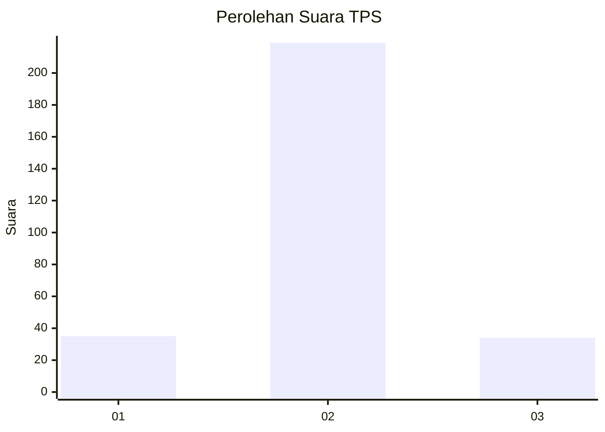
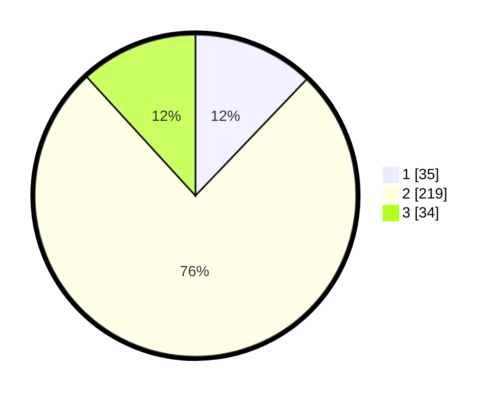

# Hasil

## Grafik

## Tabel

| No. | Nama Paslon    | Suara | Suara (raw) | Persentase |
|:--- |:-------------- | -----:| -----------:| ----------:|
| 1   | ANIES MUHAIMIN | 35    | [35][p-1]   | 12,15      |
| 2   | PRABOWO GIBRAN | 219   | [219][p-2]  | 76,04      |
| 3   | GANJAR MAHFUD  | 34    | [34][p-3]   | 11,81      |

[p-1]: https://github.com/gigit-pemilu/pemilu-2024-99-luar-negeri/blob/main/pilpres/hitung-suara/sub/99-luar-negeri/sub/63-kuching-malaysia/sub/01-kuching-malaysia/sub/0001-kuching-malaysia/sub/041-ksk-036/sub/paslon-1.txt
[p-2]: https://github.com/gigit-pemilu/pemilu-2024-99-luar-negeri/blob/main/pilpres/hitung-suara/sub/99-luar-negeri/sub/63-kuching-malaysia/sub/01-kuching-malaysia/sub/0001-kuching-malaysia/sub/041-ksk-036/sub/paslon-2.txt
[p-3]: https://github.com/gigit-pemilu/pemilu-2024-99-luar-negeri/blob/main/pilpres/hitung-suara/sub/99-luar-negeri/sub/63-kuching-malaysia/sub/01-kuching-malaysia/sub/0001-kuching-malaysia/sub/041-ksk-036/sub/paslon-3.txt

## Foto C Plano

https://sirekap-obj-formc.kpu.go.id/a57e/pemilu/ppwp/99/63/01/00/01/9963010001041-20240218-183611--6b43dde5-1811-441c-b29f-8a332d32a6d3.jpg

https://sirekap-obj-formc.kpu.go.id/a57e/pemilu/ppwp/99/63/01/00/01/9963010001041-20240214-223110--9d394cfd-f29d-407b-95e1-e833cf3a098b.jpg

https://sirekap-obj-formc.kpu.go.id/a57e/pemilu/ppwp/99/63/01/00/01/9963010001041-20240214-223234--29a29f14-f6be-42d2-aad7-58a8f1a2299f.jpg

## Metadata

| Key        | Value               |
| ---------- | ------------------- |
| Time Stamp | 2024-02-22 07:00:00 |

