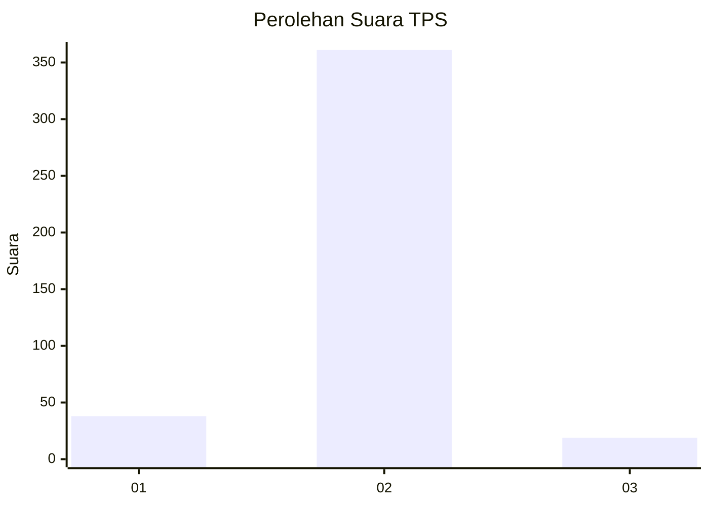
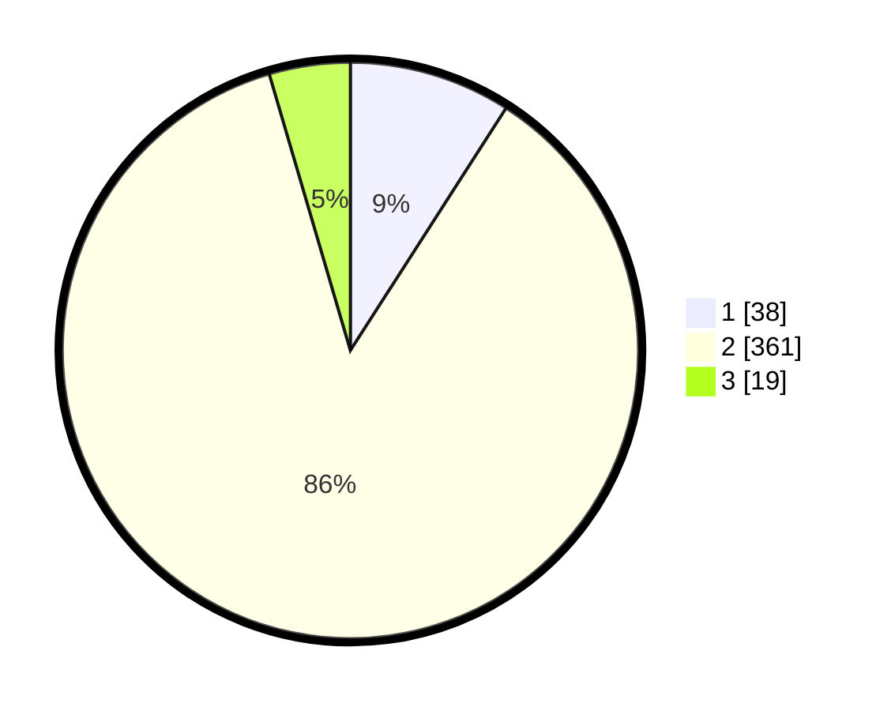

# Hasil

## Grafik

## Tabel

| No. | Nama Paslon    | Suara | Suara (raw) | Persentase |
|:--- |:-------------- | -----:| -----------:| ----------:|
| 1   | ANIES MUHAIMIN | 38    | [38][p-1]   | 9,09       |
| 2   | PRABOWO GIBRAN | 361   | [361][p-2]  | 86,36      |
| 3   | GANJAR MAHFUD  | 19    | [19][p-3]   | 4,55       |

[p-1]: https://github.com/gigit-pemilu/pemilu-2024-99-luar-negeri/blob/main/pilpres/hitung-suara/sub/99-luar-negeri/sub/63-kuching-malaysia/sub/01-kuching-malaysia/sub/0001-kuching-malaysia/sub/051-ksk-046/sub/paslon-1.txt
[p-2]: https://github.com/gigit-pemilu/pemilu-2024-99-luar-negeri/blob/main/pilpres/hitung-suara/sub/99-luar-negeri/sub/63-kuching-malaysia/sub/01-kuching-malaysia/sub/0001-kuching-malaysia/sub/051-ksk-046/sub/paslon-2.txt
[p-3]: https://github.com/gigit-pemilu/pemilu-2024-99-luar-negeri/blob/main/pilpres/hitung-suara/sub/99-luar-negeri/sub/63-kuching-malaysia/sub/01-kuching-malaysia/sub/0001-kuching-malaysia/sub/051-ksk-046/sub/paslon-3.txt

## Foto C Plano

https://sirekap-obj-formc.kpu.go.id/c5e2/pemilu/ppwp/99/63/01/00/01/9963010001051-20240214-235911--90064ef4-9a24-4eff-b115-fc63f5eecdcc.jpg

https://sirekap-obj-formc.kpu.go.id/c5e2/pemilu/ppwp/99/63/01/00/01/9963010001051-20240215-000026--499bef5c-3c09-416a-853a-b223a083abe3.jpg

https://sirekap-obj-formc.kpu.go.id/c5e2/pemilu/ppwp/99/63/01/00/01/9963010001051-20240215-000205--b0093d87-3c4e-4a5d-b61d-8b3f9d42491a.jpg

## Metadata

| Key        | Value               |
| ---------- | ------------------- |
| Time Stamp | 2024-02-19 06:16:00 |

## DATA PEMILIH TETAP

Jumlah pemilih dalam DPT: **447**.
 * L: **372**.
 * P: **75**.

## DATA PENGGUNA HAK PILIH

Jumlah pengguna hak pilih dalam DPT: **209**.
 * L: **168**.
 * P: **41**.

Jumlah pengguna hak pilih dalam DPTb: **0**.
 * L: **0**.
 * P: **0**.

Jumlah pengguna hak pilih dalam DPK: **215**.
 * L: **147**.
 * P: **68**.

Jumlah pengguna hak pilih: **424**.
 * L: **315**.
 * P: **109**.

## JUMLAH SUARA SAH DAN TIDAK SAH

JUMLAH SELURUH SUARA SAH: **418**.

JUMLAH SUARA TIDAK SAH: **6**.

JUMLAH SELURUH SUARA SAH DAN SUARA TIDAK SAH: **424**.

