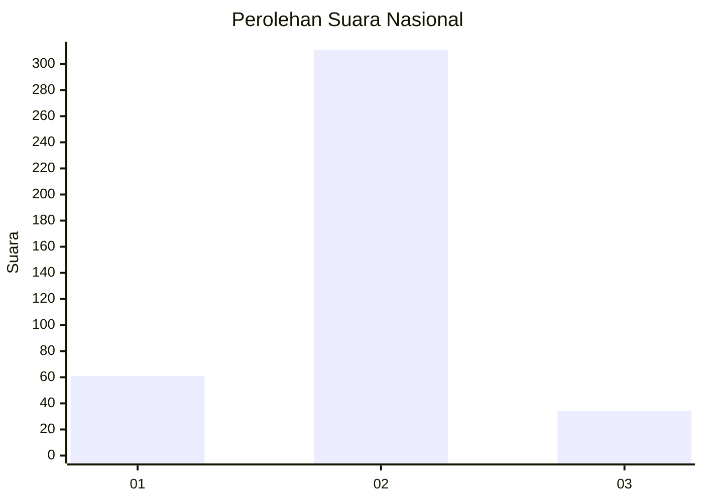
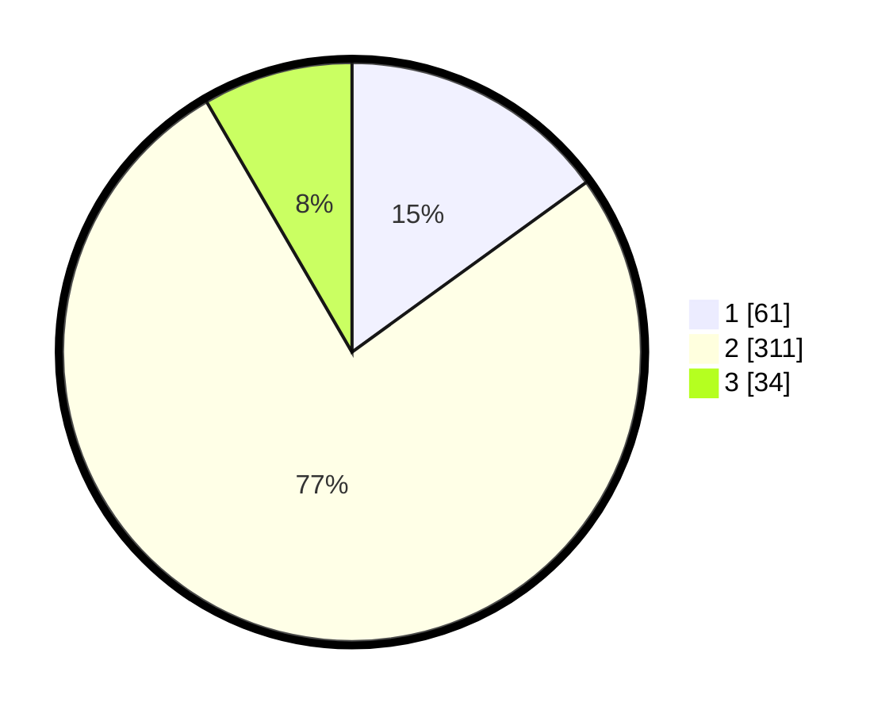

# Hasil

## Grafik

## Tabel

| No. | Nama Paslon    | Suara | Suara (raw) | Persentase |
|:--- |:-------------- | -----:| -----------:| ----------:|
| 1   | ANIES MUHAIMIN | 61    | [61][p-1]   | 15,02      |
| 2   | PRABOWO GIBRAN | 311   | [311][p-2]  | 76,60      |
| 3   | GANJAR MAHFUD  | 34    | [34][p-3]   | 8,37       |

[p-1]: https://github.com/gigit-pemilu/pemilu-2024/blob/main/pilpres/hitung-suara/sub/99-luar-negeri/sub/63-kuching-malaysia/sub/01-kuching-malaysia/sub/0001-kuching-malaysia/sub/056-ksk-051/sub/paslon-1.txt
[p-2]: https://github.com/gigit-pemilu/pemilu-2024/blob/main/pilpres/hitung-suara/sub/99-luar-negeri/sub/63-kuching-malaysia/sub/01-kuching-malaysia/sub/0001-kuching-malaysia/sub/056-ksk-051/sub/paslon-2.txt
[p-3]: https://github.com/gigit-pemilu/pemilu-2024/blob/main/pilpres/hitung-suara/sub/99-luar-negeri/sub/63-kuching-malaysia/sub/01-kuching-malaysia/sub/0001-kuching-malaysia/sub/056-ksk-051/sub/paslon-3.txt

## Foto C Plano

https://sirekap-obj-formc.kpu.go.id/a630/pemilu/ppwp/99/63/01/00/01/9963010001056-20240215-025654--198de890-89e5-4bb6-b32f-a0ecaf043c3b.jpg

https://sirekap-obj-formc.kpu.go.id/a630/pemilu/ppwp/99/63/01/00/01/9963010001056-20240215-025711--6474b180-a0fe-43c5-a3e6-a5122fa85014.jpg

https://sirekap-obj-formc.kpu.go.id/a630/pemilu/ppwp/99/63/01/00/01/9963010001056-20240215-025752--4544d124-f66e-4036-923d-c9be178a9fca.jpg

## Metadata

| Key        | Value               |
| ---------- | ------------------- |
| Time Stamp | 2024-02-22 07:00:00 |

