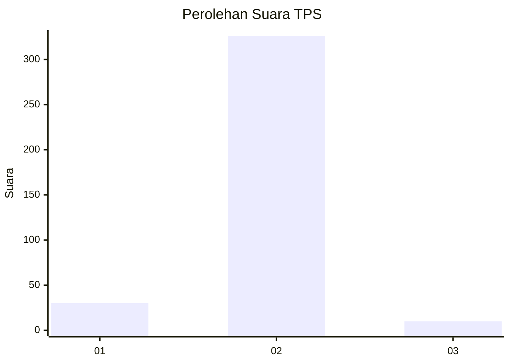
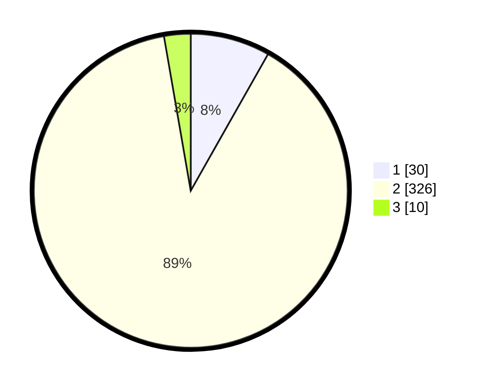

# Hasil

## Grafik

## Tabel

| No. | Nama Paslon    | Suara | Suara (raw) | Persentase |
|:--- |:-------------- | -----:| -----------:| ----------:|
| 1   | ANIES MUHAIMIN | 30    | [30][p-1]   | 8,20       |
| 2   | PRABOWO GIBRAN | 326   | [326][p-2]  | 89,07      |
| 3   | GANJAR MAHFUD  | 10    | [10][p-3]   | 2,73       |

[p-1]: https://github.com/gigit-pemilu/pemilu-2024-99-luar-negeri/blob/main/pilpres/hitung-suara/sub/99-luar-negeri/sub/63-kuching-malaysia/sub/01-kuching-malaysia/sub/0001-kuching-malaysia/sub/057-ksk-052/sub/paslon-1.txt
[p-2]: https://github.com/gigit-pemilu/pemilu-2024-99-luar-negeri/blob/main/pilpres/hitung-suara/sub/99-luar-negeri/sub/63-kuching-malaysia/sub/01-kuching-malaysia/sub/0001-kuching-malaysia/sub/057-ksk-052/sub/paslon-2.txt
[p-3]: https://github.com/gigit-pemilu/pemilu-2024-99-luar-negeri/blob/main/pilpres/hitung-suara/sub/99-luar-negeri/sub/63-kuching-malaysia/sub/01-kuching-malaysia/sub/0001-kuching-malaysia/sub/057-ksk-052/sub/paslon-3.txt

## Foto C Plano

https://sirekap-obj-formc.kpu.go.id/3c08/pemilu/ppwp/99/63/01/00/01/9963010001057-20240215-000447--2c329b8a-6266-4284-bc88-134824c37648.jpg

https://sirekap-obj-formc.kpu.go.id/3c08/pemilu/ppwp/99/63/01/00/01/9963010001057-20240215-000652--ac80cf33-e547-4623-acc1-1d0d0e12fe1c.jpg

https://sirekap-obj-formc.kpu.go.id/3c08/pemilu/ppwp/99/63/01/00/01/9963010001057-20240215-000904--13a03c91-27b4-4b6d-8fbe-0e5249c90331.jpg

## Metadata

| Key        | Value               |
| ---------- | ------------------- |
| Time Stamp | 2024-02-22 08:00:00 |

