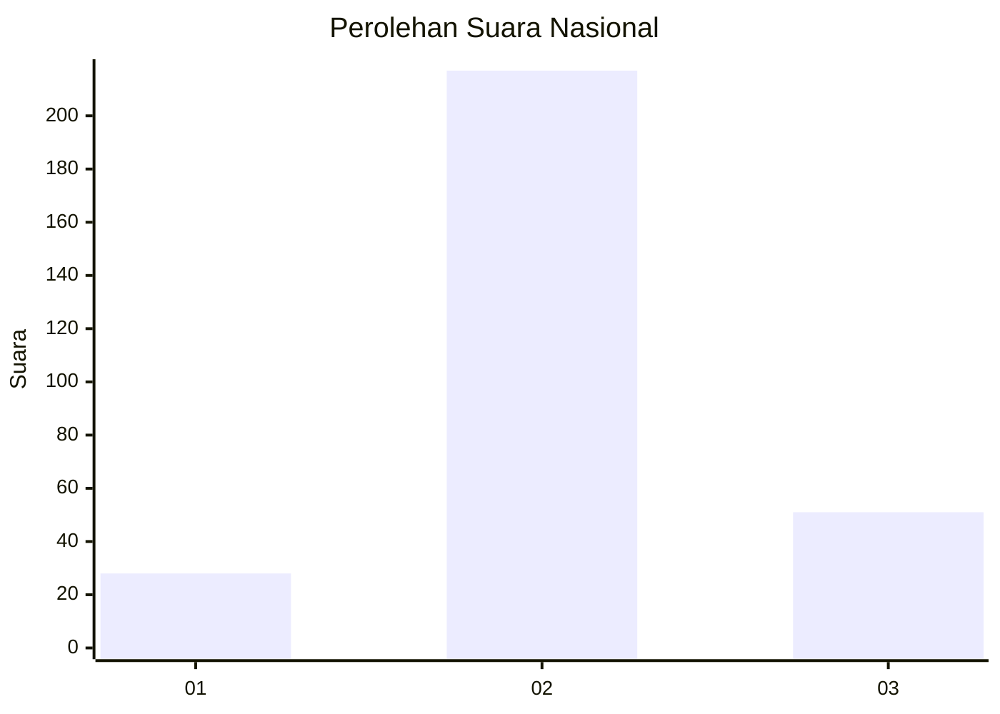
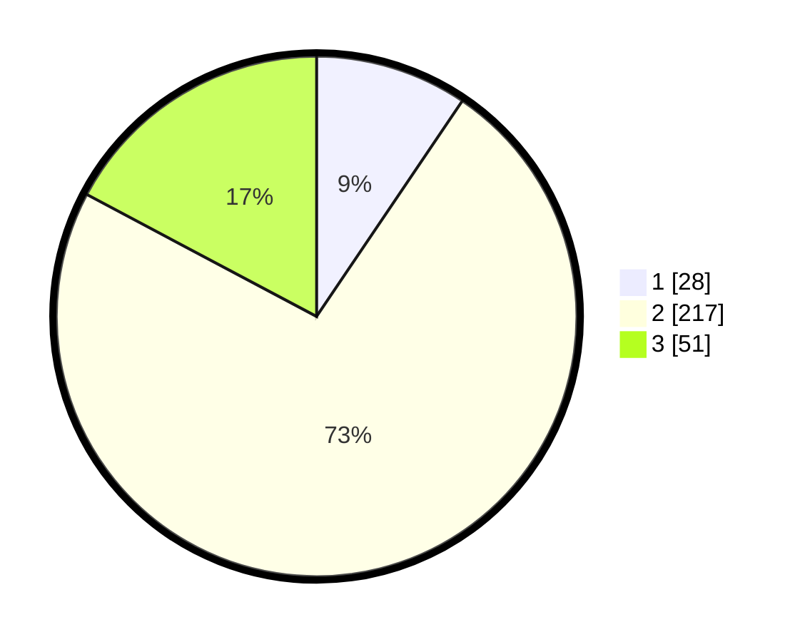

# Hasil

## Grafik

## Tabel

| No. | Nama Paslon    | Suara | Suara (raw) | Persentase |
|:--- |:-------------- | -----:| -----------:| ----------:|
| 1   | ANIES MUHAIMIN | 28    | [28][p-1]   | 9,46       |
| 2   | PRABOWO GIBRAN | 217   | [217][p-2]  | 73,31      |
| 3   | GANJAR MAHFUD  | 51    | [51][p-3]   | 17,23      |

[p-1]: https://github.com/gigit-pemilu/pemilu-2024/blob/main/pilpres/hitung-suara/sub/99-luar-negeri/sub/63-kuching-malaysia/sub/01-kuching-malaysia/sub/0001-kuching-malaysia/sub/061-ksk-056/sub/paslon-1.txt
[p-2]: https://github.com/gigit-pemilu/pemilu-2024/blob/main/pilpres/hitung-suara/sub/99-luar-negeri/sub/63-kuching-malaysia/sub/01-kuching-malaysia/sub/0001-kuching-malaysia/sub/061-ksk-056/sub/paslon-2.txt
[p-3]: https://github.com/gigit-pemilu/pemilu-2024/blob/main/pilpres/hitung-suara/sub/99-luar-negeri/sub/63-kuching-malaysia/sub/01-kuching-malaysia/sub/0001-kuching-malaysia/sub/061-ksk-056/sub/paslon-3.txt

## Foto C Plano

https://sirekap-obj-formc.kpu.go.id/d2c6/pemilu/ppwp/99/63/01/00/01/9963010001061-20240216-094035--74a696b8-5fd6-4898-a796-18213290c815.jpg

https://sirekap-obj-formc.kpu.go.id/d2c6/pemilu/ppwp/99/63/01/00/01/9963010001061-20240216-094114--85229e2a-1880-4b9d-a470-c3f53eff8585.jpg

https://sirekap-obj-formc.kpu.go.id/d2c6/pemilu/ppwp/99/63/01/00/01/9963010001061-20240216-094129--dfbb8042-1f40-49d4-b2d6-8ec9a85178e2.jpg

## Metadata

| Key        | Value               |
| ---------- | ------------------- |
| Time Stamp | 2024-02-22 08:00:00 |

