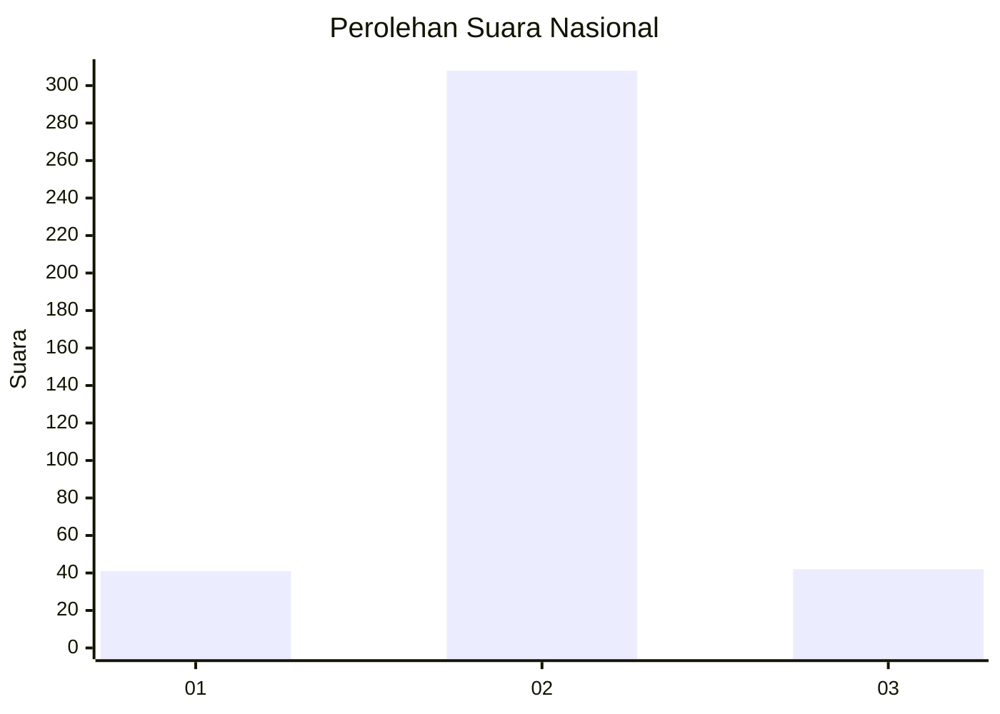
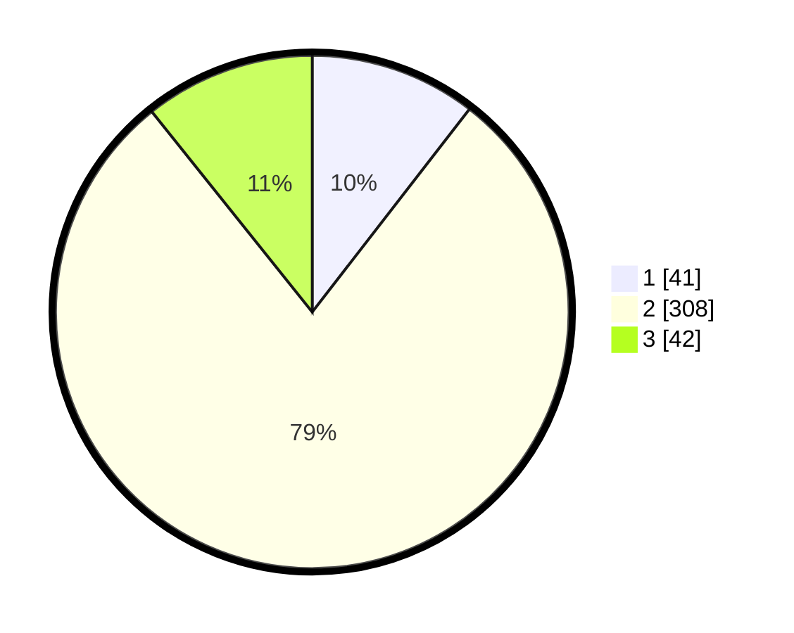

# Hasil

## Grafik

## Tabel

| No. | Nama Paslon    | Suara | Suara (raw) | Persentase |
|:--- |:-------------- | -----:| -----------:| ----------:|
| 1   | ANIES MUHAIMIN | 41    | [41][p-1]   | 10,49      |
| 2   | PRABOWO GIBRAN | 308   | [308][p-2]  | 78,77      |
| 3   | GANJAR MAHFUD  | 42    | [42][p-3]   | 10,74      |

[p-1]: https://github.com/gigit-pemilu/pemilu-2024/blob/main/pilpres/hitung-suara/sub/99-luar-negeri/sub/63-kuching-malaysia/sub/01-kuching-malaysia/sub/0001-kuching-malaysia/sub/067-ksk-062/sub/paslon-1.txt
[p-2]: https://github.com/gigit-pemilu/pemilu-2024/blob/main/pilpres/hitung-suara/sub/99-luar-negeri/sub/63-kuching-malaysia/sub/01-kuching-malaysia/sub/0001-kuching-malaysia/sub/067-ksk-062/sub/paslon-2.txt
[p-3]: https://github.com/gigit-pemilu/pemilu-2024/blob/main/pilpres/hitung-suara/sub/99-luar-negeri/sub/63-kuching-malaysia/sub/01-kuching-malaysia/sub/0001-kuching-malaysia/sub/067-ksk-062/sub/paslon-3.txt

## Foto C Plano

https://sirekap-obj-formc.kpu.go.id/5c84/pemilu/ppwp/99/63/01/00/01/9963010001067-20240214-192822--c55b1f56-476f-467e-8029-71f9151e2a3a.jpg

https://sirekap-obj-formc.kpu.go.id/5c84/pemilu/ppwp/99/63/01/00/01/9963010001067-20240214-201552--fd43073d-191e-4146-9a07-61c7b68da9ee.jpg

https://sirekap-obj-formc.kpu.go.id/5c84/pemilu/ppwp/99/63/01/00/01/9963010001067-20240214-193338--86cf28f8-0863-4745-aa28-2819f2946198.jpg

## Metadata

| Key        | Value               |
| ---------- | ------------------- |
| Time Stamp | 2024-02-15 18:30:25 |

## DATA PEMILIH TETAP

Jumlah pemilih dalam DPT: **393**.
 * L: **304**.
 * P: **89**.

## DATA PENGGUNA HAK PILIH

Jumlah pengguna hak pilih dalam DPT: **147**.
 * L: **104**.
 * P: **43**.

Jumlah pengguna hak pilih dalam DPTb: **1**.
 * L: **1**.
 * P: **0**.

Jumlah pengguna hak pilih dalam DPK: **252**.
 * L: **184**.
 * P: **68**.

Jumlah pengguna hak pilih: **400**.
 * L: **289**.
 * P: **111**.

## JUMLAH SUARA SAH DAN TIDAK SAH

JUMLAH SELURUH SUARA SAH: **391**.

JUMLAH SUARA TIDAK SAH: **9**.

JUMLAH SELURUH SUARA SAH DAN SUARA TIDAK SAH: **400**.

