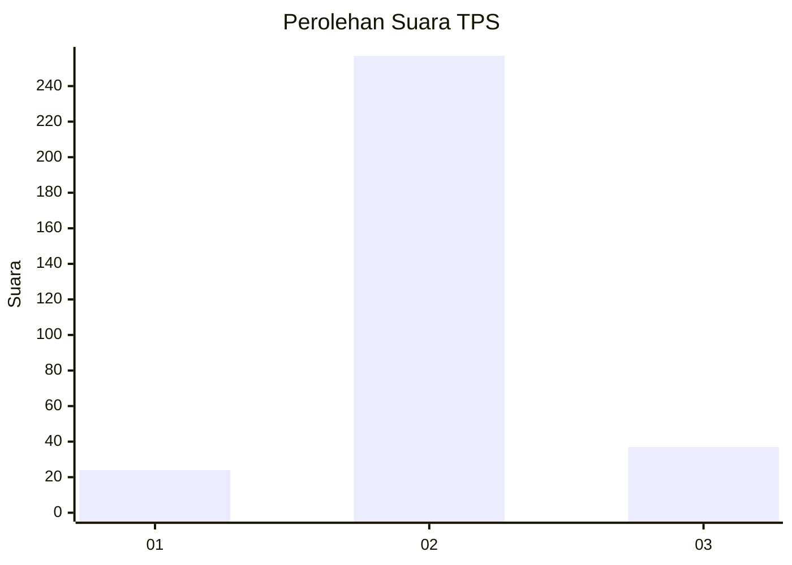
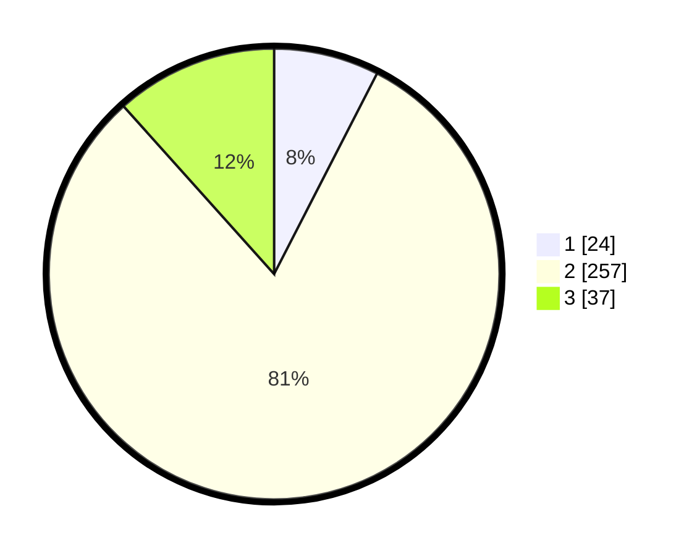

# Hasil

## Grafik

## Tabel

| No. | Nama Paslon    | Suara | Suara (raw) | Persentase |
|:--- |:-------------- | -----:| -----------:| ----------:|
| 1   | ANIES MUHAIMIN | 24    | [24][p-1]   | 7,55       |
| 2   | PRABOWO GIBRAN | 257   | [257][p-2]  | 80,82      |
| 3   | GANJAR MAHFUD  | 37    | [37][p-3]   | 11,64      |

[p-1]: https://github.com/gigit-pemilu/pemilu-2024-99-luar-negeri/blob/main/pilpres/hitung-suara/sub/99-luar-negeri/sub/63-kuching-malaysia/sub/01-kuching-malaysia/sub/0001-kuching-malaysia/sub/074-ksk-069/sub/paslon-1.txt
[p-2]: https://github.com/gigit-pemilu/pemilu-2024-99-luar-negeri/blob/main/pilpres/hitung-suara/sub/99-luar-negeri/sub/63-kuching-malaysia/sub/01-kuching-malaysia/sub/0001-kuching-malaysia/sub/074-ksk-069/sub/paslon-2.txt
[p-3]: https://github.com/gigit-pemilu/pemilu-2024-99-luar-negeri/blob/main/pilpres/hitung-suara/sub/99-luar-negeri/sub/63-kuching-malaysia/sub/01-kuching-malaysia/sub/0001-kuching-malaysia/sub/074-ksk-069/sub/paslon-3.txt

## Foto C Plano

https://sirekap-obj-formc.kpu.go.id/b8a3/pemilu/ppwp/99/63/01/00/01/9963010001074-20240214-214910--3022ff12-598e-45d6-9bba-84fc2e5e9c4f.jpg

https://sirekap-obj-formc.kpu.go.id/b8a3/pemilu/ppwp/99/63/01/00/01/9963010001074-20240214-215417--ed263ef3-4719-4024-a65f-8c074920cf19.jpg

https://sirekap-obj-formc.kpu.go.id/b8a3/pemilu/ppwp/99/63/01/00/01/9963010001074-20240214-215628--15551a7b-7a05-49c6-b568-4153ffba517c.jpg

## Metadata

| Key        | Value               |
| ---------- | ------------------- |
| Time Stamp | 2024-02-22 07:00:00 |

