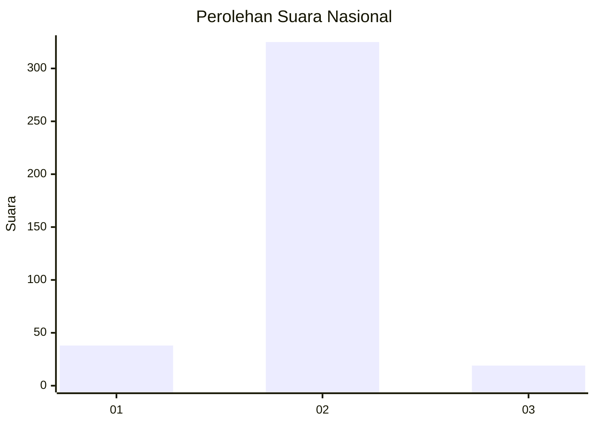
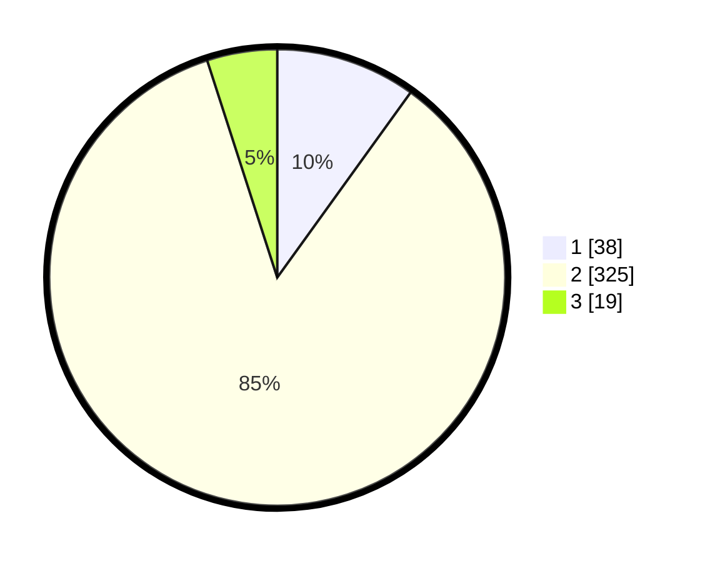

# Hasil

## Grafik

## Tabel

| No. | Nama Paslon    | Suara | Suara (raw) | Persentase |
|:--- |:-------------- | -----:| -----------:| ----------:|
| 1   | ANIES MUHAIMIN | 38    | [38][p-1]   | 9,95       |
| 2   | PRABOWO GIBRAN | 325   | [325][p-2]  | 85,08      |
| 3   | GANJAR MAHFUD  | 19    | [19][p-3]   | 4,97       |

[p-1]: https://github.com/gigit-pemilu/pemilu-2024/blob/main/pilpres/hitung-suara/sub/99-luar-negeri/sub/63-kuching-malaysia/sub/01-kuching-malaysia/sub/0001-kuching-malaysia/sub/075-ksk-070/sub/paslon-1.txt
[p-2]: https://github.com/gigit-pemilu/pemilu-2024/blob/main/pilpres/hitung-suara/sub/99-luar-negeri/sub/63-kuching-malaysia/sub/01-kuching-malaysia/sub/0001-kuching-malaysia/sub/075-ksk-070/sub/paslon-2.txt
[p-3]: https://github.com/gigit-pemilu/pemilu-2024/blob/main/pilpres/hitung-suara/sub/99-luar-negeri/sub/63-kuching-malaysia/sub/01-kuching-malaysia/sub/0001-kuching-malaysia/sub/075-ksk-070/sub/paslon-3.txt

## Foto C Plano

https://sirekap-obj-formc.kpu.go.id/f8f8/pemilu/ppwp/99/63/01/00/01/9963010001075-20240214-232308--47e9906e-244d-420f-9942-a8c04d6a9dac.jpg

https://sirekap-obj-formc.kpu.go.id/f8f8/pemilu/ppwp/99/63/01/00/01/9963010001075-20240214-232320--7f9b106c-a821-4a74-9957-7897b5b4ee37.jpg

https://sirekap-obj-formc.kpu.go.id/f8f8/pemilu/ppwp/99/63/01/00/01/9963010001075-20240214-232329--bbcfe3cb-13df-4e7f-9c8a-238999c79b95.jpg

## Metadata

| Key        | Value               |
| ---------- | ------------------- |
| Time Stamp | 2024-02-22 08:00:00 |

