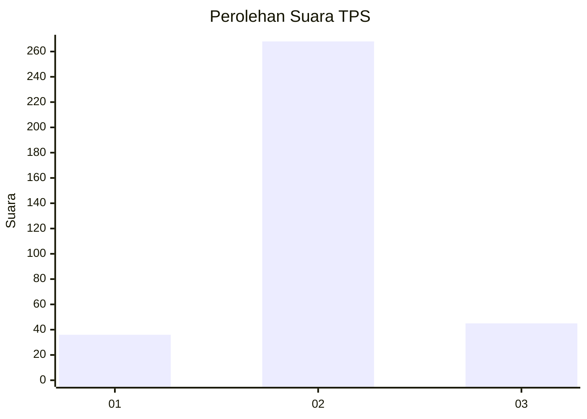
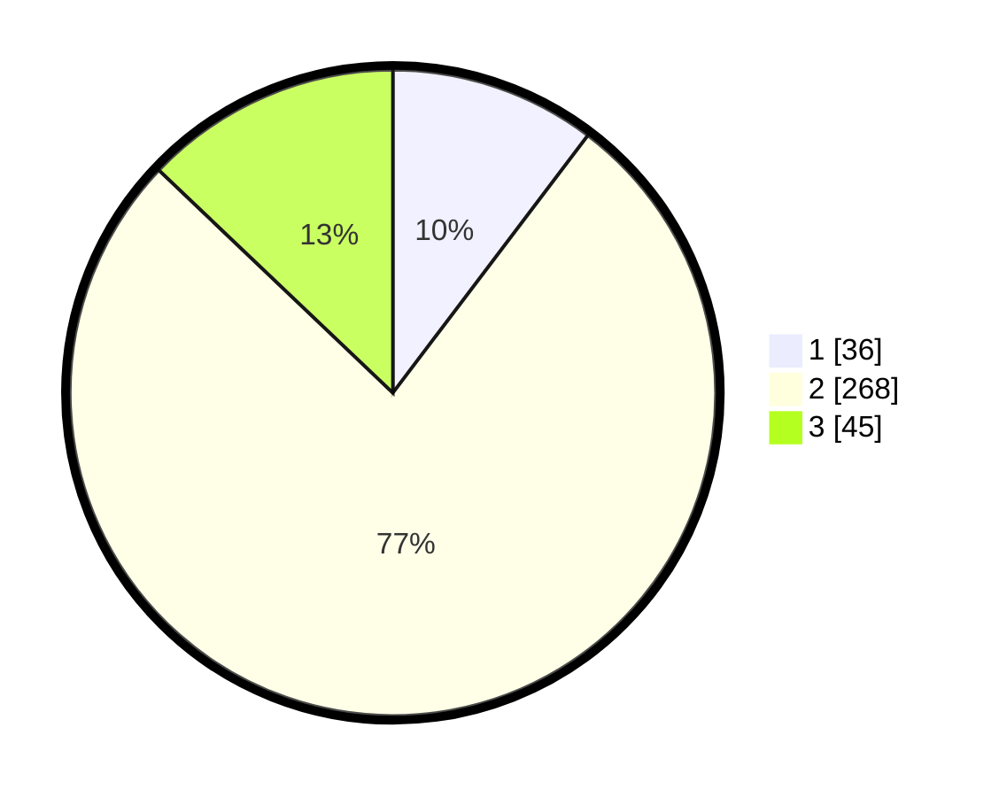

# Hasil

## Grafik

## Tabel

| No. | Nama Paslon    | Suara | Suara (raw) | Persentase |
|:--- |:-------------- | -----:| -----------:| ----------:|
| 1   | ANIES MUHAIMIN | 36    | [36][p-1]   | 10,32      |
| 2   | PRABOWO GIBRAN | 268   | [268][p-2]  | 76,79      |
| 3   | GANJAR MAHFUD  | 45    | [45][p-3]   | 12,89      |

[p-1]: https://github.com/gigit-pemilu/pemilu-2024-99-luar-negeri/blob/main/pilpres/hitung-suara/sub/99-luar-negeri/sub/63-kuching-malaysia/sub/01-kuching-malaysia/sub/0001-kuching-malaysia/sub/088-ksk-083/sub/paslon-1.txt
[p-2]: https://github.com/gigit-pemilu/pemilu-2024-99-luar-negeri/blob/main/pilpres/hitung-suara/sub/99-luar-negeri/sub/63-kuching-malaysia/sub/01-kuching-malaysia/sub/0001-kuching-malaysia/sub/088-ksk-083/sub/paslon-2.txt
[p-3]: https://github.com/gigit-pemilu/pemilu-2024-99-luar-negeri/blob/main/pilpres/hitung-suara/sub/99-luar-negeri/sub/63-kuching-malaysia/sub/01-kuching-malaysia/sub/0001-kuching-malaysia/sub/088-ksk-083/sub/paslon-3.txt

## Foto C Plano

https://sirekap-obj-formc.kpu.go.id/0ad1/pemilu/ppwp/99/63/01/00/01/9963010001088-20240214-224308--5af151c7-638c-43aa-8db6-cb38ef2dc960.jpg

https://sirekap-obj-formc.kpu.go.id/0ad1/pemilu/ppwp/99/63/01/00/01/9963010001088-20240214-224509--5f1ccae8-129e-46e7-834b-cdb4dbe92b2c.jpg

https://sirekap-obj-formc.kpu.go.id/0ad1/pemilu/ppwp/99/63/01/00/01/9963010001088-20240214-224659--1374c5d1-ddb1-48ad-8bf7-8ea47eb014d4.jpg

## Metadata

| Key        | Value               |
| ---------- | ------------------- |
| Time Stamp | 2024-02-15 22:40:13 |

