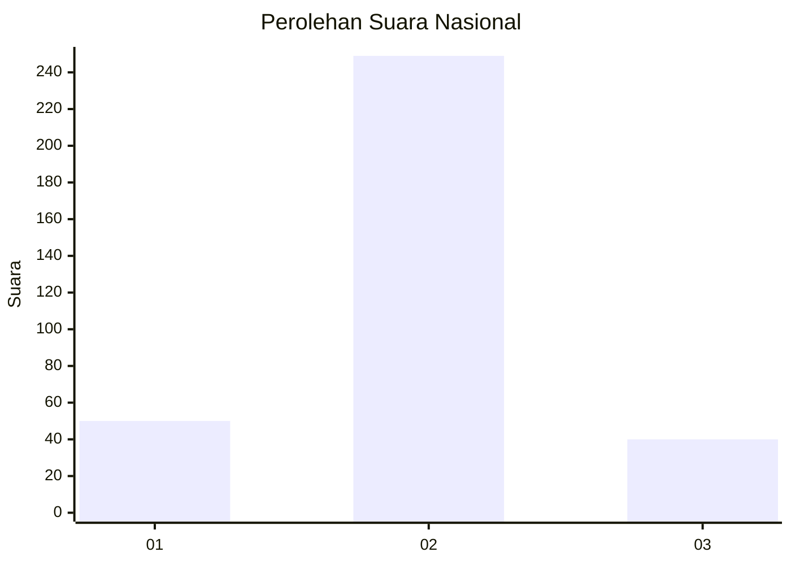
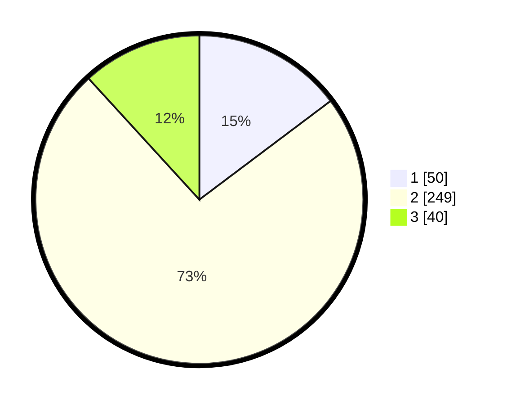

# Hasil

## Grafik

## Tabel

| No. | Nama Paslon    | Suara | Suara (raw) | Persentase |
|:--- |:-------------- | -----:| -----------:| ----------:|
| 1   | ANIES MUHAIMIN | 50    | [50][p-1]   | 14,75      |
| 2   | PRABOWO GIBRAN | 249   | [249][p-2]  | 73,45      |
| 3   | GANJAR MAHFUD  | 40    | [40][p-3]   | 11,80      |

[p-1]: https://github.com/gigit-pemilu/pemilu-2024/blob/main/pilpres/hitung-suara/sub/99-luar-negeri/sub/63-kuching-malaysia/sub/01-kuching-malaysia/sub/0001-kuching-malaysia/sub/089-ksk-084/sub/paslon-1.txt
[p-2]: https://github.com/gigit-pemilu/pemilu-2024/blob/main/pilpres/hitung-suara/sub/99-luar-negeri/sub/63-kuching-malaysia/sub/01-kuching-malaysia/sub/0001-kuching-malaysia/sub/089-ksk-084/sub/paslon-2.txt
[p-3]: https://github.com/gigit-pemilu/pemilu-2024/blob/main/pilpres/hitung-suara/sub/99-luar-negeri/sub/63-kuching-malaysia/sub/01-kuching-malaysia/sub/0001-kuching-malaysia/sub/089-ksk-084/sub/paslon-3.txt

## Foto C Plano

https://sirekap-obj-formc.kpu.go.id/f3a3/pemilu/ppwp/99/63/01/00/01/9963010001089-20240214-234330--a1cf04ef-a147-4a87-8b52-3fc533d982be.jpg

https://sirekap-obj-formc.kpu.go.id/f3a3/pemilu/ppwp/99/63/01/00/01/9963010001089-20240214-234603--274eed5e-adfe-45de-8223-ec7a360e27a8.jpg

https://sirekap-obj-formc.kpu.go.id/f3a3/pemilu/ppwp/99/63/01/00/01/9963010001089-20240214-234523--5e193ec2-e93b-427b-a32a-2b72937e149d.jpg

## Metadata

| Key        | Value               |
| ---------- | ------------------- |
| Time Stamp | 2024-02-22 08:00:00 |

