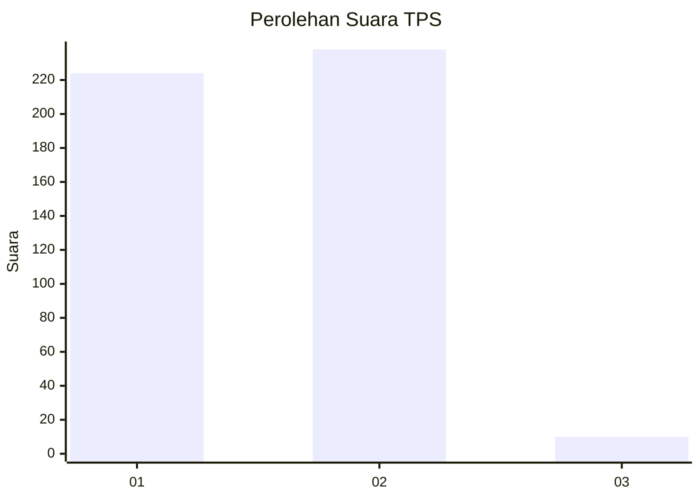
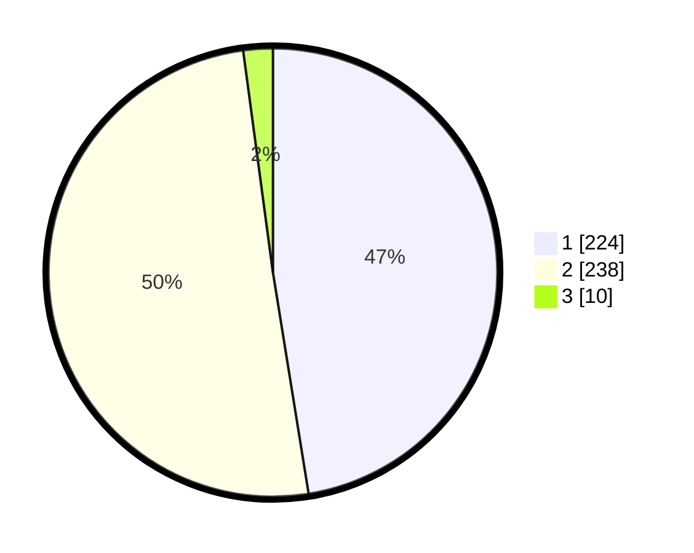

# Hasil

## Grafik

## Tabel

| No. | Nama Paslon    | Suara | Suara (raw) | Persentase |
|:--- |:-------------- | -----:| -----------:| ----------:|
| 1   | ANIES MUHAIMIN | 224   | [224][p-1]  | 47,46      |
| 2   | PRABOWO GIBRAN | 238   | [238][p-2]  | 50,42      |
| 3   | GANJAR MAHFUD  | 10    | [10][p-3]   | 2,12       |

[p-1]: https://github.com/gigit-pemilu/pemilu-2024-99-luar-negeri/blob/main/pilpres/hitung-suara/sub/99-luar-negeri/sub/63-kuching-malaysia/sub/01-kuching-malaysia/sub/0001-kuching-malaysia/sub/092-ksk-087/sub/paslon-1.txt
[p-2]: https://github.com/gigit-pemilu/pemilu-2024-99-luar-negeri/blob/main/pilpres/hitung-suara/sub/99-luar-negeri/sub/63-kuching-malaysia/sub/01-kuching-malaysia/sub/0001-kuching-malaysia/sub/092-ksk-087/sub/paslon-2.txt
[p-3]: https://github.com/gigit-pemilu/pemilu-2024-99-luar-negeri/blob/main/pilpres/hitung-suara/sub/99-luar-negeri/sub/63-kuching-malaysia/sub/01-kuching-malaysia/sub/0001-kuching-malaysia/sub/092-ksk-087/sub/paslon-3.txt

## Foto C Plano

https://sirekap-obj-formc.kpu.go.id/fadc/pemilu/ppwp/99/63/01/00/01/9963010001092-20240214-225442--81c338a8-b440-45a6-8a98-8089aee8ff4c.jpg

https://sirekap-obj-formc.kpu.go.id/fadc/pemilu/ppwp/99/63/01/00/01/9963010001092-20240214-225839--d93b8761-4663-4960-9dbf-67ce8bc0458e.jpg

https://sirekap-obj-formc.kpu.go.id/fadc/pemilu/ppwp/99/63/01/00/01/9963010001092-20240214-230020--7f12e96e-c9cb-4c7e-a952-5ed1c7e10e47.jpg

## Metadata

| Key        | Value               |
| ---------- | ------------------- |
| Time Stamp | 2024-02-22 08:00:00 |

