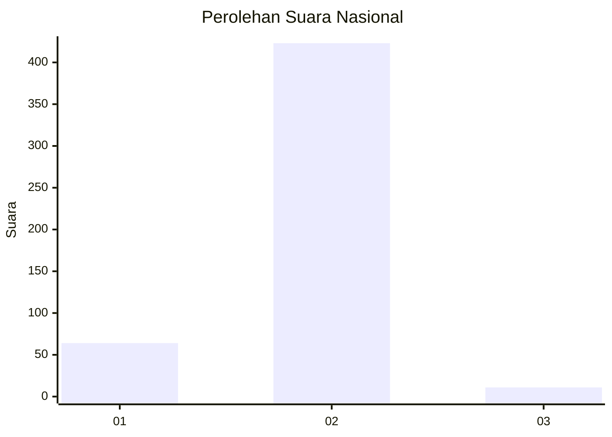
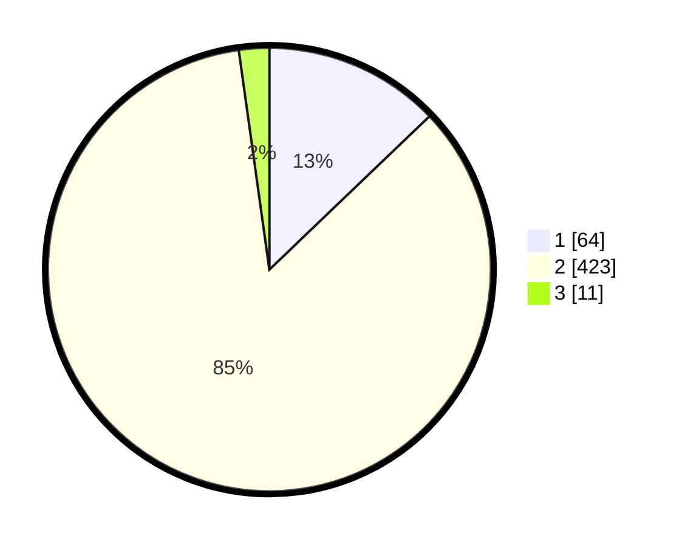

# Hasil

## Grafik

## Tabel

| No. | Nama Paslon    | Suara | Suara (raw) | Persentase |
|:--- |:-------------- | -----:| -----------:| ----------:|
| 1   | ANIES MUHAIMIN | 64    | [64][p-1]   | 12,85      |
| 2   | PRABOWO GIBRAN | 423   | [423][p-2]  | 84,94      |
| 3   | GANJAR MAHFUD  | 11    | [11][p-3]   | 2,21       |

[p-1]: https://github.com/gigit-pemilu/pemilu-2024/blob/main/pilpres/hitung-suara/sub/99-luar-negeri/sub/63-kuching-malaysia/sub/01-kuching-malaysia/sub/0001-kuching-malaysia/sub/095-ksk-090/sub/paslon-1.txt
[p-2]: https://github.com/gigit-pemilu/pemilu-2024/blob/main/pilpres/hitung-suara/sub/99-luar-negeri/sub/63-kuching-malaysia/sub/01-kuching-malaysia/sub/0001-kuching-malaysia/sub/095-ksk-090/sub/paslon-2.txt
[p-3]: https://github.com/gigit-pemilu/pemilu-2024/blob/main/pilpres/hitung-suara/sub/99-luar-negeri/sub/63-kuching-malaysia/sub/01-kuching-malaysia/sub/0001-kuching-malaysia/sub/095-ksk-090/sub/paslon-3.txt

## Foto C Plano

https://sirekap-obj-formc.kpu.go.id/0c3e/pemilu/ppwp/99/63/01/00/01/9963010001095-20240214-230736--6396fc3b-64ae-4ec2-8213-60fcb5262346.jpg

https://sirekap-obj-formc.kpu.go.id/0c3e/pemilu/ppwp/99/63/01/00/01/9963010001095-20240214-231006--9f30b812-e865-4013-8a57-5ad4fab48ada.jpg

https://sirekap-obj-formc.kpu.go.id/0c3e/pemilu/ppwp/99/63/01/00/01/9963010001095-20240214-231156--fb8a6f98-9338-4b0a-b24d-261a135dbcd0.jpg

## Metadata

| Key        | Value               |
| ---------- | ------------------- |
| Time Stamp | 2024-02-16 08:00:28 |

## DATA PEMILIH TETAP

Jumlah pemilih dalam DPT: **708**.
 * L: **507**.
 * P: **201**.

## DATA PENGGUNA HAK PILIH

Jumlah pengguna hak pilih dalam DPT: **308**.
 * L: **151**.
 * P: **157**.

Jumlah pengguna hak pilih dalam DPTb: **1**.
 * L: **0**.
 * P: **1**.

Jumlah pengguna hak pilih dalam DPK: **201**.
 * L: **121**.
 * P: **80**.

Jumlah pengguna hak pilih: **510**.
 * L: **272**.
 * P: **238**.

## JUMLAH SUARA SAH DAN TIDAK SAH

JUMLAH SELURUH SUARA SAH: **498**.

JUMLAH SUARA TIDAK SAH: **12**.

JUMLAH SELURUH SUARA SAH DAN SUARA TIDAK SAH: **510**.

