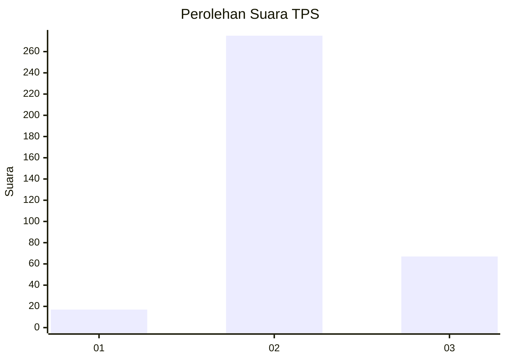
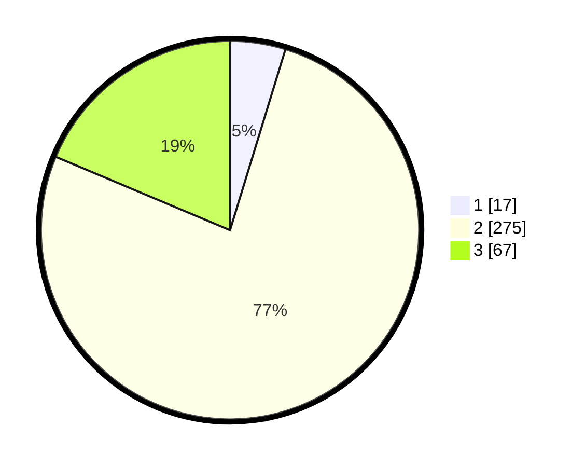

# Hasil

## Grafik

## Tabel

| No. | Nama Paslon    | Suara | Suara (raw) | Persentase |
|:--- |:-------------- | -----:| -----------:| ----------:|
| 1   | ANIES MUHAIMIN | 17    | [17][p-1]   | 4,74       |
| 2   | PRABOWO GIBRAN | 275   | [275][p-2]  | 76,60      |
| 3   | GANJAR MAHFUD  | 67    | [67][p-3]   | 18,66      |

[p-1]: https://github.com/gigit-pemilu/pemilu-2024-99-luar-negeri/blob/main/pilpres/hitung-suara/sub/99-luar-negeri/sub/63-kuching-malaysia/sub/01-kuching-malaysia/sub/0001-kuching-malaysia/sub/096-ksk-091/sub/paslon-1.txt
[p-2]: https://github.com/gigit-pemilu/pemilu-2024-99-luar-negeri/blob/main/pilpres/hitung-suara/sub/99-luar-negeri/sub/63-kuching-malaysia/sub/01-kuching-malaysia/sub/0001-kuching-malaysia/sub/096-ksk-091/sub/paslon-2.txt
[p-3]: https://github.com/gigit-pemilu/pemilu-2024-99-luar-negeri/blob/main/pilpres/hitung-suara/sub/99-luar-negeri/sub/63-kuching-malaysia/sub/01-kuching-malaysia/sub/0001-kuching-malaysia/sub/096-ksk-091/sub/paslon-3.txt

## Foto C Plano

https://sirekap-obj-formc.kpu.go.id/2912/pemilu/ppwp/99/63/01/00/01/9963010001096-20240215-012331--9233c54b-6594-41b0-b1e3-ac5570f484f8.jpg

https://sirekap-obj-formc.kpu.go.id/2912/pemilu/ppwp/99/63/01/00/01/9963010001096-20240215-012435--05010b48-3f1c-4032-bbb2-59d22a4064eb.jpg

https://sirekap-obj-formc.kpu.go.id/2912/pemilu/ppwp/99/63/01/00/01/9963010001096-20240215-012522--253633b5-62e9-49b5-af33-d359ef889bd0.jpg

## Metadata

| Key        | Value               |
| ---------- | ------------------- |
| Time Stamp | 2024-02-22 08:00:00 |

