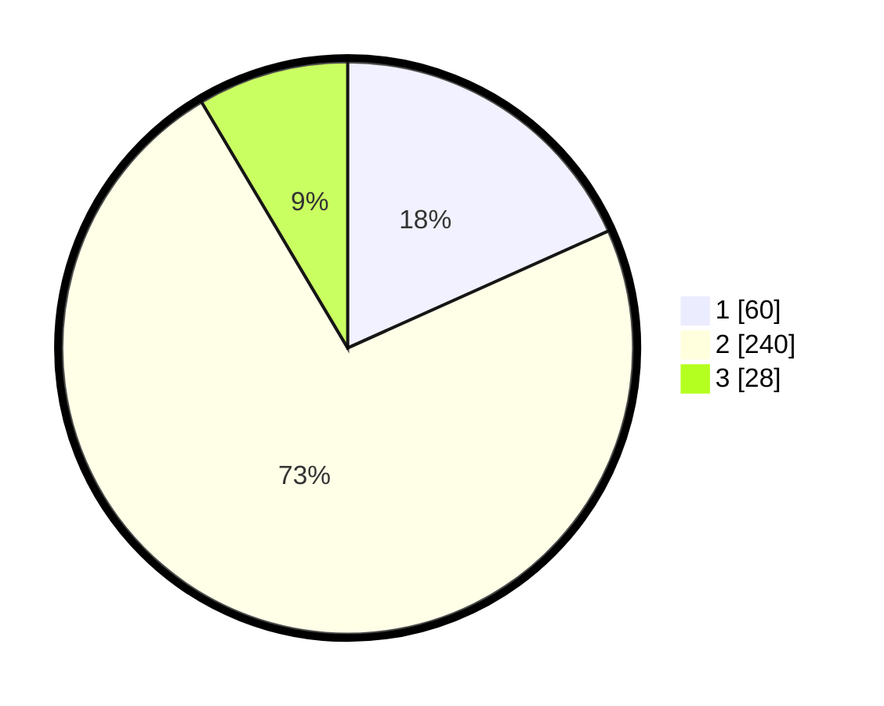

# Hasil

## Grafik

## Tabel

| No. | Nama Paslon    | Suara | Suara (raw) | Persentase |
|:--- |:-------------- | -----:| -----------:| ----------:|
| 1   | ANIES MUHAIMIN | 60    | [60][p-1]   | 18,29      |
| 2   | PRABOWO GIBRAN | 240   | [240][p-2]  | 73,17      |
| 3   | GANJAR MAHFUD  | 28    | [28][p-3]   | 8,54       |

[p-1]: https://github.com/gigit-pemilu/pemilu-2024-99-luar-negeri/blob/main/pilpres/hitung-suara/sub/99-luar-negeri/sub/63-kuching-malaysia/sub/01-kuching-malaysia/sub/0001-kuching-malaysia/sub/097-ksk-092/sub/paslon-1.txt
[p-2]: https://github.com/gigit-pemilu/pemilu-2024-99-luar-negeri/blob/main/pilpres/hitung-suara/sub/99-luar-negeri/sub/63-kuching-malaysia/sub/01-kuching-malaysia/sub/0001-kuching-malaysia/sub/097-ksk-092/sub/paslon-2.txt
[p-3]: https://github.com/gigit-pemilu/pemilu-2024-99-luar-negeri/blob/main/pilpres/hitung-suara/sub/99-luar-negeri/sub/63-kuching-malaysia/sub/01-kuching-malaysia/sub/0001-kuching-malaysia/sub/097-ksk-092/sub/paslon-3.txt

## Foto C Plano

https://sirekap-obj-formc.kpu.go.id/d7e8/pemilu/ppwp/99/63/01/00/01/9963010001097-20240214-191037--3ebdb158-8705-44aa-95d5-b49208613fe2.jpg

https://sirekap-obj-formc.kpu.go.id/d7e8/pemilu/ppwp/99/63/01/00/01/9963010001097-20240215-000941--70e37971-ebec-4136-a06f-ad310e8f79b8.jpg

https://sirekap-obj-formc.kpu.go.id/d7e8/pemilu/ppwp/99/63/01/00/01/9963010001097-20240215-001007--f4b4efce-9c80-4b99-acdf-dad0b4334a89.jpg

## Metadata

| Key        | Value               |
| ---------- | ------------------- |
| Time Stamp | 2024-02-22 08:00:00 |

## DATA PEMILIH TETAP

Jumlah pemilih dalam DPT: **459**.
 * L: **300**.
 * P: **159**.

## DATA PENGGUNA HAK PILIH

Jumlah pengguna hak pilih dalam DPT: **169**.
 * L: **108**.
 * P: **61**.

Jumlah pengguna hak pilih dalam DPTb: **0**.
 * L: **0**.
 * P: **0**.

Jumlah pengguna hak pilih dalam DPK: **178**.
 * L: **104**.
 * P: **74**.

Jumlah pengguna hak pilih: **347**.
 * L: **212**.
 * P: **135**.

## JUMLAH SUARA SAH DAN TIDAK SAH

JUMLAH SELURUH SUARA SAH: **328**.

JUMLAH SUARA TIDAK SAH: **19**.

JUMLAH SELURUH SUARA SAH DAN SUARA TIDAK SAH: **347**.

