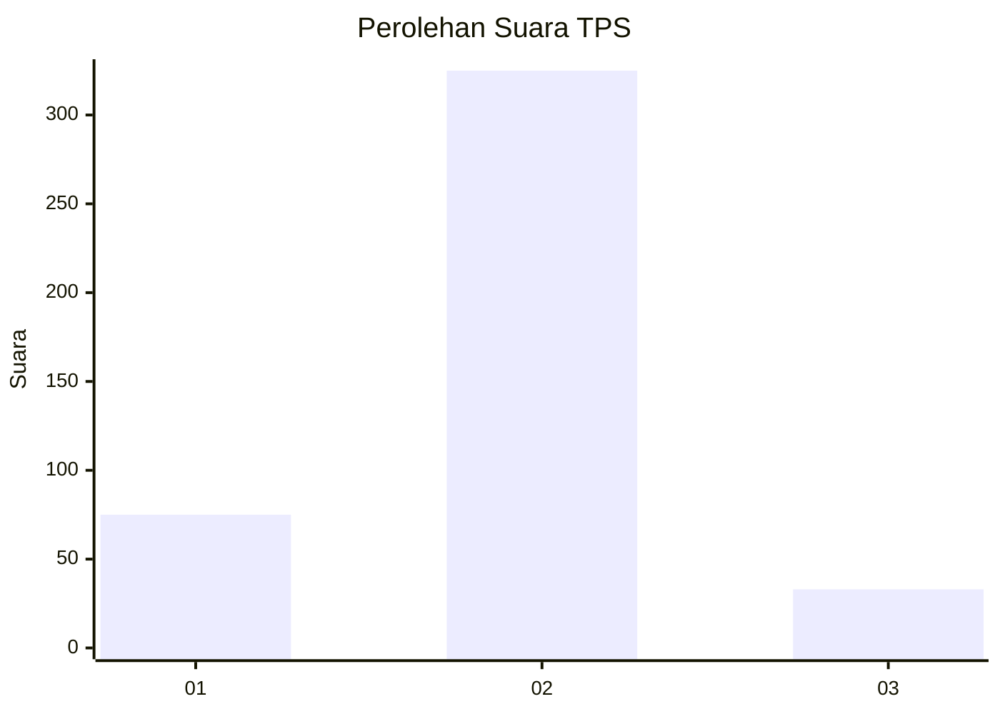
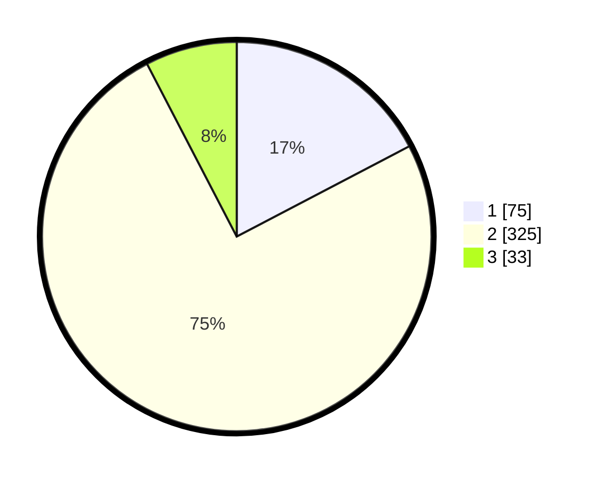

# Hasil

## Grafik

## Tabel

| No. | Nama Paslon    | Suara | Suara (raw) | Persentase |
|:--- |:-------------- | -----:| -----------:| ----------:|
| 1   | ANIES MUHAIMIN | 75    | [75][p-1]   | 17,32      |
| 2   | PRABOWO GIBRAN | 325   | [325][p-2]  | 75,06      |
| 3   | GANJAR MAHFUD  | 33    | [33][p-3]   | 7,62       |

[p-1]: https://github.com/gigit-pemilu/pemilu-2024-99-luar-negeri/blob/main/pilpres/hitung-suara/sub/99-luar-negeri/sub/63-kuching-malaysia/sub/01-kuching-malaysia/sub/0001-kuching-malaysia/sub/099-ksk-094/sub/paslon-1.txt
[p-2]: https://github.com/gigit-pemilu/pemilu-2024-99-luar-negeri/blob/main/pilpres/hitung-suara/sub/99-luar-negeri/sub/63-kuching-malaysia/sub/01-kuching-malaysia/sub/0001-kuching-malaysia/sub/099-ksk-094/sub/paslon-2.txt
[p-3]: https://github.com/gigit-pemilu/pemilu-2024-99-luar-negeri/blob/main/pilpres/hitung-suara/sub/99-luar-negeri/sub/63-kuching-malaysia/sub/01-kuching-malaysia/sub/0001-kuching-malaysia/sub/099-ksk-094/sub/paslon-3.txt

## Foto C Plano

https://sirekap-obj-formc.kpu.go.id/096e/pemilu/ppwp/99/63/01/00/01/9963010001099-20240215-001711--97c3d2ab-9127-44e0-bcdb-f9ac50f8bb50.jpg

https://sirekap-obj-formc.kpu.go.id/096e/pemilu/ppwp/99/63/01/00/01/9963010001099-20240215-001842--4bf91450-58ff-44a1-b52d-29655feea341.jpg

https://sirekap-obj-formc.kpu.go.id/096e/pemilu/ppwp/99/63/01/00/01/9963010001099-20240215-001948--1bea064a-2759-469a-899e-2a6c9ea1d57e.jpg

## Metadata

| Key        | Value               |
| ---------- | ------------------- |
| Time Stamp | 2024-02-22 07:00:00 |

## DATA PEMILIH TETAP

Jumlah pemilih dalam DPT: **436**.
 * L: **266**.
 * P: **170**.

## DATA PENGGUNA HAK PILIH

Jumlah pengguna hak pilih dalam DPT: **214**.
 * L: **113**.
 * P: **101**.

Jumlah pengguna hak pilih dalam DPTb: **1**.
 * L: **0**.
 * P: **1**.

Jumlah pengguna hak pilih dalam DPK: **230**.
 * L: **130**.
 * P: **100**.

Jumlah pengguna hak pilih: **445**.
 * L: **243**.
 * P: **202**.

## JUMLAH SUARA SAH DAN TIDAK SAH

JUMLAH SELURUH SUARA SAH: **433**.

JUMLAH SUARA TIDAK SAH: **12**.

JUMLAH SELURUH SUARA SAH DAN SUARA TIDAK SAH: **445**.

