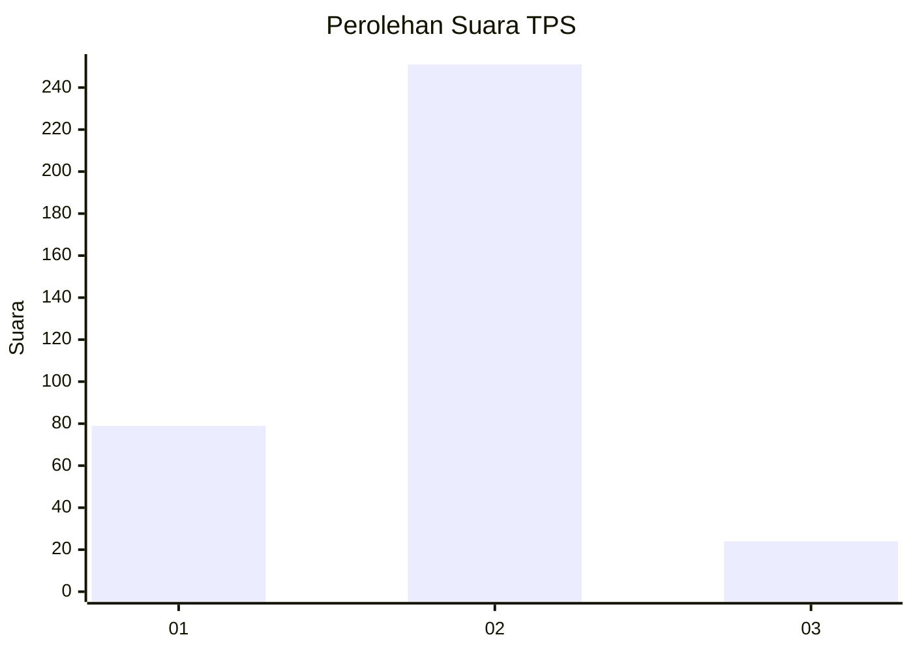

# Hasil

## Grafik

## Tabel

| No. | Nama Paslon    | Suara | Suara (raw) | Persentase |
|:--- |:-------------- | -----:| -----------:| ----------:|
| 1   | ANIES MUHAIMIN | 79    | [79][p-1]   | 22,32      |
| 2   | PRABOWO GIBRAN | 251   | [251][p-2]  | 70,90      |
| 3   | GANJAR MAHFUD  | 24    | [24][p-3]   | 6,78       |

[p-1]: https://github.com/gigit-pemilu/pemilu-2024-99-luar-negeri/blob/main/pilpres/hitung-suara/sub/99-luar-negeri/sub/63-kuching-malaysia/sub/01-kuching-malaysia/sub/0001-kuching-malaysia/sub/101-ksk-096/sub/paslon-1.txt
[p-2]: https://github.com/gigit-pemilu/pemilu-2024-99-luar-negeri/blob/main/pilpres/hitung-suara/sub/99-luar-negeri/sub/63-kuching-malaysia/sub/01-kuching-malaysia/sub/0001-kuching-malaysia/sub/101-ksk-096/sub/paslon-2.txt
[p-3]: https://github.com/gigit-pemilu/pemilu-2024-99-luar-negeri/blob/main/pilpres/hitung-suara/sub/99-luar-negeri/sub/63-kuching-malaysia/sub/01-kuching-malaysia/sub/0001-kuching-malaysia/sub/101-ksk-096/sub/paslon-3.txt

## Foto C Plano

https://sirekap-obj-formc.kpu.go.id/87da/pemilu/ppwp/99/63/01/00/01/9963010001101-20240214-233505--8d14d933-3af1-4463-8b19-e30ac61c5608.jpg

https://sirekap-obj-formc.kpu.go.id/87da/pemilu/ppwp/99/63/01/00/01/9963010001101-20240214-233624--e7e18396-7acf-4f24-82de-378fde3c1078.jpg

https://sirekap-obj-formc.kpu.go.id/87da/pemilu/ppwp/99/63/01/00/01/9963010001101-20240214-233713--cec4c7e5-eba9-48ee-98ce-2e4ba65a12df.jpg

## Metadata

| Key        | Value               |
| ---------- | ------------------- |
| Time Stamp | 2024-02-22 08:00:00 |

