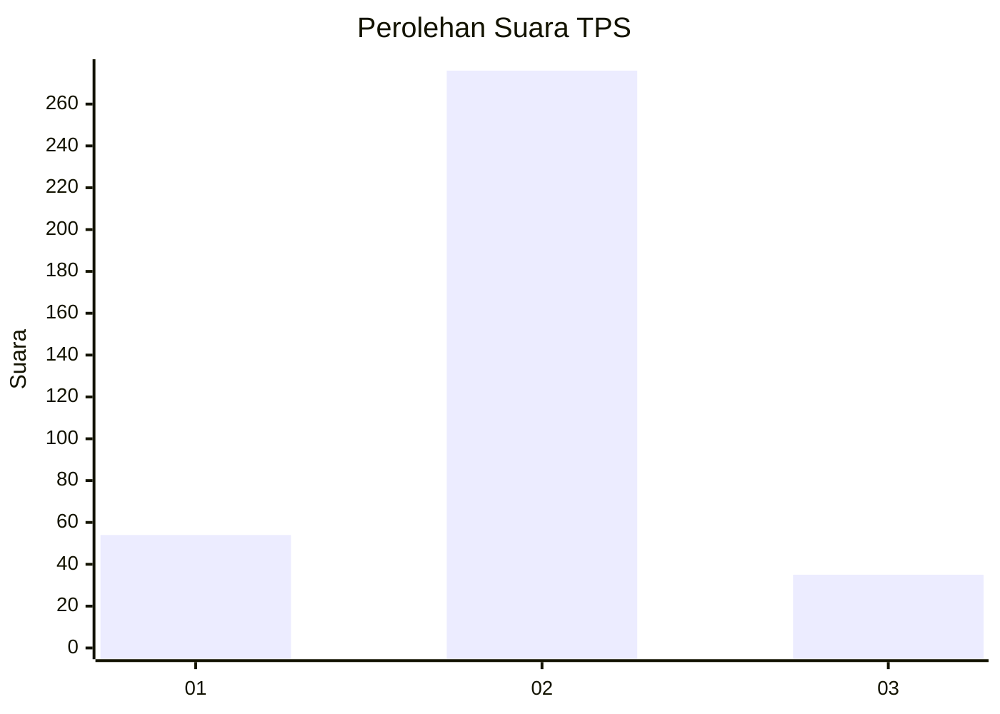
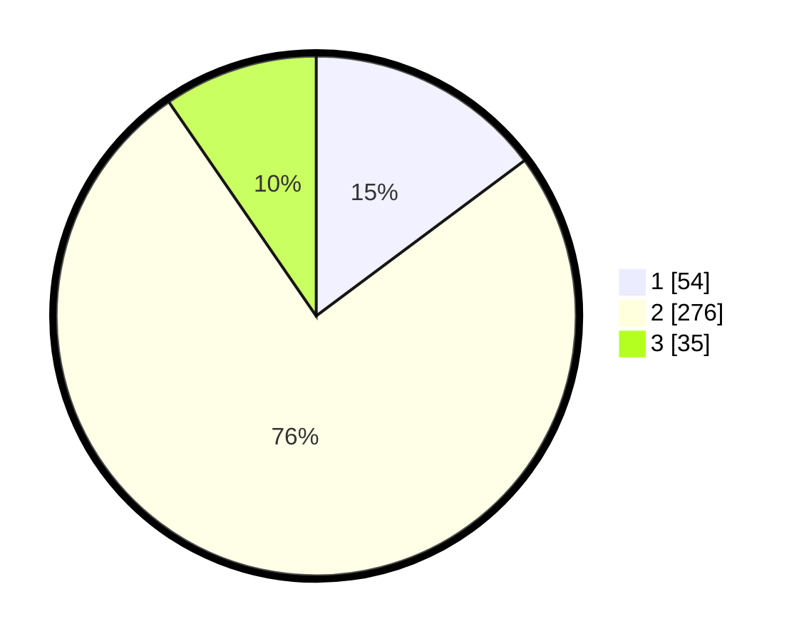

# Hasil

## Grafik

## Tabel

| No. | Nama Paslon    | Suara | Suara (raw) | Persentase |
|:--- |:-------------- | -----:| -----------:| ----------:|
| 1   | ANIES MUHAIMIN | 54    | [54][p-1]   | 14,79      |
| 2   | PRABOWO GIBRAN | 276   | [276][p-2]  | 75,62      |
| 3   | GANJAR MAHFUD  | 35    | [35][p-3]   | 9,59       |

[p-1]: https://github.com/gigit-pemilu/pemilu-2024-99-luar-negeri/blob/main/pilpres/hitung-suara/sub/99-luar-negeri/sub/63-kuching-malaysia/sub/01-kuching-malaysia/sub/0001-kuching-malaysia/sub/103-ksk-098/sub/paslon-1.txt
[p-2]: https://github.com/gigit-pemilu/pemilu-2024-99-luar-negeri/blob/main/pilpres/hitung-suara/sub/99-luar-negeri/sub/63-kuching-malaysia/sub/01-kuching-malaysia/sub/0001-kuching-malaysia/sub/103-ksk-098/sub/paslon-2.txt
[p-3]: https://github.com/gigit-pemilu/pemilu-2024-99-luar-negeri/blob/main/pilpres/hitung-suara/sub/99-luar-negeri/sub/63-kuching-malaysia/sub/01-kuching-malaysia/sub/0001-kuching-malaysia/sub/103-ksk-098/sub/paslon-3.txt

## Foto C Plano

https://sirekap-obj-formc.kpu.go.id/023b/pemilu/ppwp/99/63/01/00/01/9963010001103-20240214-212523--a709efb5-7562-4d10-b077-96022036bbc2.jpg

https://sirekap-obj-formc.kpu.go.id/023b/pemilu/ppwp/99/63/01/00/01/9963010001103-20240214-185758--b71cc4ab-d473-44f6-8bd8-e6863ace50ee.jpg

https://sirekap-obj-formc.kpu.go.id/023b/pemilu/ppwp/99/63/01/00/01/9963010001103-20240214-185803--f35876e1-dab7-4583-9b1a-4219e6d6cc03.jpg

## Metadata

| Key        | Value               |
| ---------- | ------------------- |
| Time Stamp | 2024-02-14 21:46:01 |

