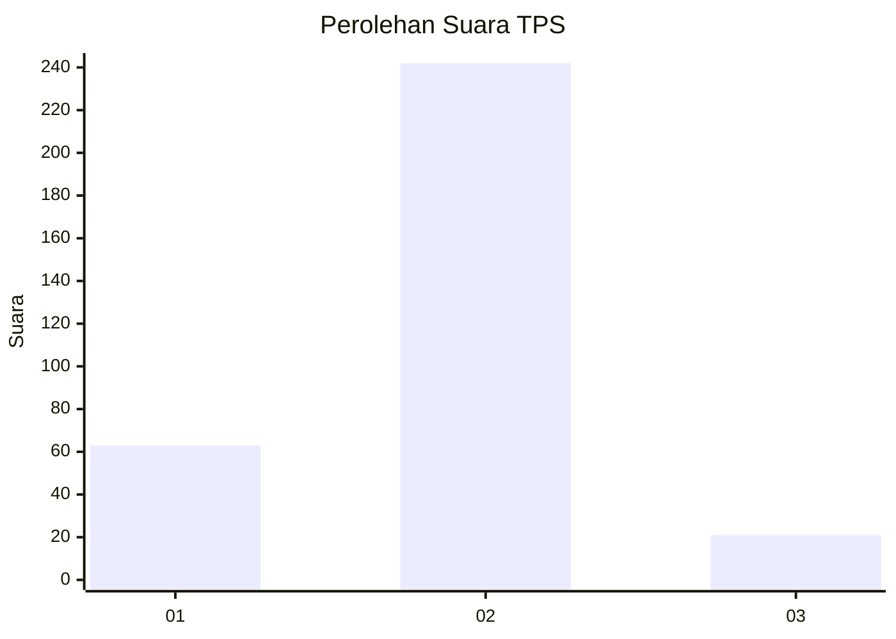
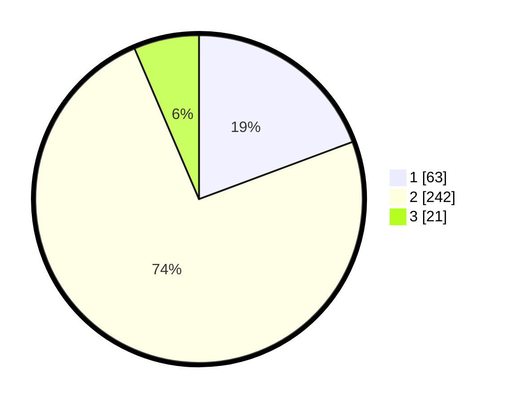

# Hasil

## Grafik

## Tabel

| No. | Nama Paslon    | Suara | Suara (raw) | Persentase |
|:--- |:-------------- | -----:| -----------:| ----------:|
| 1   | ANIES MUHAIMIN | 63    | [63][p-1]   | 19,33      |
| 2   | PRABOWO GIBRAN | 242   | [242][p-2]  | 74,23      |
| 3   | GANJAR MAHFUD  | 21    | [21][p-3]   | 6,44       |

[p-1]: https://github.com/gigit-pemilu/pemilu-2024-99-luar-negeri/blob/main/pilpres/hitung-suara/sub/99-luar-negeri/sub/63-kuching-malaysia/sub/01-kuching-malaysia/sub/0001-kuching-malaysia/sub/105-ksk-100/sub/paslon-1.txt
[p-2]: https://github.com/gigit-pemilu/pemilu-2024-99-luar-negeri/blob/main/pilpres/hitung-suara/sub/99-luar-negeri/sub/63-kuching-malaysia/sub/01-kuching-malaysia/sub/0001-kuching-malaysia/sub/105-ksk-100/sub/paslon-2.txt
[p-3]: https://github.com/gigit-pemilu/pemilu-2024-99-luar-negeri/blob/main/pilpres/hitung-suara/sub/99-luar-negeri/sub/63-kuching-malaysia/sub/01-kuching-malaysia/sub/0001-kuching-malaysia/sub/105-ksk-100/sub/paslon-3.txt

## Foto C Plano

https://sirekap-obj-formc.kpu.go.id/db60/pemilu/ppwp/99/63/01/00/01/9963010001105-20240214-223028--9b59ccb0-5a04-4af8-bfbe-2315d3d84e79.jpg

https://sirekap-obj-formc.kpu.go.id/db60/pemilu/ppwp/99/63/01/00/01/9963010001105-20240214-223230--24a5288e-3c7a-4261-aef7-d93183e42987.jpg

https://sirekap-obj-formc.kpu.go.id/db60/pemilu/ppwp/99/63/01/00/01/9963010001105-20240214-223353--1f164ea2-17b5-4e48-9abb-29b108fadca3.jpg

## Metadata

| Key        | Value               |
| ---------- | ------------------- |
| Time Stamp | 2024-02-22 07:00:00 |

