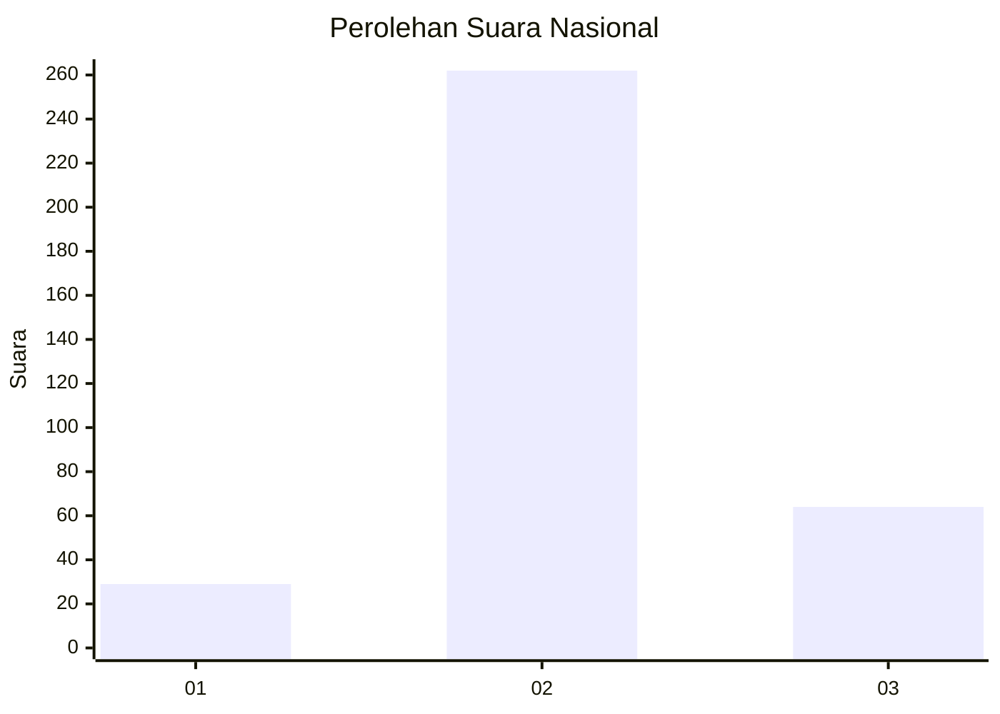
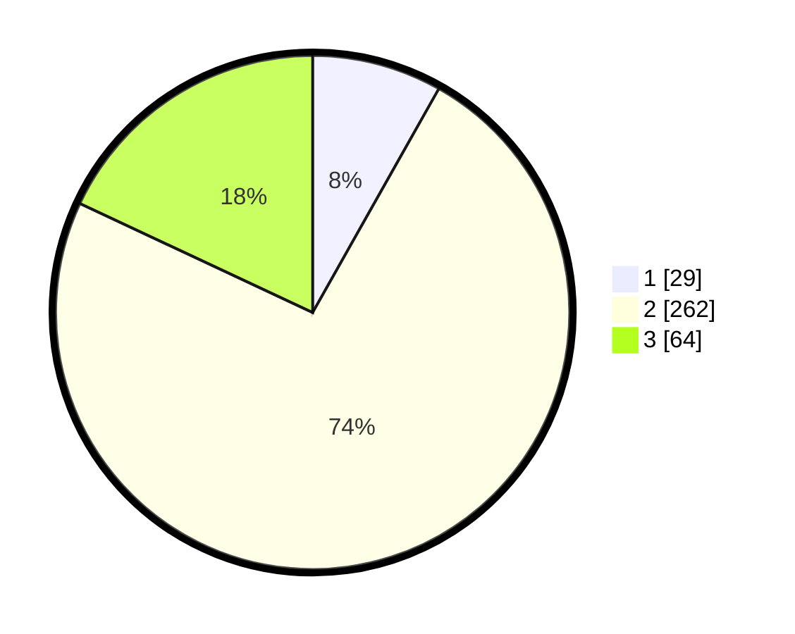

# Hasil

## Grafik

## Tabel

| No. | Nama Paslon    | Suara | Suara (raw) | Persentase |
|:--- |:-------------- | -----:| -----------:| ----------:|
| 1   | ANIES MUHAIMIN | 29    | [29][p-1]   | 8,17       |
| 2   | PRABOWO GIBRAN | 262   | [262][p-2]  | 73,80      |
| 3   | GANJAR MAHFUD  | 64    | [64][p-3]   | 18,03      |

[p-1]: https://github.com/gigit-pemilu/pemilu-2024/blob/main/pilpres/hitung-suara/sub/99-luar-negeri/sub/63-kuching-malaysia/sub/01-kuching-malaysia/sub/0001-kuching-malaysia/sub/115-ksk-110/sub/paslon-1.txt
[p-2]: https://github.com/gigit-pemilu/pemilu-2024/blob/main/pilpres/hitung-suara/sub/99-luar-negeri/sub/63-kuching-malaysia/sub/01-kuching-malaysia/sub/0001-kuching-malaysia/sub/115-ksk-110/sub/paslon-2.txt
[p-3]: https://github.com/gigit-pemilu/pemilu-2024/blob/main/pilpres/hitung-suara/sub/99-luar-negeri/sub/63-kuching-malaysia/sub/01-kuching-malaysia/sub/0001-kuching-malaysia/sub/115-ksk-110/sub/paslon-3.txt

## Foto C Plano

https://sirekap-obj-formc.kpu.go.id/deb3/pemilu/ppwp/99/63/01/00/01/9963010001115-20240214-223259--936a7bae-c5dc-4131-8a50-275735f2740a.jpg

https://sirekap-obj-formc.kpu.go.id/deb3/pemilu/ppwp/99/63/01/00/01/9963010001115-20240215-004343--88d5e131-eaca-4dbc-b4dd-23395049038a.jpg

https://sirekap-obj-formc.kpu.go.id/deb3/pemilu/ppwp/99/63/01/00/01/9963010001115-20240215-004257--d7663a33-644c-4dc7-afb9-15d1a7828287.jpg

## Metadata

| Key        | Value               |
| ---------- | ------------------- |
| Time Stamp | 2024-02-15 20:00:44 |

