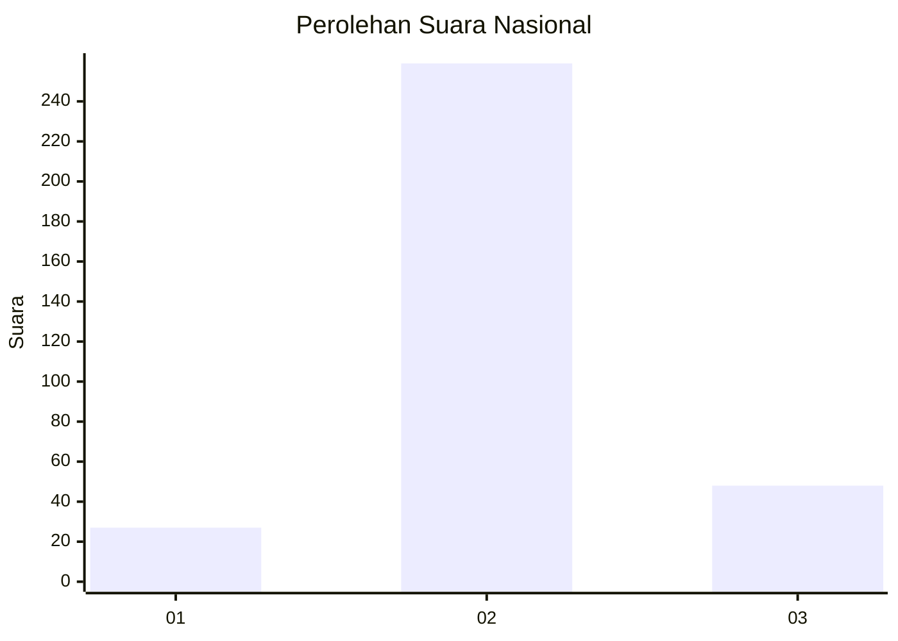

# Hasil

## Grafik

## Tabel

| No. | Nama Paslon    | Suara | Suara (raw) | Persentase |
|:--- |:-------------- | -----:| -----------:| ----------:|
| 1   | ANIES MUHAIMIN | 27    | [27][p-1]   | 8,08       |
| 2   | PRABOWO GIBRAN | 259   | [259][p-2]  | 77,54      |
| 3   | GANJAR MAHFUD  | 48    | [48][p-3]   | 14,37      |

[p-1]: https://github.com/gigit-pemilu/pemilu-2024/blob/main/pilpres/hitung-suara/sub/99-luar-negeri/sub/63-kuching-malaysia/sub/01-kuching-malaysia/sub/0001-kuching-malaysia/sub/118-ksk-113/sub/paslon-1.txt
[p-2]: https://github.com/gigit-pemilu/pemilu-2024/blob/main/pilpres/hitung-suara/sub/99-luar-negeri/sub/63-kuching-malaysia/sub/01-kuching-malaysia/sub/0001-kuching-malaysia/sub/118-ksk-113/sub/paslon-2.txt
[p-3]: https://github.com/gigit-pemilu/pemilu-2024/blob/main/pilpres/hitung-suara/sub/99-luar-negeri/sub/63-kuching-malaysia/sub/01-kuching-malaysia/sub/0001-kuching-malaysia/sub/118-ksk-113/sub/paslon-3.txt

## Foto C Plano

https://sirekap-obj-formc.kpu.go.id/6f76/pemilu/ppwp/99/63/01/00/01/9963010001118-20240214-223321--65db26e7-b624-4341-801f-e49389e131cc.jpg

https://sirekap-obj-formc.kpu.go.id/6f76/pemilu/ppwp/99/63/01/00/01/9963010001118-20240214-223552--557b6990-82a3-4c9c-aec3-6bc839de4dba.jpg

https://sirekap-obj-formc.kpu.go.id/6f76/pemilu/ppwp/99/63/01/00/01/9963010001118-20240214-223659--6ee8da5f-e270-4451-8acb-bb42ca72a78c.jpg

## Metadata

| Key        | Value               |
| ---------- | ------------------- |
| Time Stamp | 2024-02-19 08:00:00 |

## DATA PEMILIH TETAP

Jumlah pemilih dalam DPT: **351**.
 * L: **235**.
 * P: **116**.

## DATA PENGGUNA HAK PILIH

Jumlah pengguna hak pilih dalam DPT: **232**.
 * L: **146**.
 * P: **86**.

Jumlah pengguna hak pilih dalam DPTb: **2**.
 * L: **0**.
 * P: **2**.

Jumlah pengguna hak pilih dalam DPK: **123**.
 * L: **68**.
 * P: **55**.

Jumlah pengguna hak pilih: **357**.
 * L: **214**.
 * P: **143**.

## JUMLAH SUARA SAH DAN TIDAK SAH

JUMLAH SELURUH SUARA SAH: **334**.

JUMLAH SUARA TIDAK SAH: **23**.

JUMLAH SELURUH SUARA SAH DAN SUARA TIDAK SAH: **357**.

