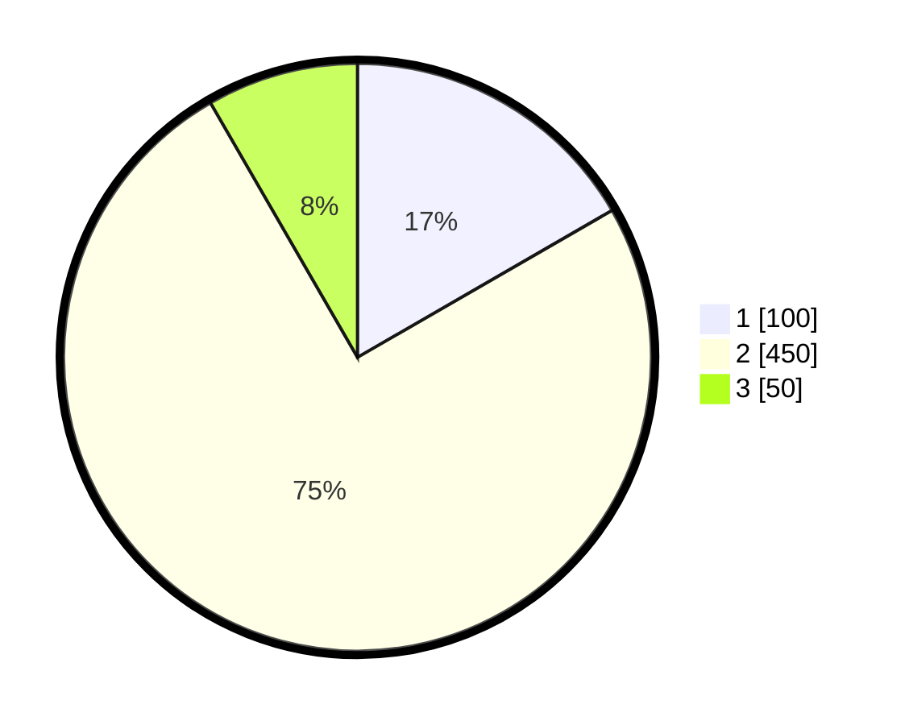

# Hasil

## Grafik

## Tabel

| No. | Nama Paslon    | Suara | Suara (raw) | Persentase |
|:--- |:-------------- | -----:| -----------:| ----------:|
| 1   | ANIES MUHAIMIN | 100   | [100][p-1]  | 16,67      |
| 2   | PRABOWO GIBRAN | 450   | [450][p-2]  | 75,00      |
| 3   | GANJAR MAHFUD  | 50    | [50][p-3]   | 8,33       |

[p-1]: https://github.com/gigit-pemilu/pemilu-2024-99-luar-negeri/blob/main/pilpres/hitung-suara/sub/99-luar-negeri/sub/63-kuching-malaysia/sub/01-kuching-malaysia/sub/0001-kuching-malaysia/sub/143-ksk-138/sub/paslon-1.txt
[p-2]: https://github.com/gigit-pemilu/pemilu-2024-99-luar-negeri/blob/main/pilpres/hitung-suara/sub/99-luar-negeri/sub/63-kuching-malaysia/sub/01-kuching-malaysia/sub/0001-kuching-malaysia/sub/143-ksk-138/sub/paslon-2.txt
[p-3]: https://github.com/gigit-pemilu/pemilu-2024-99-luar-negeri/blob/main/pilpres/hitung-suara/sub/99-luar-negeri/sub/63-kuching-malaysia/sub/01-kuching-malaysia/sub/0001-kuching-malaysia/sub/143-ksk-138/sub/paslon-3.txt

## Foto C Plano

https://sirekap-obj-formc.kpu.go.id/9fca/pemilu/ppwp/99/63/01/00/01/9963010001143-20240214-220415--81dfeb6d-b76c-43af-8bdc-aa3021126045.jpg

https://sirekap-obj-formc.kpu.go.id/9fca/pemilu/ppwp/99/63/01/00/01/9963010001143-20240214-220440--479cf6a1-3961-4c3a-bf5f-a995fca78293.jpg

https://sirekap-obj-formc.kpu.go.id/9fca/pemilu/ppwp/99/63/01/00/01/9963010001143-20240214-215201--f6b4d60d-6dbb-4f48-8412-0616eb0da902.jpg

## Metadata

| Key        | Value               |
| ---------- | ------------------- |
| Time Stamp | 2024-02-22 08:00:00 |

