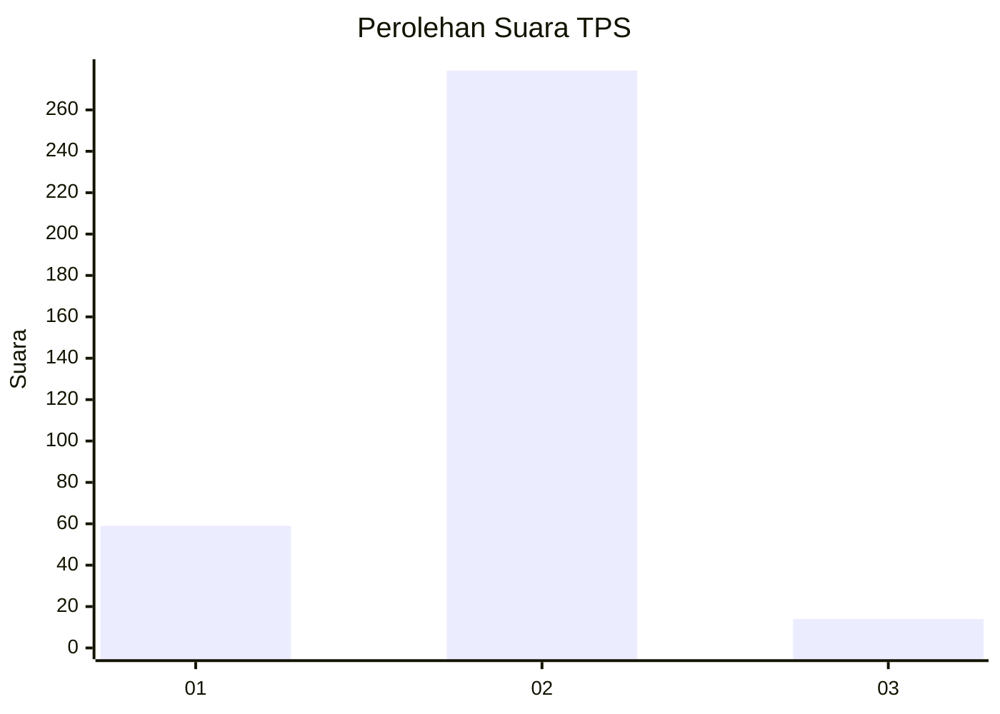
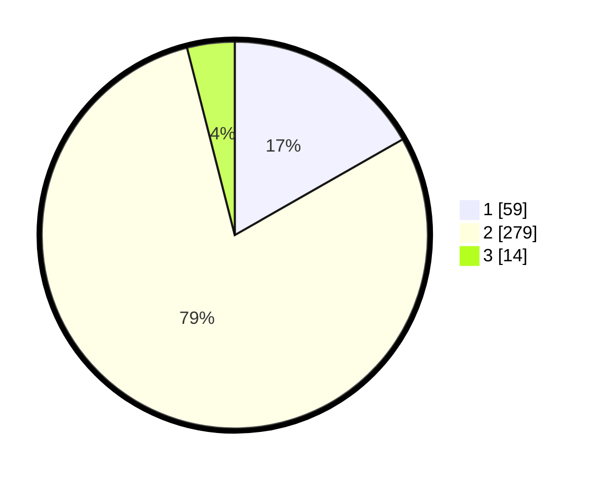

# Hasil

## Grafik

## Tabel

| No. | Nama Paslon    | Suara | Suara (raw) | Persentase |
|:--- |:-------------- | -----:| -----------:| ----------:|
| 1   | ANIES MUHAIMIN | 59    | [59][p-1]   | 16,76      |
| 2   | PRABOWO GIBRAN | 279   | [279][p-2]  | 79,26      |
| 3   | GANJAR MAHFUD  | 14    | [14][p-3]   | 3,98       |

[p-1]: https://github.com/gigit-pemilu/pemilu-2024-99-luar-negeri/blob/main/pilpres/hitung-suara/sub/99-luar-negeri/sub/63-kuching-malaysia/sub/01-kuching-malaysia/sub/0001-kuching-malaysia/sub/146-ksk-141/sub/paslon-1.txt
[p-2]: https://github.com/gigit-pemilu/pemilu-2024-99-luar-negeri/blob/main/pilpres/hitung-suara/sub/99-luar-negeri/sub/63-kuching-malaysia/sub/01-kuching-malaysia/sub/0001-kuching-malaysia/sub/146-ksk-141/sub/paslon-2.txt
[p-3]: https://github.com/gigit-pemilu/pemilu-2024-99-luar-negeri/blob/main/pilpres/hitung-suara/sub/99-luar-negeri/sub/63-kuching-malaysia/sub/01-kuching-malaysia/sub/0001-kuching-malaysia/sub/146-ksk-141/sub/paslon-3.txt

## Foto C Plano

https://sirekap-obj-formc.kpu.go.id/40b0/pemilu/ppwp/99/63/01/00/01/9963010001146-20240214-220142--8a056d10-5732-4030-ae8e-3ee39e3807db.jpg

https://sirekap-obj-formc.kpu.go.id/40b0/pemilu/ppwp/99/63/01/00/01/9963010001146-20240214-155634--1c430da1-54ea-43d0-bd65-d9562f513b7f.jpg

https://sirekap-obj-formc.kpu.go.id/40b0/pemilu/ppwp/99/63/01/00/01/9963010001146-20240214-184515--71109468-be5e-4ef4-a8ea-dd238001fa17.jpg

## Metadata

| Key        | Value               |
| ---------- | ------------------- |
| Time Stamp | 2024-02-15 00:41:44 |

