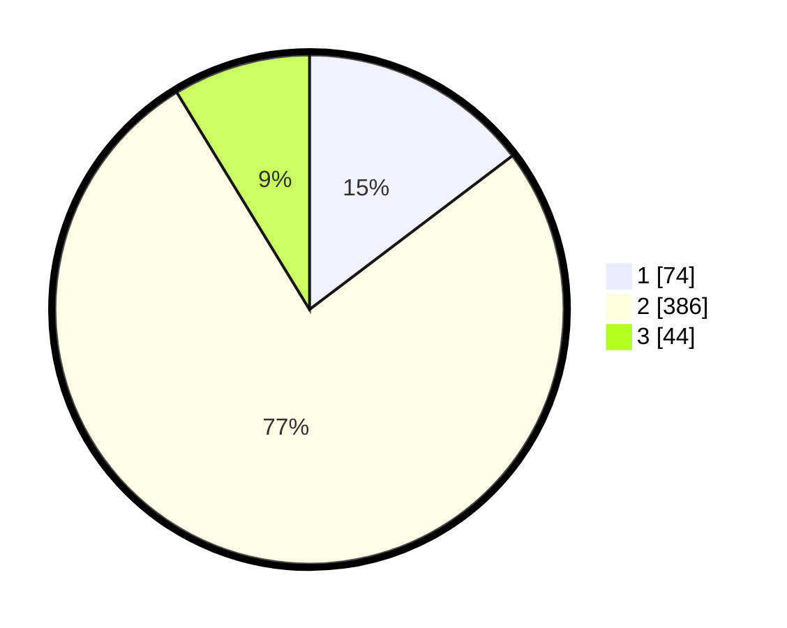

# Hasil

## Grafik

## Tabel

| No. | Nama Paslon    | Suara | Suara (raw) | Persentase |
|:--- |:-------------- | -----:| -----------:| ----------:|
| 1   | ANIES MUHAIMIN | 74    | [74][p-1]   | 14,68      |
| 2   | PRABOWO GIBRAN | 386   | [386][p-2]  | 76,59      |
| 3   | GANJAR MAHFUD  | 44    | [44][p-3]   | 8,73       |

[p-1]: https://github.com/gigit-pemilu/pemilu-2024-99-luar-negeri/blob/main/pilpres/hitung-suara/sub/99-luar-negeri/sub/63-kuching-malaysia/sub/01-kuching-malaysia/sub/0001-kuching-malaysia/sub/148-ksk-143/sub/paslon-1.txt
[p-2]: https://github.com/gigit-pemilu/pemilu-2024-99-luar-negeri/blob/main/pilpres/hitung-suara/sub/99-luar-negeri/sub/63-kuching-malaysia/sub/01-kuching-malaysia/sub/0001-kuching-malaysia/sub/148-ksk-143/sub/paslon-2.txt
[p-3]: https://github.com/gigit-pemilu/pemilu-2024-99-luar-negeri/blob/main/pilpres/hitung-suara/sub/99-luar-negeri/sub/63-kuching-malaysia/sub/01-kuching-malaysia/sub/0001-kuching-malaysia/sub/148-ksk-143/sub/paslon-3.txt

## Foto C Plano

https://sirekap-obj-formc.kpu.go.id/cf6b/pemilu/ppwp/99/63/01/00/01/9963010001148-20240217-112538--b0ce6433-a92f-4d8f-8073-09708f01fdad.jpg

https://sirekap-obj-formc.kpu.go.id/cf6b/pemilu/ppwp/99/63/01/00/01/9963010001148-20240217-113837--a703e531-73e9-4b05-baea-3353a0e22795.jpg

https://sirekap-obj-formc.kpu.go.id/cf6b/pemilu/ppwp/99/63/01/00/01/9963010001148-20240217-115607--89957c28-d76e-40ed-abd2-f42ceff239bc.jpg

## Metadata

| Key        | Value               |
| ---------- | ------------------- |
| Time Stamp | 2024-02-21 18:00:00 |

## DATA PEMILIH TETAP

Jumlah pemilih dalam DPT: **500**.
 * L: **358**.
 * P: **142**.

## DATA PENGGUNA HAK PILIH

Jumlah pengguna hak pilih dalam DPT: **189**.
 * L: **128**.
 * P: **61**.

Jumlah pengguna hak pilih dalam DPTb: **1**.
 * L: **0**.
 * P: **1**.

Jumlah pengguna hak pilih dalam DPK: **320**.
 * L: **229**.
 * P: **91**.

Jumlah pengguna hak pilih: **38585**.
 * L: **78352**.
 * P: **80558**.

## JUMLAH SUARA SAH DAN TIDAK SAH

JUMLAH SELURUH SUARA SAH: **504**.

JUMLAH SUARA TIDAK SAH: **6**.

JUMLAH SELURUH SUARA SAH DAN SUARA TIDAK SAH: **510**.

