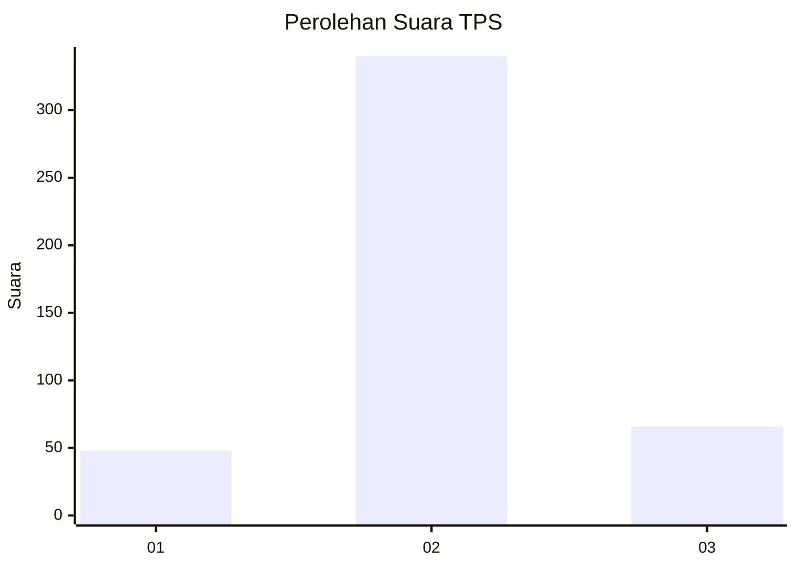

# Hasil

## Grafik

## Tabel

| No. | Nama Paslon    | Suara | Suara (raw) | Persentase |
|:--- |:-------------- | -----:| -----------:| ----------:|
| 1   | ANIES MUHAIMIN | 48    | [48][p-1]   | 10,57      |
| 2   | PRABOWO GIBRAN | 340   | [340][p-2]  | 74,89      |
| 3   | GANJAR MAHFUD  | 66    | [66][p-3]   | 14,54      |

[p-1]: https://github.com/gigit-pemilu/pemilu-2024-99-luar-negeri/blob/main/pilpres/hitung-suara/sub/99-luar-negeri/sub/63-kuching-malaysia/sub/01-kuching-malaysia/sub/0001-kuching-malaysia/sub/152-ksk-147/sub/paslon-1.txt
[p-2]: https://github.com/gigit-pemilu/pemilu-2024-99-luar-negeri/blob/main/pilpres/hitung-suara/sub/99-luar-negeri/sub/63-kuching-malaysia/sub/01-kuching-malaysia/sub/0001-kuching-malaysia/sub/152-ksk-147/sub/paslon-2.txt
[p-3]: https://github.com/gigit-pemilu/pemilu-2024-99-luar-negeri/blob/main/pilpres/hitung-suara/sub/99-luar-negeri/sub/63-kuching-malaysia/sub/01-kuching-malaysia/sub/0001-kuching-malaysia/sub/152-ksk-147/sub/paslon-3.txt

## Foto C Plano

https://sirekap-obj-formc.kpu.go.id/d939/pemilu/ppwp/99/63/01/00/01/9963010001152-20240217-184946--4fc2629c-5ae6-46c8-9eff-37bf8ef0f82b.jpg

https://sirekap-obj-formc.kpu.go.id/d939/pemilu/ppwp/99/63/01/00/01/9963010001152-20240217-184651--733c195c-afa9-412e-b4dc-fb7bce41443a.jpg

https://sirekap-obj-formc.kpu.go.id/d939/pemilu/ppwp/99/63/01/00/01/9963010001152-20240217-175718--1ab7c48e-843a-47d8-97fa-f591b48ecfad.jpg

## Metadata

| Key        | Value               |
| ---------- | ------------------- |
| Time Stamp | 2024-02-21 21:00:04 |

## DATA PEMILIH TETAP

Jumlah pemilih dalam DPT: **479**.
 * L: **317**.
 * P: **162**.

## DATA PENGGUNA HAK PILIH

Jumlah pengguna hak pilih dalam DPT: **280**.
 * L: **174**.
 * P: **106**.

Jumlah pengguna hak pilih dalam DPTb: **0**.
 * L: **0**.
 * P: **0**.

Jumlah pengguna hak pilih dalam DPK: **197**.
 * L: **126**.
 * P: **71**.

Jumlah pengguna hak pilih: **477**.
 * L: **300**.
 * P: **177**.

## JUMLAH SUARA SAH DAN TIDAK SAH

JUMLAH SELURUH SUARA SAH: **454**.

JUMLAH SUARA TIDAK SAH: **23**.

JUMLAH SELURUH SUARA SAH DAN SUARA TIDAK SAH: **477**.

