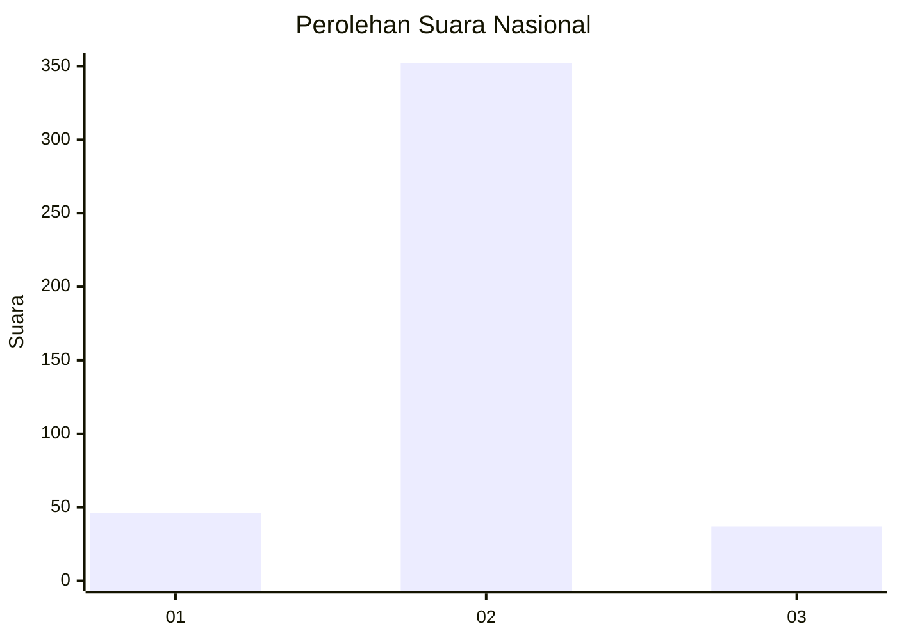
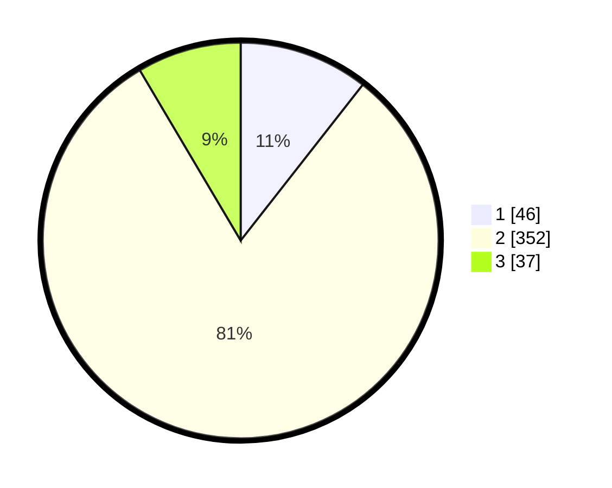

# Hasil

## Grafik

## Tabel

| No. | Nama Paslon    | Suara | Suara (raw) | Persentase |
|:--- |:-------------- | -----:| -----------:| ----------:|
| 1   | ANIES MUHAIMIN | 46    | [46][p-1]   | 10,57      |
| 2   | PRABOWO GIBRAN | 352   | [352][p-2]  | 80,92      |
| 3   | GANJAR MAHFUD  | 37    | [37][p-3]   | 8,51       |

[p-1]: https://github.com/gigit-pemilu/pemilu-2024/blob/main/pilpres/hitung-suara/sub/99-luar-negeri/sub/63-kuching-malaysia/sub/01-kuching-malaysia/sub/0001-kuching-malaysia/sub/153-ksk-148/sub/paslon-1.txt
[p-2]: https://github.com/gigit-pemilu/pemilu-2024/blob/main/pilpres/hitung-suara/sub/99-luar-negeri/sub/63-kuching-malaysia/sub/01-kuching-malaysia/sub/0001-kuching-malaysia/sub/153-ksk-148/sub/paslon-2.txt
[p-3]: https://github.com/gigit-pemilu/pemilu-2024/blob/main/pilpres/hitung-suara/sub/99-luar-negeri/sub/63-kuching-malaysia/sub/01-kuching-malaysia/sub/0001-kuching-malaysia/sub/153-ksk-148/sub/paslon-3.txt

## Foto C Plano

https://sirekap-obj-formc.kpu.go.id/0c60/pemilu/ppwp/99/63/01/00/01/9963010001153-20240214-221953--38f37fc8-7d57-44ac-8e1f-f921c452697f.jpg

https://sirekap-obj-formc.kpu.go.id/0c60/pemilu/ppwp/99/63/01/00/01/9963010001153-20240214-222149--d366056f-413a-498a-abbc-4cbfb6b6f7d1.jpg

https://sirekap-obj-formc.kpu.go.id/0c60/pemilu/ppwp/99/63/01/00/01/9963010001153-20240214-222421--cb2b5988-a6e7-4c96-8e22-72c06a85edd6.jpg

## Metadata

| Key        | Value               |
| ---------- | ------------------- |
| Time Stamp | 2024-02-22 08:00:00 |

