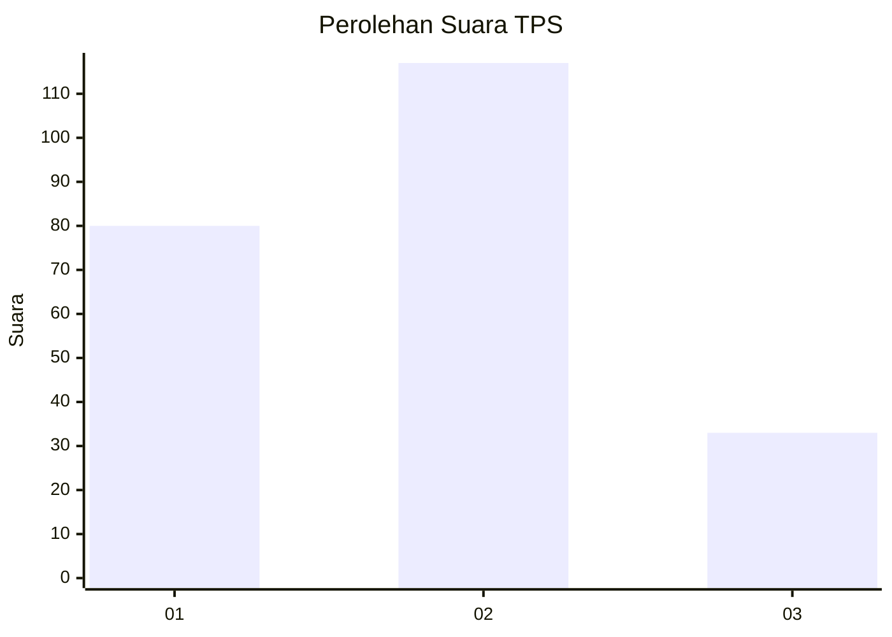
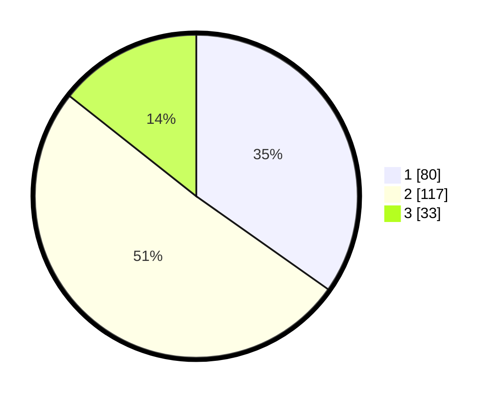

# Hasil

## Grafik

## Tabel

| No. | Nama Paslon    | Suara | Suara (raw) | Persentase |
|:--- |:-------------- | -----:| -----------:| ----------:|
| 1   | ANIES MUHAIMIN | 80    | [80][p-1]   | 34,78      |
| 2   | PRABOWO GIBRAN | 117   | [117][p-2]  | 50,87      |
| 3   | GANJAR MAHFUD  | 33    | [33][p-3]   | 14,35      |

[p-1]: https://github.com/gigit-pemilu/pemilu-2024-99-luar-negeri/blob/main/pilpres/hitung-suara/sub/99-luar-negeri/sub/64-kuwait-city-kuwait/sub/01-kuwait-city-kuwait/sub/0001-kuwait-city-kuwait/sub/001-tps/sub/paslon-1.txt
[p-2]: https://github.com/gigit-pemilu/pemilu-2024-99-luar-negeri/blob/main/pilpres/hitung-suara/sub/99-luar-negeri/sub/64-kuwait-city-kuwait/sub/01-kuwait-city-kuwait/sub/0001-kuwait-city-kuwait/sub/001-tps/sub/paslon-2.txt
[p-3]: https://github.com/gigit-pemilu/pemilu-2024-99-luar-negeri/blob/main/pilpres/hitung-suara/sub/99-luar-negeri/sub/64-kuwait-city-kuwait/sub/01-kuwait-city-kuwait/sub/0001-kuwait-city-kuwait/sub/001-tps/sub/paslon-3.txt

## Foto C Plano

https://sirekap-obj-formc.kpu.go.id/27e8/pemilu/ppwp/99/64/01/00/01/9964010001001-20240214-231247--8e1cae1f-d886-40cc-a655-4b5cdfa6918b.jpg

https://sirekap-obj-formc.kpu.go.id/27e8/pemilu/ppwp/99/64/01/00/01/9964010001001-20240214-231432--7099165b-c841-4b50-afd6-2cba82f9e91d.jpg

https://sirekap-obj-formc.kpu.go.id/27e8/pemilu/ppwp/99/64/01/00/01/9964010001001-20240214-231347--4dbd20df-807d-4d89-b73b-079dcc617e47.jpg

## Metadata

| Key        | Value               |
| ---------- | ------------------- |
| Time Stamp | 2024-02-15 23:29:50 |

## DATA PEMILIH TETAP

Jumlah pemilih dalam DPT: **435**.
 * L: **74**.
 * P: **361**.

## DATA PENGGUNA HAK PILIH

Jumlah pengguna hak pilih dalam DPT: **167**.
 * L: **42**.
 * P: **125**.

Jumlah pengguna hak pilih dalam DPTb: **32**.
 * L: **18**.
 * P: **14**.

Jumlah pengguna hak pilih dalam DPK: **39**.
 * L: **9**.
 * P: **30**.

Jumlah pengguna hak pilih: **238**.
 * L: **69**.
 * P: **169**.

## JUMLAH SUARA SAH DAN TIDAK SAH

JUMLAH SELURUH SUARA SAH: **230**.

JUMLAH SUARA TIDAK SAH: **8**.

JUMLAH SELURUH SUARA SAH DAN SUARA TIDAK SAH: **238**.

