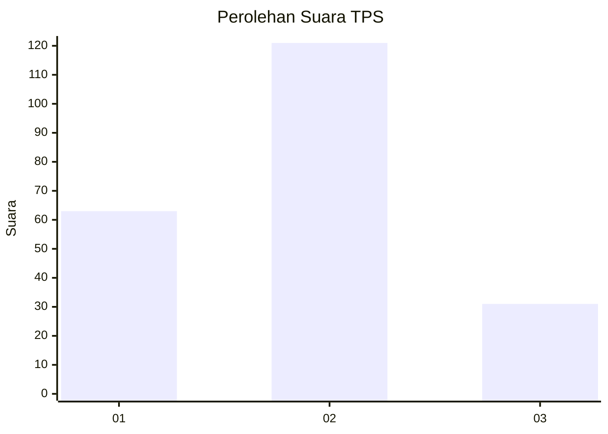
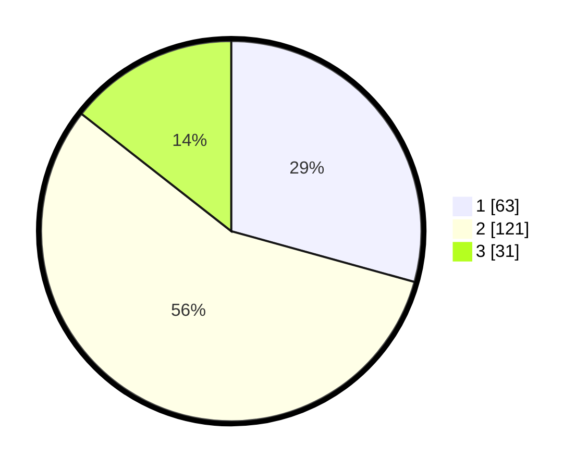

# Hasil

## Grafik

## Tabel

| No. | Nama Paslon    | Suara | Suara (raw) | Persentase |
|:--- |:-------------- | -----:| -----------:| ----------:|
| 1   | ANIES MUHAIMIN | 63    | [63][p-1]   | 29,30      |
| 2   | PRABOWO GIBRAN | 121   | [121][p-2]  | 56,28      |
| 3   | GANJAR MAHFUD  | 31    | [31][p-3]   | 14,42      |

[p-1]: https://github.com/gigit-pemilu/pemilu-2024-99-luar-negeri/blob/main/pilpres/hitung-suara/sub/99-luar-negeri/sub/64-kuwait-city-kuwait/sub/01-kuwait-city-kuwait/sub/0001-kuwait-city-kuwait/sub/002-tps/sub/paslon-1.txt
[p-2]: https://github.com/gigit-pemilu/pemilu-2024-99-luar-negeri/blob/main/pilpres/hitung-suara/sub/99-luar-negeri/sub/64-kuwait-city-kuwait/sub/01-kuwait-city-kuwait/sub/0001-kuwait-city-kuwait/sub/002-tps/sub/paslon-2.txt
[p-3]: https://github.com/gigit-pemilu/pemilu-2024-99-luar-negeri/blob/main/pilpres/hitung-suara/sub/99-luar-negeri/sub/64-kuwait-city-kuwait/sub/01-kuwait-city-kuwait/sub/0001-kuwait-city-kuwait/sub/002-tps/sub/paslon-3.txt

## Foto C Plano

https://sirekap-obj-formc.kpu.go.id/ae98/pemilu/ppwp/99/64/01/00/01/9964010001002-20240214-204535--cfb0c9e6-a2c9-499d-bd9d-4669a1034155.jpg

https://sirekap-obj-formc.kpu.go.id/ae98/pemilu/ppwp/99/64/01/00/01/9964010001002-20240214-204613--3e0c4425-3506-498c-b12a-09c71cce3667.jpg

https://sirekap-obj-formc.kpu.go.id/ae98/pemilu/ppwp/99/64/01/00/01/9964010001002-20240214-204639--ae6aa277-da65-48d0-9b34-c1f236ff476e.jpg

## Metadata

| Key        | Value               |
| ---------- | ------------------- |
| Time Stamp | 2024-02-14 21:46:01 |

## DATA PEMILIH TETAP

Jumlah pemilih dalam DPT: **453**.
 * L: **133**.
 * P: **320**.

## DATA PENGGUNA HAK PILIH

Jumlah pengguna hak pilih dalam DPT: **151**.
 * L: **56**.
 * P: **95**.

Jumlah pengguna hak pilih dalam DPTb: **28**.
 * L: **14**.
 * P: **14**.

Jumlah pengguna hak pilih dalam DPK: **42**.
 * L: **8**.
 * P: **34**.

Jumlah pengguna hak pilih: **221**.
 * L: **78**.
 * P: **143**.

## JUMLAH SUARA SAH DAN TIDAK SAH

JUMLAH SELURUH SUARA SAH: **215**.

JUMLAH SUARA TIDAK SAH: **6**.

JUMLAH SELURUH SUARA SAH DAN SUARA TIDAK SAH: **221**.

