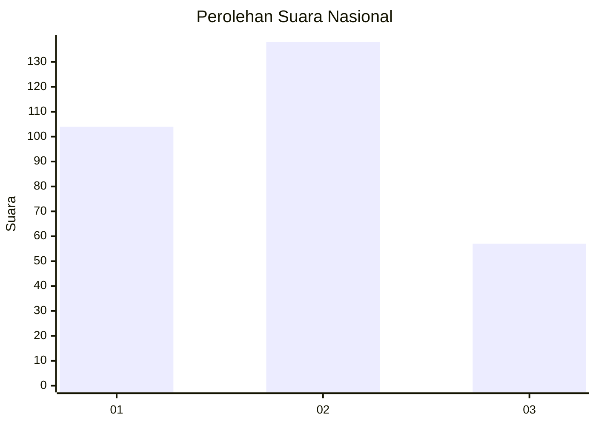
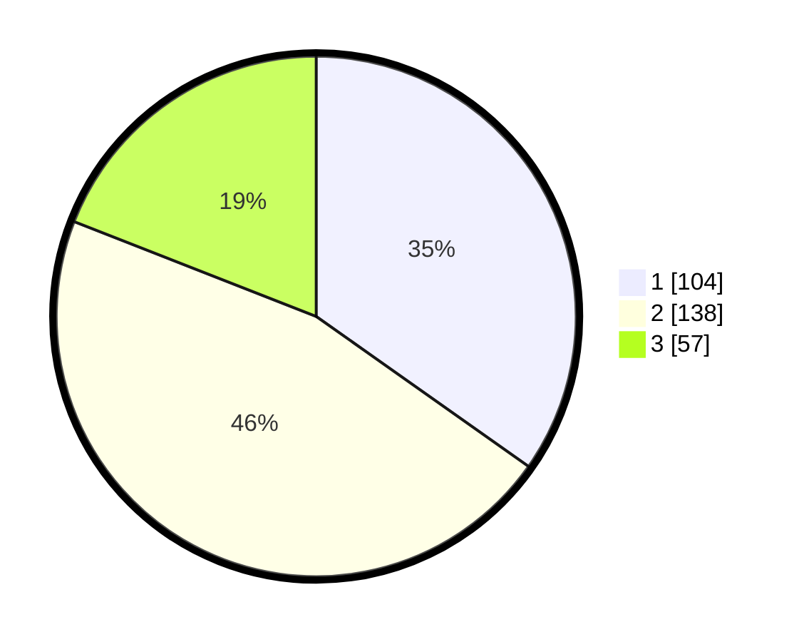

# Hasil

## Grafik

## Tabel

| No. | Nama Paslon    | Suara | Suara (raw) | Persentase |
|:--- |:-------------- | -----:| -----------:| ----------:|
| 1   | ANIES MUHAIMIN | 104   | [104][p-1]  | 34,78      |
| 2   | PRABOWO GIBRAN | 138   | [138][p-2]  | 46,15      |
| 3   | GANJAR MAHFUD  | 57    | [57][p-3]   | 19,06      |

[p-1]: https://github.com/gigit-pemilu/pemilu-2024/blob/main/pilpres/hitung-suara/sub/99-luar-negeri/sub/64-kuwait-city-kuwait/sub/01-kuwait-city-kuwait/sub/0001-kuwait-city-kuwait/sub/003-tps/sub/paslon-1.txt
[p-2]: https://github.com/gigit-pemilu/pemilu-2024/blob/main/pilpres/hitung-suara/sub/99-luar-negeri/sub/64-kuwait-city-kuwait/sub/01-kuwait-city-kuwait/sub/0001-kuwait-city-kuwait/sub/003-tps/sub/paslon-2.txt
[p-3]: https://github.com/gigit-pemilu/pemilu-2024/blob/main/pilpres/hitung-suara/sub/99-luar-negeri/sub/64-kuwait-city-kuwait/sub/01-kuwait-city-kuwait/sub/0001-kuwait-city-kuwait/sub/003-tps/sub/paslon-3.txt

## Foto C Plano

https://sirekap-obj-formc.kpu.go.id/c7ef/pemilu/ppwp/99/64/01/00/01/9964010001003-20240214-192518--b26f2ce7-6c96-4cd3-966a-eb80f9aa49c1.jpg

https://sirekap-obj-formc.kpu.go.id/c7ef/pemilu/ppwp/99/64/01/00/01/9964010001003-20240214-192614--32fd903f-d6d5-4247-86a3-081d95c2c9f4.jpg

https://sirekap-obj-formc.kpu.go.id/c7ef/pemilu/ppwp/99/64/01/00/01/9964010001003-20240214-192701--14ba59f7-3d1e-485e-aa39-066b2ca84bea.jpg

## Metadata

| Key        | Value               |
| ---------- | ------------------- |
| Time Stamp | 2024-02-14 21:46:01 |

## DATA PEMILIH TETAP

Jumlah pemilih dalam DPT: **460**.
 * L: **186**.
 * P: **278**.

## DATA PENGGUNA HAK PILIH

Jumlah pengguna hak pilih dalam DPT: **212**.
 * L: **104**.
 * P: **108**.

Jumlah pengguna hak pilih dalam DPTb: **28**.
 * L: **18**.
 * P: **10**.

Jumlah pengguna hak pilih dalam DPK: **61**.
 * L: **28**.
 * P: **33**.

Jumlah pengguna hak pilih: **301**.
 * L: **150**.
 * P: **151**.

## JUMLAH SUARA SAH DAN TIDAK SAH

JUMLAH SELURUH SUARA SAH: **299**.

JUMLAH SUARA TIDAK SAH: **2**.

JUMLAH SELURUH SUARA SAH DAN SUARA TIDAK SAH: **301**.

